> **РОССИЙСКИЙ** **УНИВЕРСИТЕТ** **ДРУЖБЫ** **НАРОДОВ** **Факультет**
> **физико-математических** **и** **естественных** **наук**
>
> **Кафедра** **прикладной** **информатики** **и** **теории**
> **вероятностей**
>
> **ОТЧЕТ**
>
> **ПО** **ЛАБОРАТОРНОЙ** **РАБОТЕ** **№10**
>
> *<u>дисциплина:</u>* *<u>Основы администрирования операционных
> систем</u>*

Студент: Хамди Мохаммад, 1032235868

> **МОСКВА** 2<u>024</u> г.

**Постановка** **задачи**

Получить навыки работы с утилитами управления модулями ядра операционной
системы.

**Выполнение** **работы**

**Управление** **модулями** **ядра** **из** **командной** **строки**

1\. Запустите терминал и получите полномочия администратора: su –

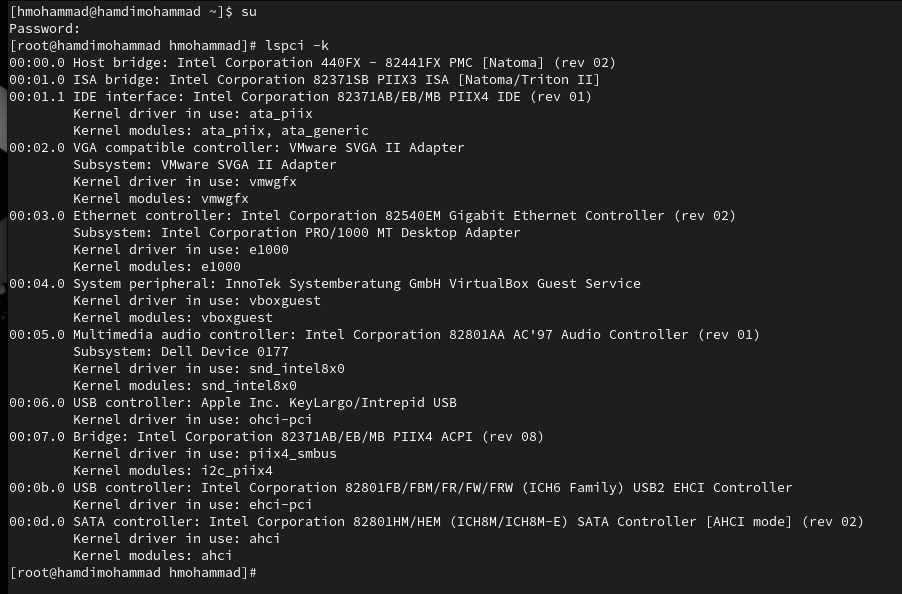2.
Посмотрите, какие устройства имеются в вашей системе и какие модули ядра
с ними связаны: lspci -k В отчёте отразите информацию с вашими
пояснениями.

3\. Посмотрите, какие модули ядра загружены: lsmod \|
sort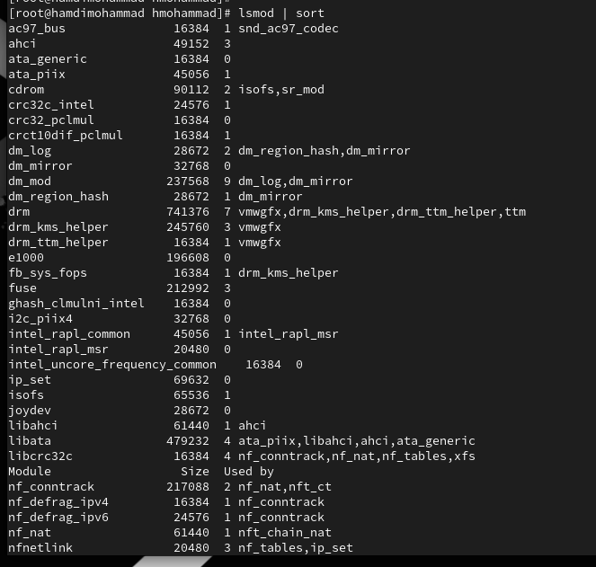

4\. Посмотрите, загружен ли модуль ext4: lsmod \| grep ext4

5\. Загрузите модуль ядра ext4: modprobe ext4 Убедитесь, что модуль
загружен, посмотрев список загруженных модулей: lsmod \| grep ext4

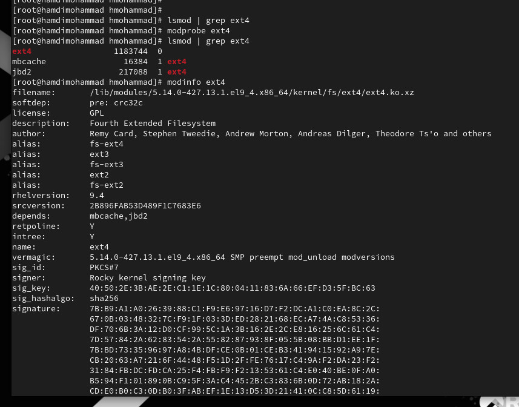6. Посмотрите информацию о
модуле ядра ext4: modinfo ext4 Обратите внимание, что у этого модуля нет
параметров. В отчёте поясните выведенную на экран информацию.

7\. Попробуйте выгрузить модуль ядра ext4: modprobe -r ext4 Возможно
команду потребуется ввести несколько раз. В отчёте отразите, какую
информацию выдаёт система.

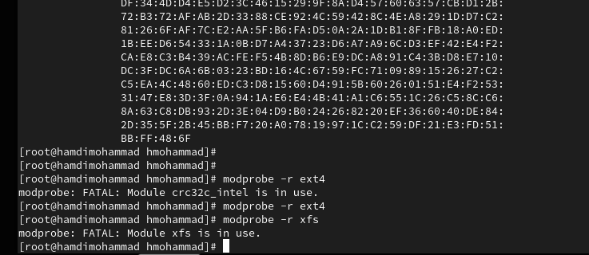8. Попробуйте выгрузить
модуль ядра xfs: modprobe -r xfs Обратите внимание, что вы получаете
сообщение об ошибке, поскольку модуль ядра в данный момент используется

**Загрузка** **модулей** **ядра** **с** **параметрами**

1\. Запустите терминал и получите полномочия администратора.

2\. Посмотрите, загружен ли модуль bluetooth: lsmod \| grep bluetooth

3\. Загрузите модуль ядра bluetooth: modprobe bluetooth

4\. Посмотрите список модулей ядра, отвечающих за работу с Bluetooth:
lsmod \| grep bluetooth

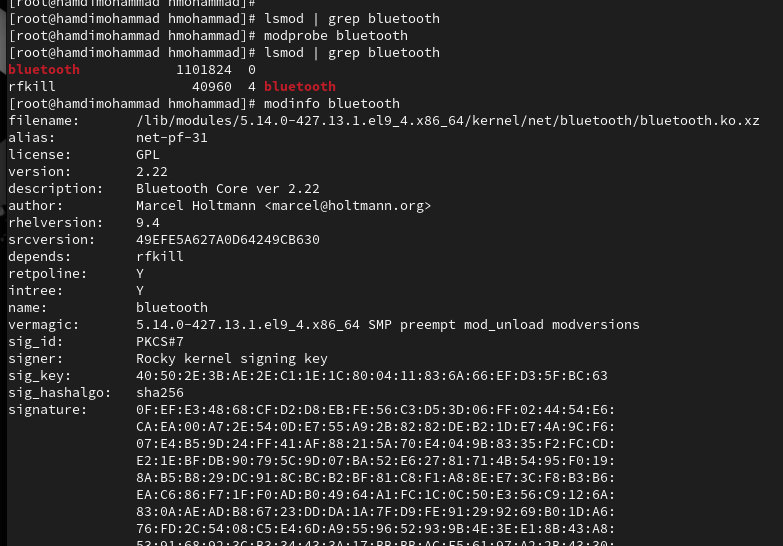5. Посмотрите информацию о
модуле bluetooth: modinfo bluetooth В отчёте поясните, какие параметры
могут быть установлены для работы этого модуля.

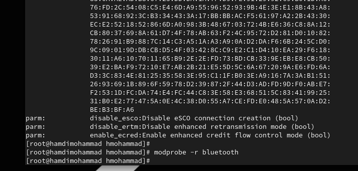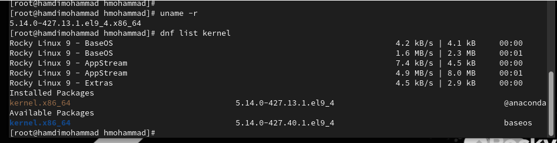

6\. Выгрузите модуль ядра bluetooth: modprobe -r bluetooth

**Обновление** **ядра** **системы**

Rocky Linux является нисходящей версией RHEL. Это означает, что данный
дистрибутив достаточно стабилен, но имеет устаревшие пакеты с точки
зрения функциональности.

1\. Запустите терминал и получите полномочия администратора: su –

2\. Посмотрите версию ядра, используемую в операционной системе: uname
-r

> 3\. Выведите на экран список пакетов, относящихся к ядру операционной
> системы: dnf list kernel

4\. Обновите систему, чтобы убедиться, что все существующие пакеты
обновлены, так как это важно при установке/обновлении ядер Linux и
избежания конфликтов:

dnf upgrade --refresh

5\. Обновите ядро операционной системы, а затем саму операционную
систему: dnf update kernel

dnf update

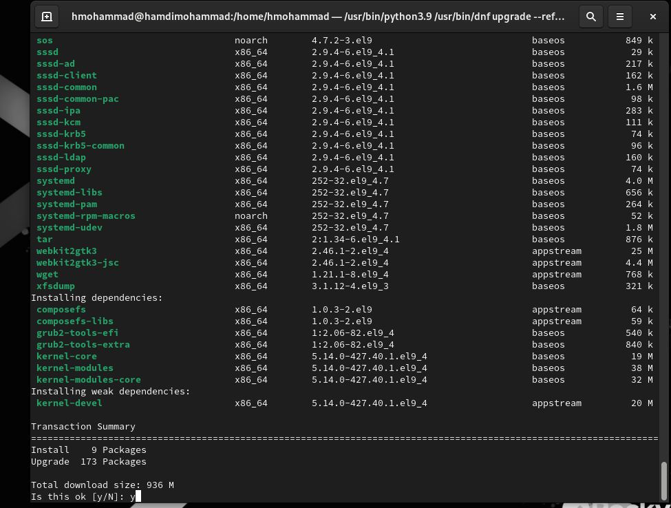dnf upgrade --refresh

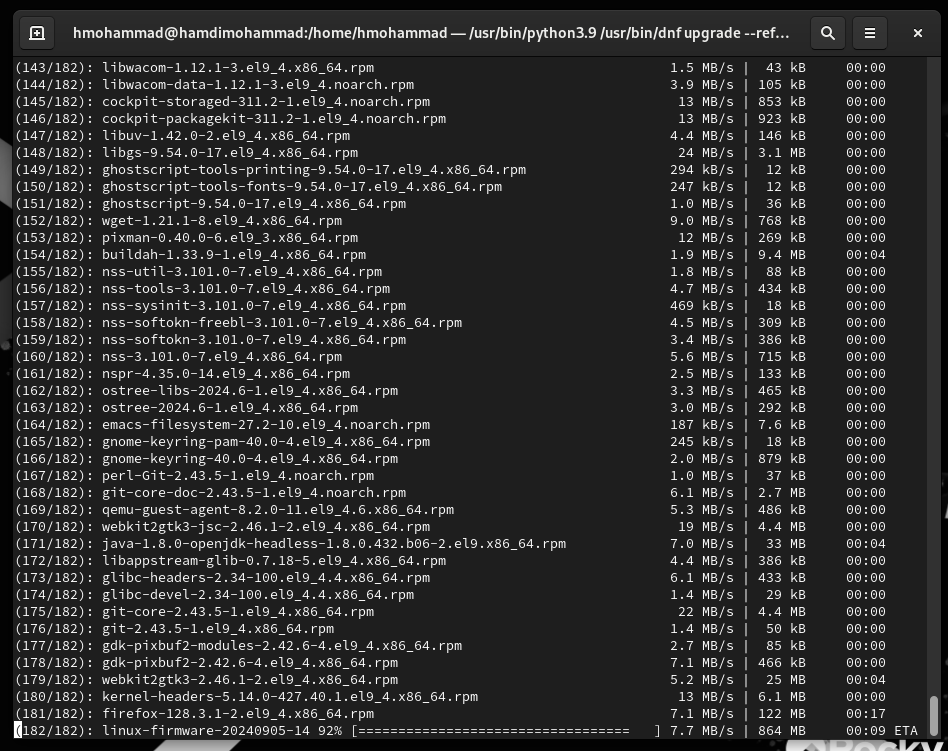

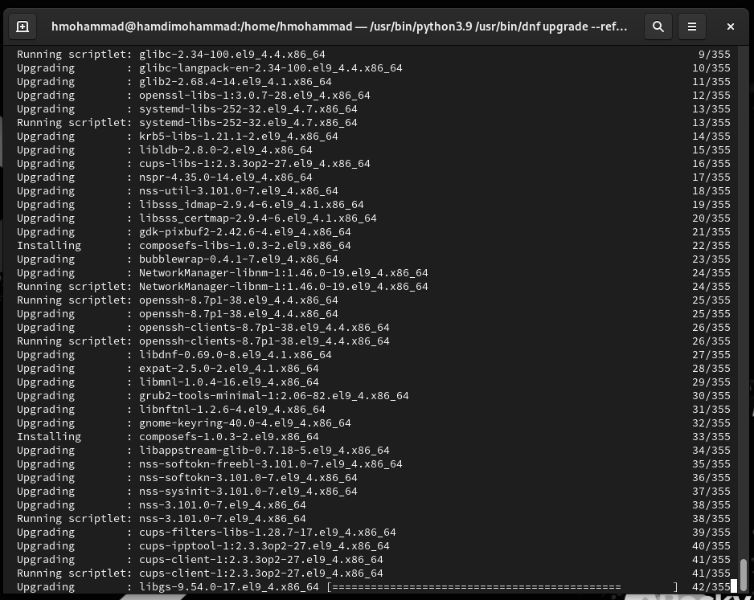

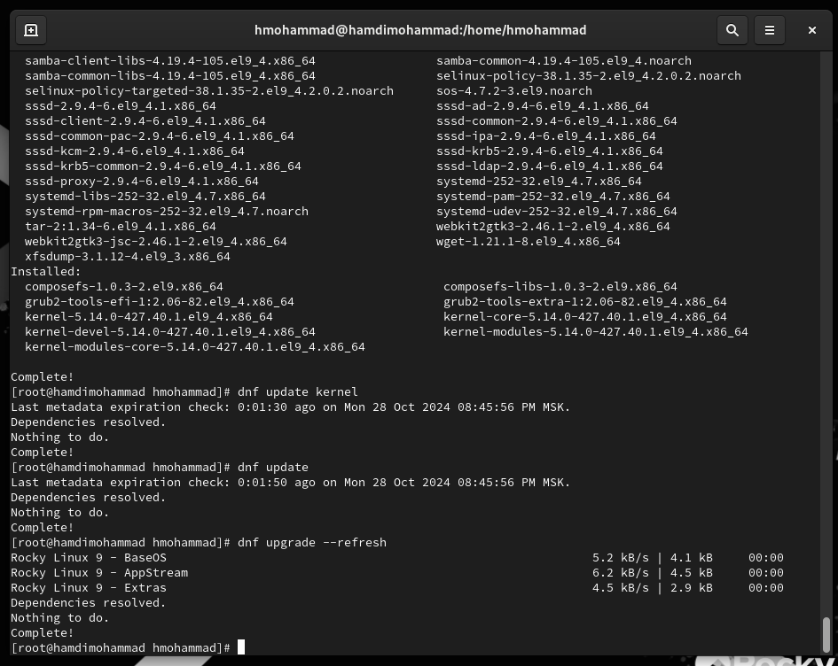

6\. Перегрузите систему. При загрузке выберите новое ядро.

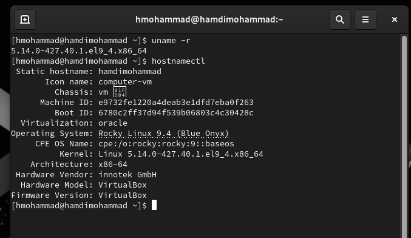7. Посмотрите версию ядра,
используемую в операционной системы: uname -r hostnamectl

**Контрольные** **вопросы**

1\. Какая команда показывает текущую версию ядра, которая используется
на вашей

системе?

> uname -r

2\. Как можно посмотреть более подробную информацию о текущей версии
ядра операционной системы?

> uname -a или cat /proc/version

3\. Какая команда показывает список загруженных модулей ядра?

> lsmod

4\. Какая команда позволяет вам определять параметры модуля ядра?

> modinfo \<module_name\>

5\. Как выгрузить модуль ядра?

> sudo rmmod \<module_name\>

6\. Что вы можете сделать, если получите сообщение об ошибке при попытке
выгрузить

модуль ядра?

> Убедитесь, что модуль не используется. Используйте команду lsmod для
> проверки.
>
> Используйте команду sudo modprobe -r \<module_name\> вместо rmmod, так
> как она
>
> позволяет автоматически выгружать модули-зависимости.
>
> Если модуль критически важен или занят, его выгрузка может быть
> невозможна без
>
> остановки зависимых процессов.

7\. Как определить, какие параметры модуля ядра поддерживаются?

> modinfo \<module_name\>
>
> Эта команда показывает параметры и описание модуля, включая возможные
>
> настройки.

8\. Как установить новую версию ядра?

> sudo dnf update
>
> sudo dnf install kernel

**Заключение**

> Получены навыки работы с с утилитами управления модулями ядра
> операционной

системы.
