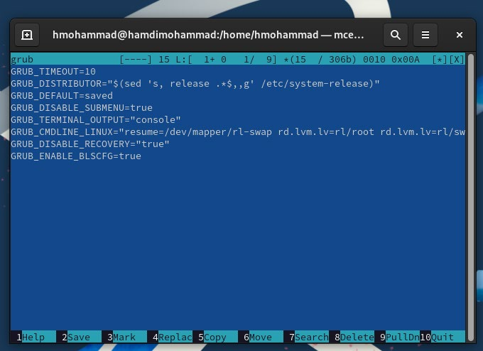
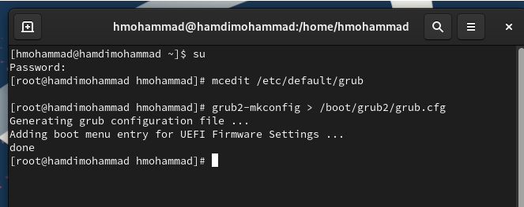
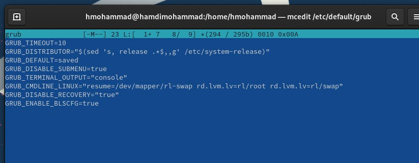
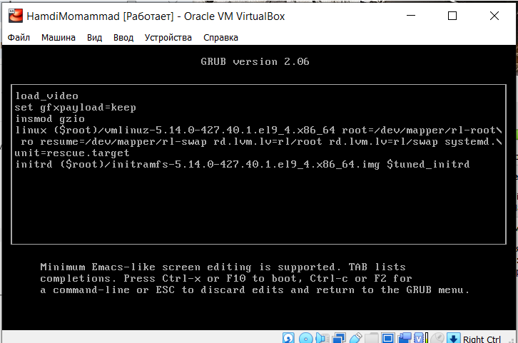
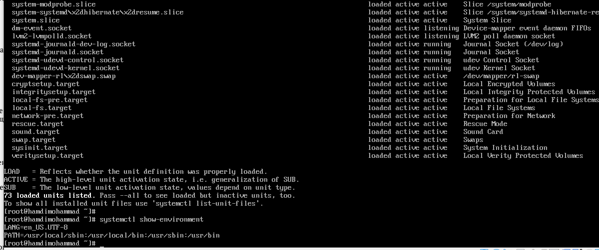
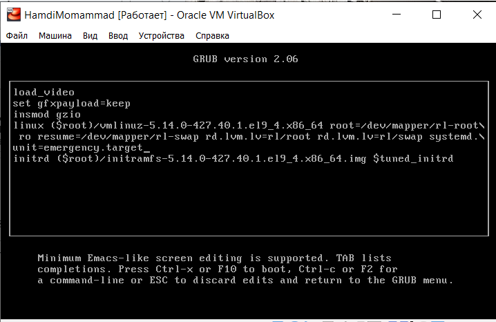
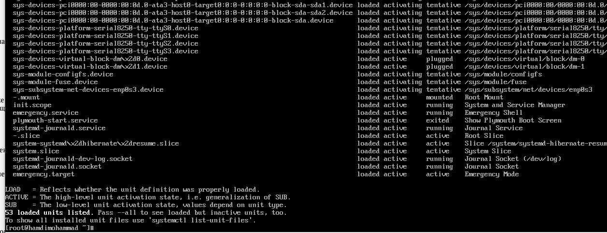
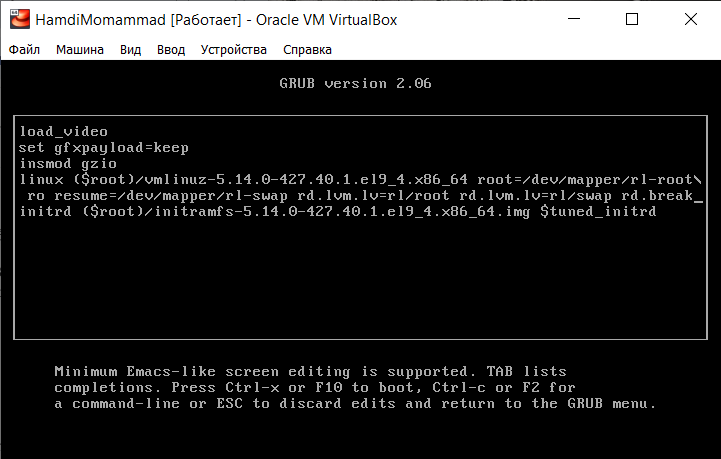
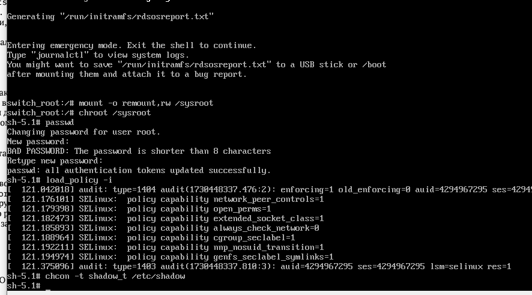
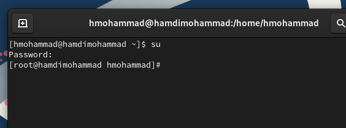

> **РОССИЙСКИЙ** **УНИВЕРСИТЕТ** **ДРУЖБЫ** **НАРОДОВ** **Факультет**
> **физико-математических** **и** **естественных** **наук**
>
> **Кафедра** **прикладной** **информатики** **и** **теории**
> **вероятностей**
>
> **ОТЧЕТ**
>
> **ПО** **ЛАБОРАТОРНОЙ** **РАБОТЕ** **№11**
>
> *<u>дисциплина:</u>* *<u>Основы администрирования операционных
> систем</u>*

Студент: Хамди Мохаммад, 1032235868

> **МОСКВА**
>
> 2<u>024</u> г.

**Постановка** **задачи**

Получить навыки работы с загрузчиком системы GRUB2.

**Выполнение** **работы**

**Модификация** **параметров** **GRUB2**

1\. Запустите терминал и получите полномочия администратора: su –

2\. В файле /etc/default/grub установите параметр отображения меню
загрузки в течение 10 секунд: GRUB_TIMEOUT=10 Сохраните изменения в
файле и закройте редактор.

3. Запишите изменения в GRUB2,
введя в командной строке grub2-mkconfig \> /boot/grub2/grub.cfg или
grub2-mkconfig -o /boot/grub2/grub.cfg

4\. Перезагрузите систему и убедитесь, что при загрузке вы видите
прокрутку загрузочных сообщений. Если вы не наблюдаете меню GRUB, то в
файле /etc/default/grub удалите из строки указания параметров запуска
ядра системы GRUB_CMDLINE_LINUX параметры rhgb и quiet, которые отвечают
за показ графической заставки при запуске системы (для дистрибутивов,
основанных на Red Hat), скрывая процесс загрузки от пользователя.
Сохраните изменения в файле и закройте редактор. Запишите изменения в
GRUB2.

**Устранения** **неполадок**

1\. Запустите (перегрузите) систему. Как только появится меню GRUB,
выберите строку с текущей версией ядра в меню и нажмите e для
редактирования.

2. Прокрутите вниз до строки,
начинающейся с linux (\$root)/vmlinuz-. Эта строка загружает ядро
системы. В конце этой строки введите systemd.unit=rescue.target и
удалите опции rhgb и quit из этой строки, если они там есть.

3\. Нажмите Ctrl + x для продолжения процесса загрузки.

4\. Введите пароль пользователя root при появлении запроса.

5\. Посмотрите список всех файлов модулей, которые загружены в настоящее
время: systemctl list-units Вы можете видеть, что загружена базовая
системная среда.

6\. Посмотрите задействованные переменные среды оболочки: systemctl
show-environment

7\. Перегрузите систему, используя команду systemctl reboot

8. Как только отобразится
меню GRUB, ещё раз нажмите e на строке с текущей версией ядра, чтобы
войти в режим редактора. В конце строки, загружающей ядро, введите
systemd.unit=emergency.target и удалите опции rhgb и quit из этой
строки, если они там есть.

9\. Нажмите Ctrl + x для продолжения процесса
загрузки.

10\. Введите пароль пользователя root при появлении запроса.

11\. После успешного входа в систему посмотрите список всех загруженных
файлов модулей: systemctl list-units Обратите внимание, что количество
загружаемых файлов модулей уменьшилось до минимума.

12\. Перегрузите систему, используя команду: systemctl reboot

**Сброс** **пароля** **root**

1\. Запустите (перегрузите) компьютер. Когда отобразится меню GRUB,
выберите в меню строку с текущей версией ядра системы и нажмите e ,
чтобы войти в режим редактора. В конце строки, загружающей ядро, введите
rd.break и удалите опции rhgb и quit из этой строки, если они там есть.

2\. Нажмите Ctrl + x для продолжения процесса загрузки.

3\. Этап загрузки системы остановится в момент загрузки initramfs,
непосредственно перед монтированием корневой файловой системы в каталоге
/.

4\. Чтобы получить доступ к системному образу для чтения и записи,
наберите mount -o remount,rw /sysroot

5\. Сделайте содержимое каталога /sysimage новым корневым каталогом,
набрав chroot /sysroot

6\. Теперь вы можете ввести команду задания пароля: passwd и установить
новый пароль для пользователя root.

7\. Поскольку на этом очень раннем этапе загрузки SELinux ещё не
активирован, то тип контекста SELinux для файла /etc/shadow будет
испорчен. Если вы перезагрузитесь в этот момент, то никто не сможет
войти в систему. Поэтому вы должны убедиться, что тип контекста
установлен правильно. Чтобы сделать это, на этом этапе вы должны
загрузить политику SELinux с помощью команды load_policy -i

8\. Теперь вы можете вручную установить правильный тип контекста для
/etc/shadow. Для этого введите chcon -t shadow_t /etc/shadow

9.
Перезагрузите систему с помощью команды reboot -f и войдите в систему с
изменённым паролем для пользователя root. Опция -f (--force) означает
принудительную немедленную остановку, выключение или перезагрузку. При
указании один раз это приводит к немедленному, но чистому завершению
работы системным менеджером. Если указано дважды, это приводит к
немедленному завершению работы без обращения к системному менеджеру.

**Контрольные** **вопросы**

1\. Какой файл конфигурации следует изменить для применения общих
изменений в

GRUB2?

> Для применения общих изменений в GRUB2 следует изменить файл
> конфигурации /etc/default/grub.

2\. Как называется конфигурационный файл GRUB2, в котором вы применяете
изменения

для GRUB2?

> Конфигурационный файл GRUB2, в котором вы применяете изменения,
> называется
>
> /boot/grub2/grub.cfg. Однако этот файл не редактируется напрямую,
> изменения
>
> вносятся в /etc/default/grub, а затем обновляется конфигурация GRUB.

3\. После внесения изменений в конфигурацию GRUB2, какую команду вы
должны

выполнить, чтобы изменения сохранились и воспринялись при загрузке
системы?

> После внесения изменений в конфигурацию GRUB2 необходимо выполнить
>
> команду: grub2-mkconfig -o /boot/grub2/grub.cfg

**Заключение**

> Получены навыки работы с загрузчиком GRUB2.
