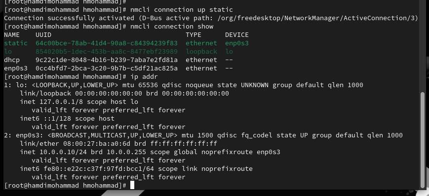
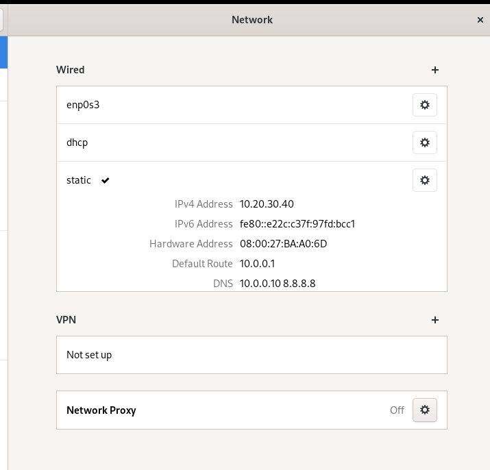

> **РОССИЙСКИЙ** **УНИВЕРСИТЕТ** **ДРУЖБЫ** **НАРОДОВ** **Факультет**
> **физико-математических** **и** **естественных** **наук**
>
> **Кафедра** **прикладной** **информатики** **и** **теории**
> **вероятностей**
>
> **ОТЧЕТ**
>
> **ПО** **ЛАБОРАТОРНОЙ** **РАБОТЕ** **№12**
>
> *<u>дисциплина:</u>* *<u>Основы администрирования операционных
> систем</u>*

Студент: Хамди Мохаммад, 1032235868

> **МОСКВА** 2<u>024</u> г.

**Постановка** **задачи**

Получить навыки настройки сетевых параметров системы.

**Выполнение** **работы**

**Проверка** **конфигурации** **сети**

1\. Получите полномочия администратора: su -

2\. Выведите на экран информацию о существующих сетевых подключениях, а
также

статистику о количестве отправленных пакетов и связанных с ними
сообщениях об

ошибках: ip -s link

Поясните в отчёте полученную информацию об одном из интерфейсов.

Команда выдает MAC адрес и статистипу полученных и отправленных пакетов
в байтах и

количестве пакетах. Также есть счетчики потерянных и отброшенных
пакетов, коллизий,

ошибой.

3\. Выведите на экран информацию о текущих маршрутах: ip route show
Поясните в отчёте

выведенную на экран информацию.

Эта команда показывает маршруты, а именно маршрут через шлюз.

4\. Выведите на экран информацию о текущих назначениях адресов для
сетевых

интерфейсов на устройстве: ip addr show

Поясните в отчёте полученную информацию для одного из интерфейсов.
Определите IPv4-

адрес устройства и обозначение сетевого адаптера.

Устройство enp0s3 с адресом 10.0.2.15/24

5\. Используйте команду ping для проверки правильности подключения к
Интернету.

Например, для отправки
четырёх пакетов на IP-адрес 8.8.8.8 введите ping -c 4 8.8.8.8

6\. Добавьте дополнительный адрес к вашему интерфейсу:

ip addr add 10.0.0.10/24 dev \<yourdevicename\> Здесь \<yourdevicename\>
— название

интерфейса, которому добавляется IP-адрес.

7\. Проверьте, что адрес добавился: ip addr show

8\. Сравните вывод информации от утилиты ip и от команды ifconfig:
ifconfig

9\. Выведите на экран список всех прослушиваемых системой портов UDP и
TCP: ss -tul

**Управление** **сетевыми** **подключениями** **с** **помощью**
**nmcli**

1\. Получите полномочия администратора. Выведите на экран информацию о
текущих

соединениях: nmcli connection show

2\. Добавьте Ethernet-соединение с именем dhcp к интерфейсу: nmcli
connection add con-

name "dhcp" type ethernet ifname \<ifname\> Здесь вместо \<ifname\>
должно быть указано название интерфейса.

3\. Добавьте к этому же интерфейсу Ethernet-соединение с именем static,
статическим

IPv4-адресом адаптера и статическим адресом шлюза: nmcli connection add
con-name

"static" ifname \<ifname\> autoconnect no type ethernet ip4 10.0.0.10/24
gw4 10.0.0.1 ifname

\<ifname\>

Здесь вместо \<ifname\> должно быть указано название интерфейса.

4\. Выведите информацию о текущих соединениях: nmcli connection show

5\. Переключитесь на статическое соединение: nmcli connection up
"static"

Проверьте
успешность переключения при помощи nmcli connection show и ip addr.

6\. Вернитесь к соединению dhcp: nmcli connection up "dhcp"

Проверьте успешность
переключения при помощи nmcli connection show и ip addr.

**Изменение** **параметров** **соединения** **с** **помощью** **nmcli**

1\. Отключите автоподключение статического соединения: nmcli connection
modify "static"

connection.autoconnect no

2\. Добавьте DNS-сервер в статическое соединение: nmcli connection
modify "static"

ipv4.dns 10.0.0.10 Обратите внимание, что при добавлении сетевого
подключения

используется ip4, а при изменении параметров для существующего
соединения

используется ipv4.

3\. Для добавления второго и последующих элементов для тех же параметров
используется

знак +. Если этот знак проигнорировать, то произойдёт замена, а не
добавление элемента.

Добавьте второй DNS-сервер: nmcli connection modify "static" +ipv4.dns
8.8.8.8

4\. Измените IP-адрес статического соединения: nmcli connection modify
"static"

ipv4.addresses 10.0.0.20/24

5\. Добавьте другой IP-адрес для статического соединения: nmcli
connection modify "static"

+ipv4.addresses 10.20.30.40/16

6\. После изменения свойств соединения активируйте его: nmcli connection
up "static"

Проверьте
успешность переключения при помощи nmcli con show и ip addr.

7. Используя nmtui,
посмотрите и опишите в отчёте настройки сети на устройстве.

8. Посмотрите настройки
сетевых соединений в графическом интерфейсе операционной системы.

9\. Переключитесь на первоначальное сетевое соединение: nmcli connection
up "\<ifname\>"

Здесь вместо \<ifname\> должно быть указано название интерфейса.

**Контрольные** **вопросы**

1\. Какая команда отображает только статус соединения, но не IP-адрес?

> Команда: nmcli connection show --active
>
> Эта команда выводит только информацию о статусе активных сетевых
> соединений,
>
> не показывая IP-адреса.

2\. Какая служба управляет сетью в ОС типа RHEL?

> В ОС типа RHEL сеть управляется службой NetworkManager. Для старых
> версий
>
> также может использоваться network service, но с RHEL 7 и выше
> предпочтительнее
>
> NetworkManager.

3\. Какой файл содержит имя узла (устройства) в ОС типа RHEL?

> Имя узла хранится в файле: /etc/hostname
>
> Также можно получить имя устройства с помощью команды hostname.

4\. Какая команда позволяет вам задать имя узла (устройства)?

> Для установки имени хоста можно использовать команду:
>
> sudo hostnamectl set-hostname \<новое_имя_узла\>

5\. Какой конфигурационный файл можно изменить для включения разрешения
имён для

конкретного IP-адреса?

> Для этого используется файл: /etc/hosts
>
> В этот файл можно добавить строки с сопоставлением IP-адресов и
> доменных имён.

6\. Какая команда показывает текущую конфигурацию маршрутизации?

> Для отображения текущей конфигурации маршрутизации используется
> команда:
>
> ip route show

7\. Как проверить текущий статус службы NetworkManager?

> Чтобы проверить статус службы NetworkManager, используйте команду:
>
> systemctl status NetworkManager

8\. Какая команда позволяет вам изменить текущий IP-адрес и шлюз по
умолчанию для

вашего сетевого соединения?

> Для временной смены IP-адреса и шлюза можно использовать команду:
>
> sudo ip addr add \<новый_IP\>/24 dev \<интерфейс\>
>
> sudo ip route add default via \<шлюз\>

**Заключение**

> Получены навыки настройки сетевых параметров системы.
