> **РОССИЙСКИЙ** **УНИВЕРСИТЕТ** **ДРУЖБЫ** **НАРОДОВ** **Факультет**
> **физико-математических** **и** **естественных** **наук**
>
> **Кафедра** **прикладной** **информатики** **и** **теории**
> **вероятностей**
>
> **ОТЧЕТ**
>
> **ПО** **ЛАБОРАТОРНОЙ** **РАБОТЕ** **№13**
>
> *<u>дисциплина:</u>* *<u>Основы администрирования операционных
> систем</u>*

Студент: Хамди Мохаммад, 1032235868

> **МОСКВА**
>
> 2<u>024</u> г.

**Постановка** **задачи**

Получить навыки настройки пакетного фильтра в Linux.

**Выполнение** **работы**

**Управление** **брандмауэром** **с** **помощью** **firewall-cmd**

1\. Получите полномочия администратора: su –

2\. Определите текущую зону по умолчанию, введя: firewall-cmd
--get-default-zone

3\. Определите доступные зоны, введя: firewall-cmd --get-zones

4\. Посмотрите службы, доступные на вашем компьютере, используя

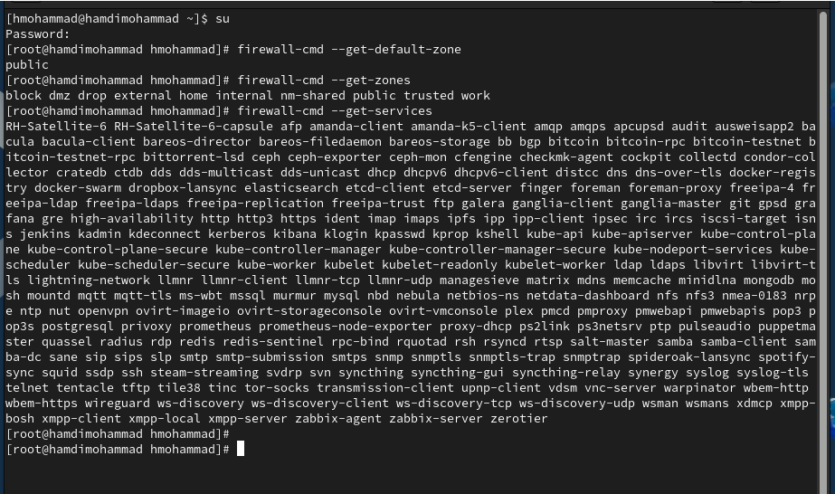firewall-cmd --get-services

5\. Определите доступные службы в текущей зоне: firewall-cmd
--list-services

6\. Сравните результаты вывода информации при использовании команды

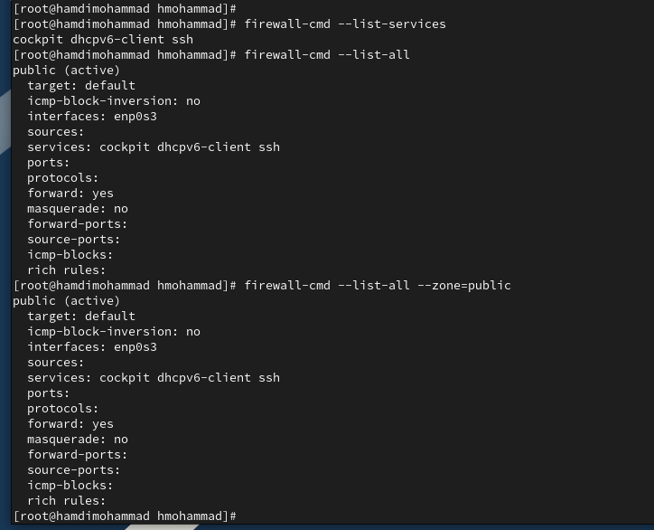firewall-cmd --list-all и
команды firewall-cmd --list-all --zone=public

7\. Добавьте сервер VNC в конфигурацию брандмауэра:

firewall-cmd --add-service=vnc-server

8\. Проверьте, добавился ли vnc-server в конфигурацию: firewall-cmd
--list-all

9\. Перезапустите службу firewalld: systemctl restart firewalld

10\. Проверьте, есть ли vnc-server в конфигурации: firewall-cmd
--list-all Обратите внимание,

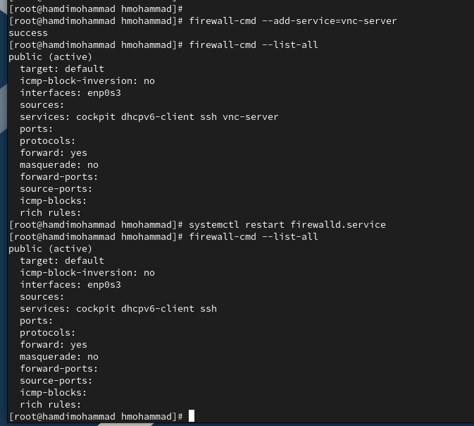что служба vnc-server больше
не указана. Поясните, почему это произошло.

11\. Добавьте службу vnc-server ещё раз, но на этот раз сделайте её
постоянной, используя

команду firewall-cmd --add-service=vnc-server --permanent

12\. Проверьте наличие vnc-server в конфигурации: firewall-cmd
--list-all Вы увидите, что

VNC-сервер не указан. Службы, которые были добавлены в конфигурацию на
диске,

автоматически не добавляются в конфигурацию времени выполнения.

13\. Перезагрузите конфигурацию firewalld и просмотрите конфигурацию
времени

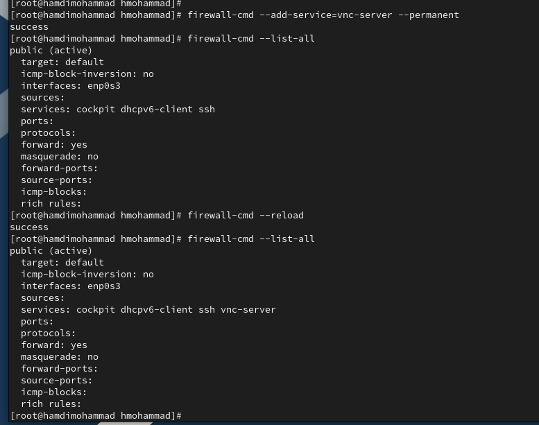выполнения: firewall-cmd
--reload firewall-cmd --list-all

14\. Добавьте в конфигурацию межсетевого экрана порт 2022 протокола TCP:

firewall-cmd --add-port=2022/tcp --permanent

Затем перезагрузите конфигурацию firewalld: firewall-cmd --reload

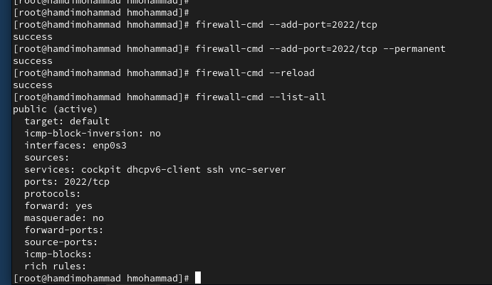15. Проверьте, что порт
добавлен в конфигурацию: firewall-cmd --list-all

**Управление** **брандмауэром** **с** **помощью** **firewall-config**

1\. Откройте терминали подучётной записьюсвоего пользователя
запуститеинтерфейсGUI

firewall-config: firewall-config

Если служба отсутствует, то система предложит вам её установить. Также
при запуске

потребуется ввести пароль пользователя с полномочиями управления этой
службой.

2\. Нажмите выпадающее меню рядом с параметром Configuration . Откройте

раскрывающийся список и выберите Permanent . Это позволит сделать
постоянными все

изменения, которые вы вносите при конфигурировании.

3\. Выберите зону public и отметьте службы http, https и ftp, чтобы
включить их.

4\. Выберите вкладку Ports и на этой вкладке нажмите Add . Введите порт
2022 и протокол

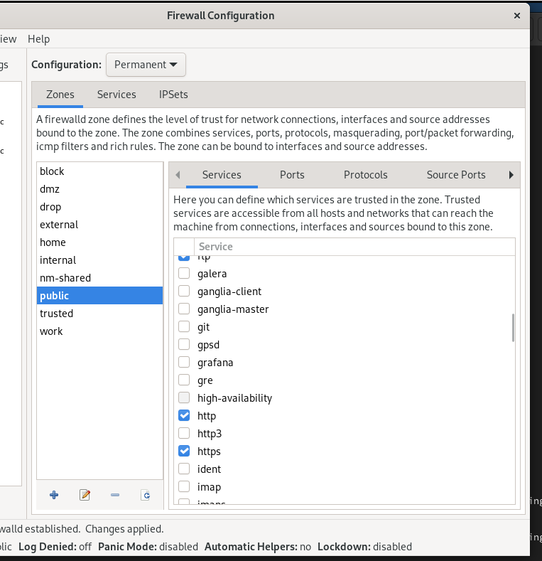udp, нажмите ОК , чтобы
добавить их в список.

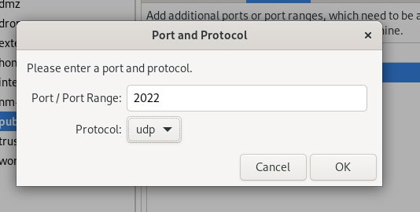

5\. Закройте утилиту firewall-config.

6\. В окне терминала введите firewall-cmd --list-all

Обратите внимание, что изменения, которые вы только что внесли, ещё не
вступилив силу.

Это связано с тем, что вы настроили их как постоянные изменения, а не
как изменения

времени выполнения.

7\. Перегрузите конфигурацию firewall-cmd: firewall-cmd –reload и список
доступных

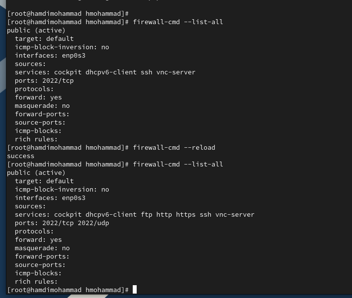сервисов: firewall-cmd
--list-all Вы увидите, что изменения были применены.

**Самостоятельная** **работа**

1\. Создайте конфигурацию межсетевого экрана, которая позволяет получить
доступ

к следующим службам:

– telnet;

– imap;

– pop3;

– smtp.

2.Сделайте этокаквкоманднойстроке
(дляслужбыtelnet),такивграфическоминтерфейсе

(для служб imap, pop3, smtp).

3\. Убедитесь, что конфигурация является постоянной и будет активирована
после

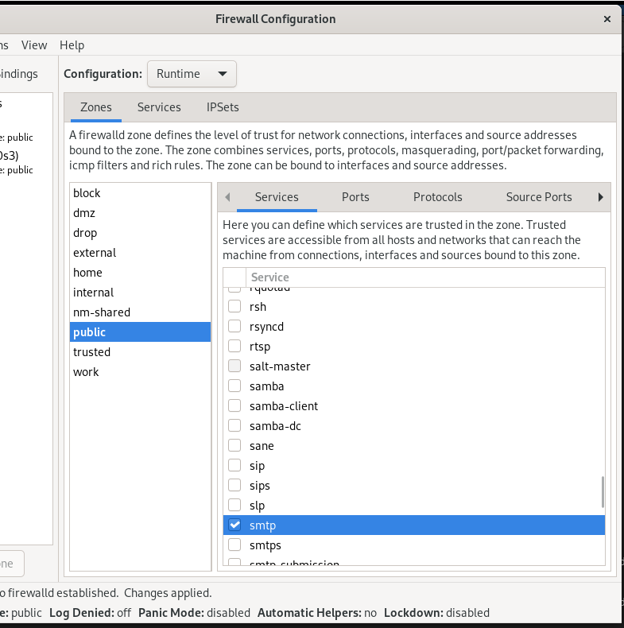перезагрузки компьютера.

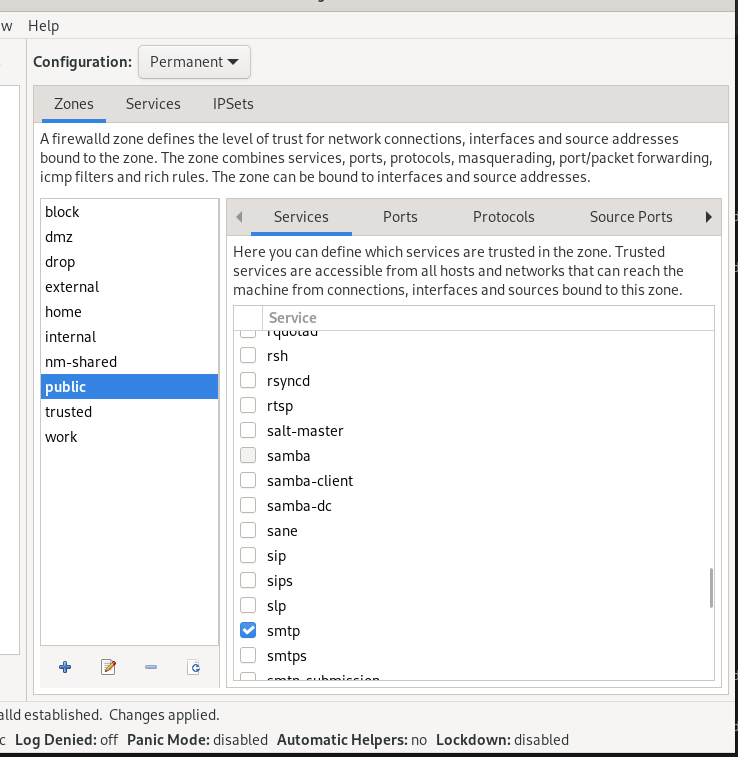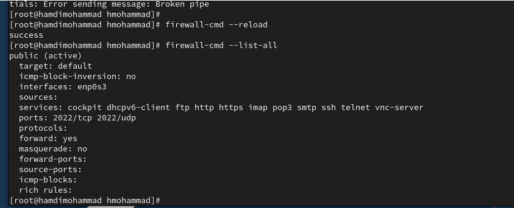

**Контрольные** **вопросы**

1\. Какая служба должна быть запущена перед началом работы с менеджером
конфигурации

брандмауэра firewall-config?

> Перед работой с firewall-config должна быть запущена служба firewalld.
> Команда для
>
> её запуска: sudo systemctl start firewalld

2\. Какая команда позволяет добавить UDP-порт 2355 в конфигурацию
брандмауэра в зоне

по умолчанию?

> Для добавления UDP-порта 2355 в текущую зону (по умолчанию обычно это
> зона
>
> public): sudo firewall-cmd --add-port=2355/udp

3\. Какая команда позволяет показать всю конфигурацию брандмауэра во
всех зонах?

> Чтобы увидеть всю конфигурацию брандмауэра в разных зонах:
>
> sudo firewall-cmd --list-all-zones

4\. Какая команда позволяет удалить службу vnc-server из текущей
конфигурации

брандмауэра?

> Чтобы удалить службу vnc-server из текущей зоны:
>
> sudo firewall-cmd --remove-service=vnc-server

5\. Какая команда firewall-cmd позволяет активировать новую
конфигурацию, добавленную

опцией --permanent?

> Чтобы применить изменения, добавленные с параметром --permanent (для
> их
>
> постоянного сохранения): sudo firewall-cmd --reload

6\. Какой параметр firewall-cmd позволяет проверить, что новая
конфигурация была

добавлена в текущую зону и теперь активна?

> Для проверки активных изменений в текущей зоне можно использовать:
>
> sudo firewall-cmd --list-all

7\. Какая команда позволяет добавить интерфейс eno1 в зону public?

> Чтобы добавить интерфейс eno1 в зону public:
>
> sudo firewall-cmd --zone=public --add-interface=eno1

8\. Если добавить новый интерфейс в конфигурацию брандмауэра, пока не
указана зона, в

какую зону он будет добавлен?

> Если не указана зона, новый интерфейс по умолчанию будет добавлен в
> зону default.
>
> Это зона, которая используется, если не указано иное.

**Заключение**

> Получены навыки настройки сетевого пакетного фильтра.
