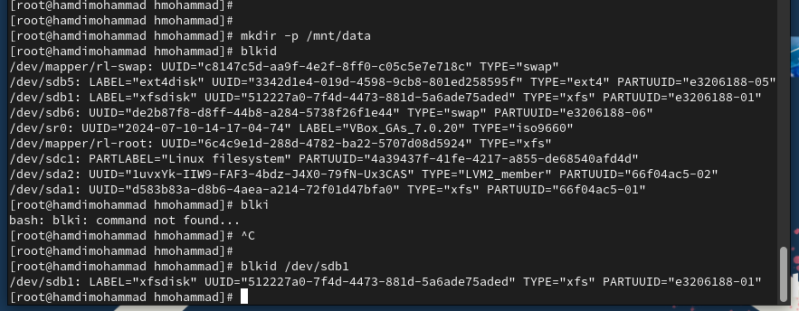

> **РОССИЙСКИЙ** **УНИВЕРСИТЕТ** **ДРУЖБЫ** **НАРОДОВ** **Факультет**
> **физико-математических** **и** **естественных** **наук**
>
> **Кафедра** **прикладной** **информатики** **и** **теории**
> **вероятностей**
>
> **ОТЧЕТ**
>
> **ПО** **ЛАБОРАТОРНОЙ** **РАБОТЕ** **№14**
>
> *<u>дисциплина:</u>* *<u>Основы администрирования операционных
> систем</u>*

Студент: Хамди Мохаммад, 1032235868

> **МОСКВА**
>
> 2<u>024</u> г.

**Постановка** **задачи**

Получить навыки создания разделов на диске и файловых систем. Получить
навыки

монтирования файловых систем.

**Выполнение** **работы**

**Создание** **виртуальных** **носителей**

Подключил к виртуальной машине 2 диска по 512МБ.

**Создание** **разделов** **MBR** **с** **помощью** **fdisk**

1\. Запустите вашу виртуальную машину с добавленными дополнительными
дисками disk1

и disk2.

2\. В командной строке с полномочиями администратора с помощью fdisk
посмотрите

перечень разделов на всех имеющихся в системе устройствах жёстких
дисков: su - fdisk --

list В списке должна отразиться информация о добавленных дисках размером
512 MiB, в

частности название разделов:
/dev/sdb и /dev/sdc.

3\. Предположим, что необходимосделать разметку диска /dev/sdb с помощью
утилиты fdisk

(измените название раздела, если необходимо, в соответствии с вашим
оборудованием):

fdisk /dev/sdb Изменения останутся в памяти только до тех пор, пока вы
не решите их

записать. Будьте внимательны перед использованием команды записи.
Утилита fdisk

записывает изменения на диск только при вводе команды w . Если вы
допустили ошибку и

хотите выйти, то нажмите q для выхода из fdisk без записи изменений.

4. Введите m , чтобы получить
справку по командам.

5\. Прежде чем делать что-либо, рекомендуется проверить, сколько
дискового пространства

у вас есть. Нажмите p , чтобы просмотреть текущее распределение
пространства диска.

Обратите внимание на общее количество секторов и последний сектор,
который в

настоящее время используется. Если последний раздел не заканчивается в
последнем

секторе, то у вас есть свободное место для создания нового раздела.

6\. Введите n , чтобы добавить новый раздел.

7\. Выберите p , чтобы создать основной раздел. Примите номер раздела,
который

предлагается.

8\. Укажите первый сектор на диске, с которого начнётся новый раздел. По
умолчанию

предлагается первый доступный сектор, нажмите Enter для подтверждения
выбора.

9\. Укажите последний сектор, которым будетзавершён раздел. По
умолчаниюпредлагается

последний сектор, доступный на диске. Если вы согласитесь с предложенным
по

умолчанию вариантом, то после этого упражнения у вас не останется
свободного места на диске для создания дополнительных разделов или
логических томов. Поэтому вы должны использовать другой последний
сектор, остановившись на одном из следующих вариантов:

– ввести номер последнего сектора, который вы хотите использовать; –
ввести +номер,

чтобы создать раздел, размер которого составляет определённое количество
секторов; –

ввести +номер (K, M, G), чтобы указать размер, который вы хотите
назначить разделу в

KiB, MiB или GiB. Например, введите +100M, чтобы создать раздел на 100
MiB.

10\. На этом этапе можно определить тип раздела. По умолчанию
используется тип раздела

Linux. Если вы хотите, чтобы раздел имел какой-либо другой тип,
используйте для

изменения t . Вам интересны следующие типы разделов: – 82: Linux swap; –
83: Linux; – 8e:

Linux LVM. Нажмите Enter , чтобы принять тип раздела по умолчанию 83.

11\. Нажмите w , чтобы записать изменения на диск и выйти из fdisk.

12\. Таблица разделов находится только в памяти ядра. Сравните вывод
команды fdisk -l /dev/sdb с выводом команды cat /proc/partitions Опишите
разницу.

13. Запишите изменения в
таблицу разделов ядра: partprobe /dev/sdb

**Создание** **логических** **разделов**

1\. В терминале с полномочиями администратора запустите fdisk /dev/sdb

2\. Введите n , чтобы добавить новый раздел.

3\. Введите e , чтобы создать расширенный раздел.

4\. Если расширенный раздел — четвёртый раздел, который вы записываете в
MBR, он

также будет последним разделом, который можно добавить в MBR. По этой
причине он

должен заполнить всю оставшуюся часть жёсткого диска вашего компьютера.
Нажмите

Enter , чтобы принять первый сектор по умолчанию и снова нажмите Enter ,
когда fdisk

запросит последний сектор.

5\. Теперь, когда расширенный раздел создан, вы можете создать в нём
логический раздел.

Из интерфейса fdisk снова нажмите n . Утилита сообщит, что нет свободных
первичных

разделов и по умолчанию предложит добавить логический раздел с номером
5.

6\. Нажмите Enter , чтобы принять выбор первого сектора в качестве
сектора по умолчанию. На вопрос о последнем секторе введите +101M (или
любой другой размер, который вы хотите использовать).

7\. После создания логического раздела введите w , чтобы записать
изменения на диск и

выйти из fdisk. Чтобы завершить процедуру и обновить таблицу разделов,
введите partprobe

/dev/sdb Новый раздел теперь готов к использованию.

. Просмотрите информацию о добавленных разделах: cat /proc/partitions
fdisk --list /dev/sdb

**Создание** **раздела** **подкачки**

1\. Получите полномочия администратора. Запустите fdisk: fdisk /dev/sdb

2\. Нажмите n , чтобы добавить новый раздел. Утилита сообщит, что нет
свободных

первичных разделов и по умолчанию предложит добавить логический раздел с
номером

раздела 6.

3\. Нажмите Enter , чтобы принять первый сектор по умолчанию. На вопрос
о последнем

секторе введите +100M (или любой другой размер, который вы хотите
использовать).

4\. Далее измените тип раздела. Для этого нажмите t , затем укажите
номер партиции, для

которой хотите изменить тип (в данном случае это номер 6). Затем введите
код типа раздела

(в данном случае 82 — раздел подкачки).

5\. После создания логического раздела введите w , чтобы записать
изменения на диск и

выйти из fdisk. Чтобы завершить процедуру и обновить таблицу разделов
ядра, введите

partprobe /dev/sdb Новый раздел теперь готов к использованию.

6\. Просмотрите информацию о добавленных разделах: cat /proc/partitions
fdisk --list /dev/sdb

7\. Отформатируйте раздел подкачки, используя команду mkswap /dev/sdb6

8\. Для включения вновь выделенного пространства подкачки используйте
swapon /dev/sdb6

9\. Для просмотра размера пространства подкачки, которое в настоящее
время выделено,

введите free -m.

**Создание** **разделов** **GPT** **с** **помощью** **gdisk**

1\. В терминале с полномочиями администратора с помощью gdisk посмотрите
таблицы

разделов и разделы на втором добавленном вами ранее диске /dev/sdc:
gdisk -l /dev/sdc

2\. Создайте раздел с помощью gdisk: gdisk /dev/sdc. Программа gdisk
попытается

определить текущее разбиение диска, и если ничего не обнаружено, то
будет создана

таблица разделов GPT и соответствующее разбиение диска.

3\. Введите n , чтобы добавить новый раздел. Вы можете выбрать любой
номер раздела

между 1 и 128, но разумно принять номер раздела по умолчанию, который
предлагается.

4\. Теперь вас попросят задать первый сектор. По умолчанию будет
использоваться первый

сектор, доступный на диске, но также можно указать смещение. Нажмите
Enter , чтобы

принять предлагаемый по умолчанию первый сектор.

5\. При запросе последнего сектора по умолчанию предлагается последний
сектор,

доступный на диске (создаётся раздел, который заполняет весь жёсткий
диск). Можно указать другой последний сектор или указать размер диска,
используя +, размер и размерность(KMGTP). Чтобысоздатьраздел диска
размером 100 MiB,используйте +100M.

6\. Теперь предлагается установить тип раздела. Если ничего не делать,
то тип раздела

устанавливается в 8300, что является типом раздела файловой системы
Linux. Также

доступны другие варианты. Можно нажать l , чтобы отобразить список
доступных типов

разделов. Вам интересны следующие типы разделов: – 8200: Linux swap; –
8300: Linux; –

8e00: Linux LVM. Обратите внимание, что это те же типы разделов, которые
используются

в MBR, с двумя нулями, добавленными к их именам. Можно просто нажать
Enter , чтобы

принять тип раздела 8300 по умолчанию.

7\. Теперь раздел создан (но ещё не записан на диск). Нажмите p , чтобы
отобразить

разбиение диска.

8\. Если текущее разбиение устраивает, нажмите w , чтобы записать
изменения на диск.

9\. Обновите таблицу разделов: partprobe /dev/sdc

10. Просмотрите информацию о
добавленных разделах: cat /proc/partitions gdisk -l /dev/sdc

**Форматирование** **файловой** **системы** **XFS**

1\. В терминале с полномочиями администратора для диска dev/sdb1
создайте файловую

систему XFS: mkfs.xfs /dev/sdb1

2\. Для установки метки файловой системы в xfsdisk используйте команду
xfs_admin -L

xfsdisk /dev/sdb1

**Форматирование** **файловой** **системы** **EXT4**

1\. В терминале с полномочиями администратора для диска dev/sdb5
создайте файловую

систему EXT4: mkfs.ext4 /dev/sdb5

2\. Для установки метки файловой системы в ext4disk используйте команду
tune2fs -L

ext4disk /dev/sdb5

3\. Для установки параметров монтирования по умолчанию для файловой
системы

используйте команду tune2fs -o acl,user_xattr /dev/sdb5. В данном случае
включены списки

контроля доступа и расширенные атрибуты пользователя.

**Ручное** **монтирование** **файловых** **систем**

Для ручной установки файловой системы используется команда mount. Чтобы
отключить

смонтированную файловую систему, используется команда umount.

1\. Получите полномочия администратора. Для создания точки монтирования
для раздела

введите mkdir -p /mnt/tmp

2\. Чтобы смонтировать файловую систему, используйте следующую команду
mount

/dev/sdb5 /mnt/tmp

3\. Для проверки корректности монтирования раздела введите: mount

4\. Чтобы отмонтировать раздел, можно использовать umount либо с именем
устройства,

либо с именем точки монтирования. Таким образом, обе следующие команды
будут

работать: umount /dev/sdb5 или umount /mnt/tmp

5\. Проверьте, что раздел отмонтирован: mount

**Монтирование** **разделов** **с** **помощью** **/etc/fstab**

В этом упражнении требуется подмонтировать отформатированный раздел XFS
/dev/sdb1,

который был создан в предыдущих упражнениях.

1\. Получите полномочия администратора.

2\. Создайте точку монтирования для раздела XFS /dev/sdb1: mkdir -p
/mnt/data

3\. Посмотрите информацию об идентификаторах блочных устройств (UUID):
blkid Эта

утилита позволяет определить тип файловой системы блочного устройства
(TYPE), его

идентификатор (UUID) и метку тома (LABEL). UUID представляет собой
16-байтный (128-битный) номер. В каноническом представлении UUID
отображается в виде числа в шестнадцатеричной системе счисления,
разделённого дефисами на пять групп в формате 8-4-4-4-12. Такое
представление занимает 36 символов.

4\. Введите blkid /dev/sdb1 и затем используйте мышь, чтобы скопировать
значение

идентификатора UUID для устройства /dev/sdb1.

5\. Откройте файл /etc/fstab на редактирование и добавьте следующую
строку:

UUID=значение_идентификатора /mnt/data xfs defaults 1 2

6\. Перед попыткой автоматического монтирования при перезагрузке
рекомендуется

проверить конфигурацию. Следующая команда монтирует всё, что указано в
/etc/fstab:

mount -a

7. Проверьте, что раздел
примонтирован правильно: df -h

**Самостоятельная** **работа**

1\. Добавьте две партиции на диск с разбиением GPT. Создайте оба раздела
размером 100

MiB. Один из этих разделов должен быть настроен как пространство
подкачки, другой

раздел должен быть отформатирован файловой системой ext4.

2\. Настройте сервер для автоматического монтирования этих разделов.
Установите раздел

ext4 на /mnt/data-ext и установите пространство подкачки в качестве
области подкачки.

3. Перезагрузите вашу систему
и убедитесь, что всё установлено правильно.

**Контрольные** **вопросы**

1\. Какой инструмент используется для создания разделов GUID?

Для создания разделов GUID используется инструмент gdisk (GPT fdisk). 2.
Какой инструмент применяется для создания разделов MBR?

> Для создания разделов MBR используется инструмент fdisk.

3\. Какой файл используется для автоматического монтирования разделов во
время

загрузки?

> Для автоматического монтирования разделов во время загрузки
> используется файл
>
> /etc/fstab.

4\. Какой вариант монтирования целесообразно выбрать, если необходимо,
чтобы файловая

система не была автоматически примонтирована во время загрузки?

> Для того чтобы файловая система не монтировалась автоматически во
> время
>
> загрузки, нужно использовать опцию noauto в файле /etc/fstab.

5\. Какая команда позволяет форматировать раздел с типом 82 с
соответствующей файловой

системой?

> Для форматирования раздела с типом 82 (Linux swap) используется
> команда mkswap.
>
> Для других типов файловых систем можно использовать команды вроде
> mkfs.ext4,
>
> mkfs.xfs и т. д., в зависимости от нужной файловой системы.

6\. Вы только что добавили несколько разделов для автоматического
монтирования при

загрузке. Как можно безопасно проверить, будет ли это работать без
реальной

перезагрузки?

> Для проверки без перезагрузки можно использовать команду mount -a,
> которая
>
> попытается смонтировать все файловые системы, указанные в /etc/fstab.

7\. Какая файловая система создаётся, если вы используете команду mkfs
без какой-либо

спецификации файловой системы?

> Если вы используете команду mkfs без указания файловой системы, по
> умолчанию
>
> создается файловая система ext2

8\. Как форматировать раздел EXT4?

> Для форматирования раздела в файловую систему EXT4 используется
> команда:
>
> mkfs.ext4 /dev/sdXn
>
> Где /dev/sdXn — это путь к разделу, который необходимо
> отформатировать.

9\. Как найти UUID для всех устройств на компьютере?

> Для нахождения UUID всех устройств на компьютере можно использовать
> команду:
>
> blkid
>
> Эта команда покажет UUID всех подключенных блоковых устройств.

**Заключение**

> Получены навыки создания и монтирования разделов файловой системы.
