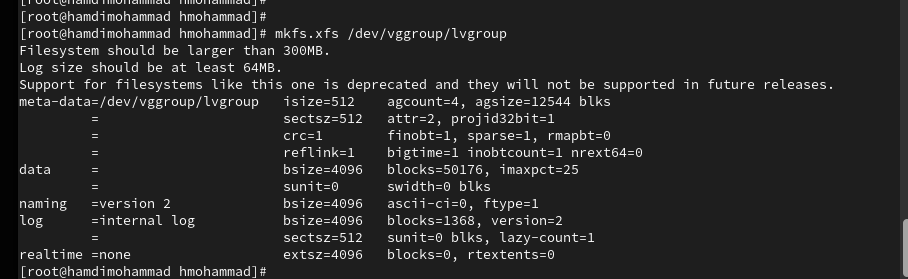

> **РОССИЙСКИЙ** **УНИВЕРСИТЕТ** **ДРУЖБЫ** **НАРОДОВ** **Факультет**
> **физико-математических** **и** **естественных** **наук**
>
> **Кафедра** **прикладной** **информатики** **и** **теории**
> **вероятностей**
>
> **ОТЧЕТ**
>
> **ПО** **ЛАБОРАТОРНОЙ** **РАБОТЕ** **№15**
>
> *<u>дисциплина:</u>* *<u>Основы администрирования операционных
> систем</u>*

Студент: Хамди Мохаммад, 1032235868

> **МОСКВА**
>
> 2<u>024</u> г.

**Постановка** **задачи**

Получить навыки управления логическими томами.

**Выполнение** **работы**

**Создание** **физического** **тома**

1\. В терминале с полномочиями администратора в файле /etc/fstab удалите
(или

закомментируйте) строки автомонтирования /mnt/data и /mnt/data-ext.

2\. Отмонтируйте /mnt/data и /mnt/data-ext: umount /mnt/data umount
/mnt/data-ext

3\. С помощью команды mount без параметров убедитесь, что диски /dev/sdb
и /dev/sdc не

подмонтированы.

4\. С помощью fdisk сделайте новую разметку для /dev/sdb и /dev/sdc,
удалив ранее

созданные партиции: – В терминале с полномочиями администратора введите
fdisk

/dev/sdb. – Введите p для просмотра текущей разметки дискового
пространства. Затем для

удаления всех имеющихся партиций на диске достаточно создать новую
пустую таблицу

DOS-партиции, используя команду o . Убедитесь, что партиции удалены,
введя p .

Сохраните изменения, введя w .

5\. Запишите изменения в таблицу разделов ядра: partprobe /dev/sdb

6\. Просмотрите информацию о разделах: cat /proc/partitions fdisk --list
/dev/sdb

1\. В терминале с полномочиями администратора с помощью fdisk создайте
основной раздел

с типом LVM: – Введите fdisk /dev/sdb – Введите n , чтобы создать новый
раздел. Выберите

p , чтобы сделать его основным разделом, и используйте номер раздела,
который

предлагается по умолчанию. Если вы используете чистое устройство, это
будет номер

раздела 1. – Нажмите Enter при запросе для первого сектора и введите
+100M, чтобы

выбрать последний сектор. – Вернувшись в приглашение fdisk, введите t ,
чтобы изменить

тип раздела. Поскольку существует только один раздел, fdisk не
спрашивает, какой раздел

использовать. – Программа запрашивает тип раздела, который вы хотите
использовать.

Выберите 8е. Затем нажмите w , чтобы записать изменения на диск и выйти
из fdisk.

2\. Чтобы обновить таблицу разделов, введите partprobe /dev/sdb

3\. Теперь, когда раздел был создан, вы должны указать его как
физический том LVM. Для

этого введите (с учётом наименования дисков в вашей системе): pvcreate
/dev/sdb1

4\. Теперь введите pvs, чтобы убедиться, что физический том создан
успешно. Обратите

внимание, что в этом списке уже существует другой физический том, так
как RHEL по

умолчанию использует LVM для организации хранилища.

**Создание** **группы** **томов** **и** **логических** **томов**

1\. В терминале с полномочиями администратора проверьте доступность
физических томов

в вашей системе: pvs Вы должны увидеть созданный вами физический том
/dev/sdb1.

2\. Создайте группу томов с присвоенным ей физическим томом: vgcreate
vgdata /dev/sdb1

3\. Убедитесь, что группа томов была создана успешно: vgs Затем введите
pvs Обратите

внимание, что теперь эта команда показывает имя физических томов с
именами групп

томов, которым они назначены.

4\. Введите lvcreate -n lvdata -l 50%FREE vgdata Это создаст логический
том LVM с именем

lvdata, который будетиспользовать50%доступного дискового
пространствавгруппетомов

vgdata.

5\. Для проверки успешного добавления тома введите lvs

6\. На этом этапе вы готовы создать файловую систему поверх логического
тома. Для этого

введите mkfs.ext4 /dev/vgdata/lvdata

7\. Чтобы создать папку, на которую можно смонтировать том, введите
mkdir -p /mnt/data

8. Добавьте следующую строку
в /etc/fstab: /dev/vgdata/lvdata /mnt/data ext4 defaults 1 2

9\. Проверьте, монтируется ли файловая система: mount -a mount \| grep
/mnt

**Изменение** **размера** **логических** **томов**

1\. В терминале с полномочиями администратора введите pvs и vgs, чтобы
отобразить

текущую конфигурацию физических томов и группы томов.

2\. С помощью fdisk добавьте раздел /dev/sdb2 размером 100 М. Задайте
тип раздела 8e.

3\. Создайте физический том: pvcreate /dev/sdb2

4\. Расширьте vgdata: vgextend vgdata /dev/sdb2

5\. Проверьте, что размер доступной группы томов увеличен: vgs

6\. Проверьте текущий размер логического тома lvdata: lvs

7. Проверьте текущий размер
файловой системы на lvdata: df -h

8\. Увеличьте lvdata на 50% оставшегося доступного дискового
пространства в группе

томов: lvextend -r -l +50%FREE /dev/vgdata/lvdata

9. Убедитесь, что добавленное
дисковое пространство стало доступным: lvs df -h

10\. Уменьшите размер lvdata на 50 МБ: lvreduce -r -L -50M
/dev/vgdata/lvdata Обратите

внимание, что при этом том временно размонтируется.

11. Убедитесь в успешном
изменении дискового пространства: lvs df -h

**Самостоятельная** **работа**

1\. Создайте логический том lvgroup размером 200 МБ. Отформатируйте его
в файловой

системе XFS и cмонтируйте его постоянно на /mnt/groups. Перезагрузите
виртуальную

машину, чтобы убедиться, что устройство подключается.

2\. Послеперезагрузки добавьтеещё150 МБктому lvgroup. Убедитесь, что
размер файловой

системы также изменится при изменении размера тома.

3.
Убедитесь, что расширение тома выполнено успешно.

**Контрольные** **вопросы**

1\. Какой тип раздела используется в разделе GUID для работы с LVM?

> Для работы с LVM используется тип раздела GUID 8e00 (Linux LVM).

2\. Какой командой можно создать группу томов с именем vggroup, которая
содержит

физическое устройство /dev/sdb3 и использует физический экстент 4 MiB?

> vgcreate --physicalextentsize 4M vggroup /dev/sdb3

3\. Какая команда показывает краткую сводку физических томов в вашей
системе, а также

группу томов, к которой они принадлежат?

> Pvs Команда выводит информацию о физических томах, включая их размер,
> статус
>
> и принадлежность к группам томов

4\. Что вам нужно сделать, чтобы добавить весь жёсткий диск /dev/sdd в
группу томов

группы?

> Сделать устройство физическим томом для LVM: pvcreate /dev/sdd
>
> Добавить физический том в группу томов: vgextend vggroup /dev/sdd

5\. Какая команда позволяет вам создать логический том lvvol1 с размером
6 MiB?

> lvcreate -L 6M -n lvvol1 vggroup
>
> -L 6M задаёт размер логического тома.
>
> -n lvvol1 задаёт имя тома.

6\. Какая команда позволяет вам добавить 100 МБ в логический том lvvol1,
если

предположить, что дисковое пространство доступно в группе томов?

> lvextend -L +100M /dev/vggroup/lvvol1

7\. Каков первый шаг, чтобы добавить ещё 200 МБ дискового пространства в
логический

том, если требуемое дисковое пространство недоступно в группе томов?

> Первый шаг — расширить группу томов, добавив к ней новый физический
> том или
>
> раздел. Например:
>
> pvcreate /dev/sde1
>
> vgextend vggroup /dev/sde1

**Заключение**

Получены навыки управления логическими томами.

> .
