> **РОССИЙСКИЙ** **УНИВЕРСИТЕТ** **ДРУЖБЫ** **НАРОДОВ** **Факультет**
> **физико-математических** **и** **естественных** **наук**
>
> **Кафедра** **прикладной** **информатики** **и** **теории**
> **вероятностей**
>
> **ОТЧЕТ**
>
> **ПО** **ЛАБОРАТОРНОЙ** **РАБОТЕ** **№16**
>
> *<u>дисциплина:</u>* *<u>Основы администрирования операционных
> систем</u>*

Студент: Файсал Ахмад, 1032235499

> **МОСКВА**
>
> 2<u>024</u> г.

**Постановка** **задачи**

Освоить работу с RAID-массивами при помощи утилиты mdadm.

**Выполнение** **работы**

**Создание** **RAID-диска**

1\. Запустите виртуальную машину. Получите полномочия администратора: su
–

2\. Проверьте наличие созданных вами на предыдущем этапе дисков: fdisk
-l \| grep /dev/sd

Если предыдущая работа по LVM у вас выполнена успешно, то в системе
добавленные диски отобразятся как /dev/sdd, /dev/sde, /dev/sdf.

Создайте на каждом из дисков раздел: sfdisk /dev/sdd \<\<EOF

; EOF

sfdisk /dev/sde \<\<EOF ;

EOF

sfdisk /dev/sdf \<\<EOF ;

EOF

4\. Проверьте текущий тип созданных разделов: sfdisk --print-id /dev/sdd
1

sfdisk --print-id /dev/sde 1 sfdisk --print-id /dev/sdf 1

В отчёте укажите, какой тип имеют созданные вами разделы на дисках.

5\. Просмотрите, какие типы партиций, относящиеся к RAID, можно задать:
sfdisk -T \| grep -i raid

6\. Установите тип разделов в Linux raid autodetect: sfdisk --change-id
/dev/sdd 1 fd

sfdisk --change-id /dev/sde 1 fd sfdisk --change-id /dev/sdf 1 fd

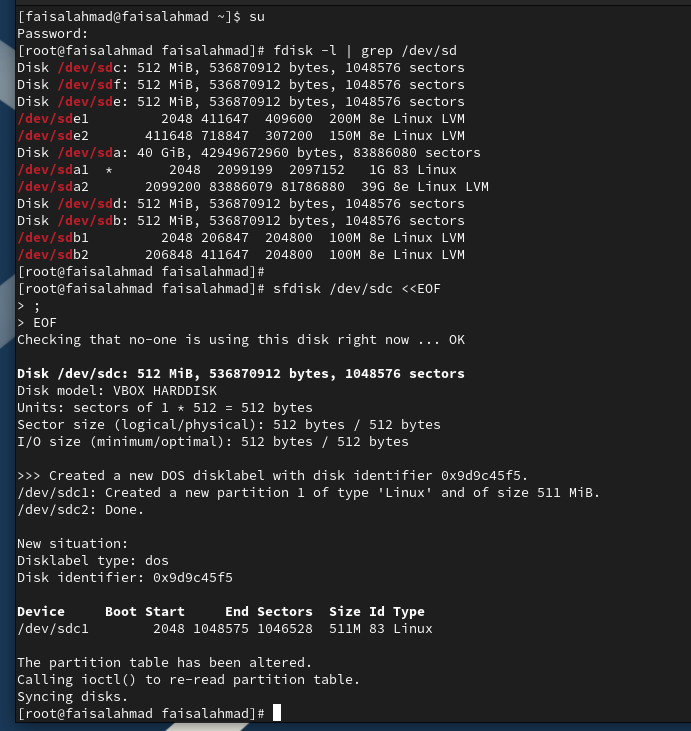

7\. Просмотрите состояние дисков: sfdisk -l /dev/sdd

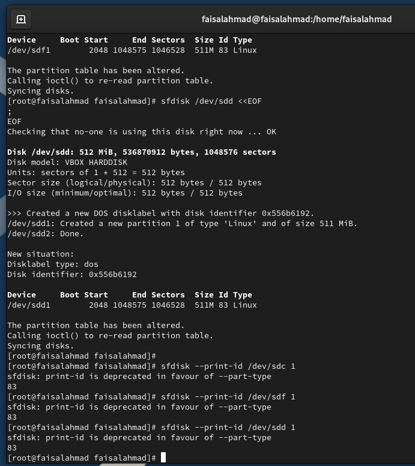sfdisk -l /dev/sde sfdisk -l
/dev/sdf

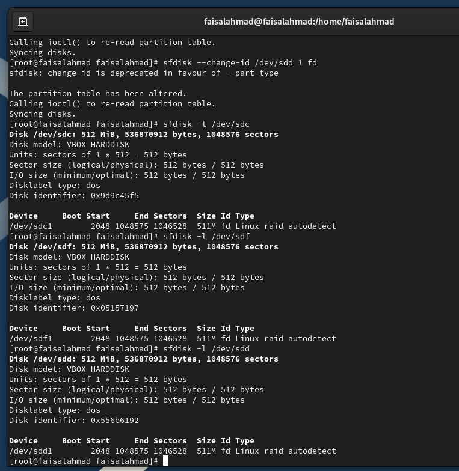

8\. Если утилита mdadm не установлена в вашей системе, то установите её.

9\. При помощи утилиты mdadm создайте массив RAID 1 из двух дисков:
mdadm --create --verbose /dev/md0 --level=1 --raid-devices=2 /dev/sdd1
/dev/sde1

10\. Проверьте состояние массива RAID, используя команды cat
/proc/mdstat

mdadm --query /dev/md0 mdadm --detail /dev/md0

Опишите состояние массива в отчёте.

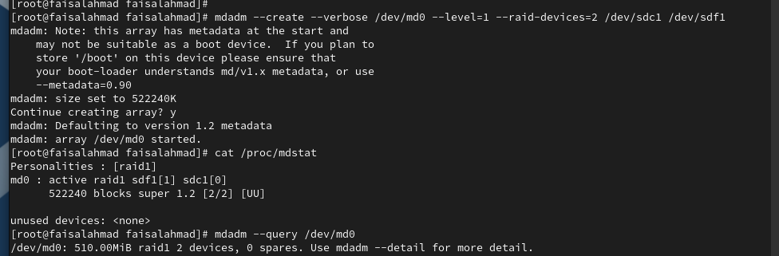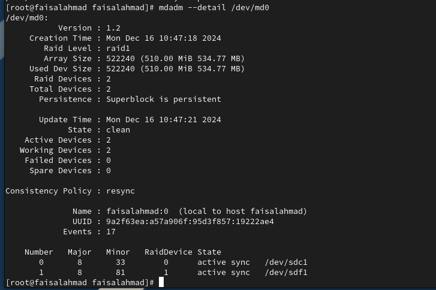

11\. Создайте файловую систему на RAID: mkfs.ext4
/dev/md0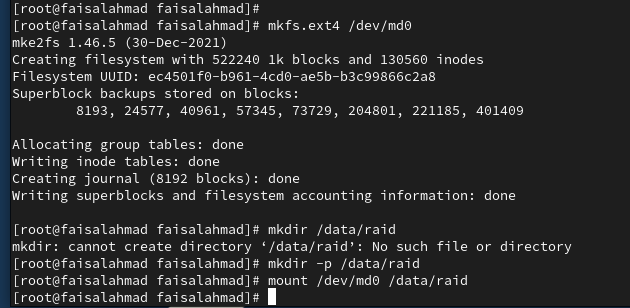

12\. Подмонтируйте RAID: mkdir /data mount /dev/md0 /data

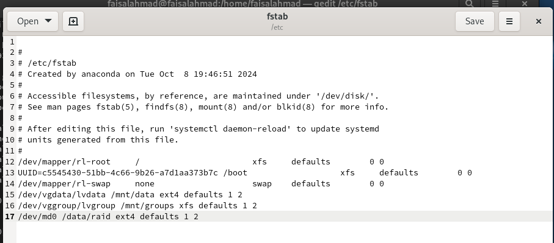13. Для автомонтирования
добавьте запись в /etc/fstab: /dev/md0 /data ext4 defaults 1 2

14\. Сымитируйте сбой одного из дисков: mdadm /dev/md0 --fail /dev/sde1

15\. Удалите сбойный диск: mdadm /dev/md0 --remove /dev/sde1

16\. Замените диск в массиве: mdadm /dev/md0 --add /dev/sdf1

17. Посмотрите состояние
массива и опишите его в отчёте.

18\. Удалите массив и очистите метаданные: umount /dev/md0 mdadm --stop
/dev/md0 mdadm --zero-superblock /dev/sdd1 mdadm --zero-superblock
/dev/sde1 mdadm --zero-superblock
/dev/sdf1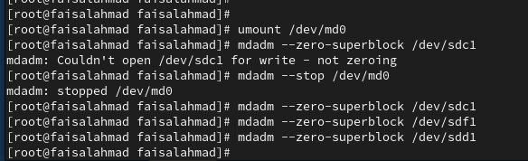

**RAID-массив** **с** **горячим** **резервом** **(hotspare)**

1\. Получите полномочия администратора: su –

2\. Создайте массив RAID 1 из двух дисков: mdadm --create --verbose
/dev/md0 --level=1 --raid-devices=2 /dev/sdd1 /dev/sde1

3\. Добавьте третий диск: mdadm --add /dev/md0 /dev/sdf1

4\. Подмонтируйте /dev/md0 mount /dev/md0

5.
Проверьте состояние массива: cat /proc/mdstat mdadm --query /dev/md0
mdadm --detail /dev/md0 Опишите состояние массива в отчёте.

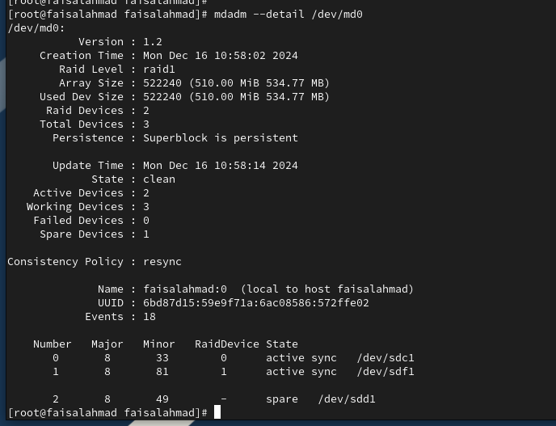

6\. Сымитируйте сбой одного из дисков: mdadm /dev/md0 --fail
/dev/sde1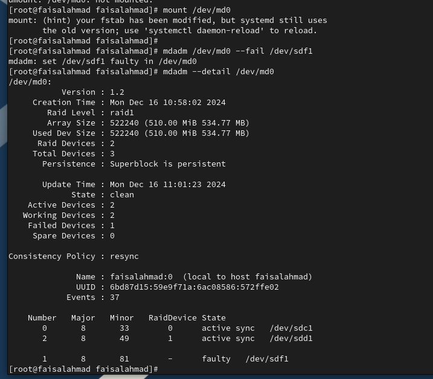

7\. Проверьте состояние массива: mdadm --detail /dev/md0

Убедитесь, что массив автоматически пересобирается. Отобразите и
поясните состояние массива в отчёте.

8\. Удалите массив и очистите метаданные: umount /dev/md0

mdadm --stop /dev/md0

mdadm --zero-superblock /dev/sdd1 mdadm --zero-superblock /dev/sde1
mdadm --zero-superblock /dev/sdf1

**Преобразование** **массива** **RAID** **1** **в** **RAID** **5** 1.
Получите полномочия администратора: su –

2\. Создайте массив RAID 1 из двух дисков: mdadm --create --verbose
/dev/md0 --level=1 --raid-devices=2 /dev/sdd1 /dev/sde1

3\. Добавьте третий диск: mdadm --add /dev/md0 /dev/sdf1

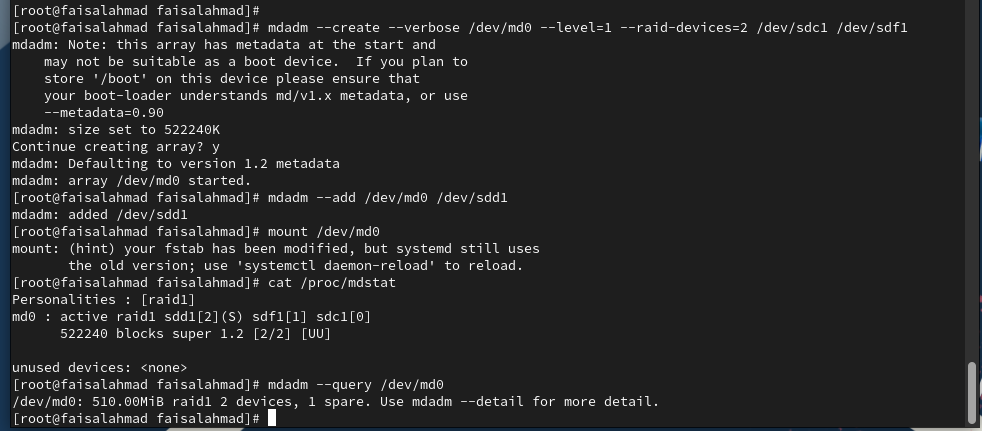4. Подмонтируйте /dev/md0
mount /dev/md0

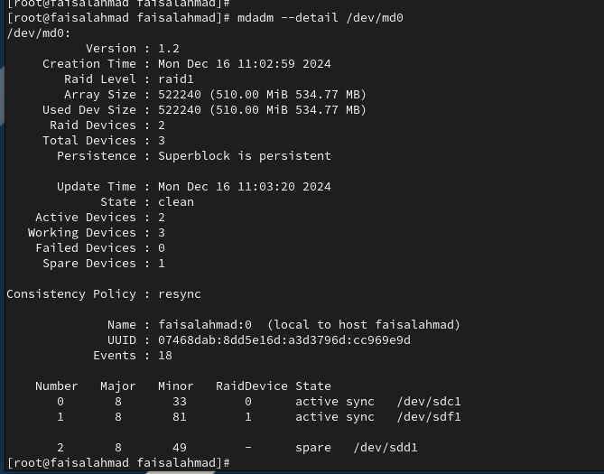5. Проверьте состояние массива:
cat /proc/mdstat mdadm --query /dev/md0 mdadm --detail /dev/md0 Опишите
состояние массива в отчёте.

6\. Измените тип массива RAID: mdadm --grow /dev/md0 --level=5

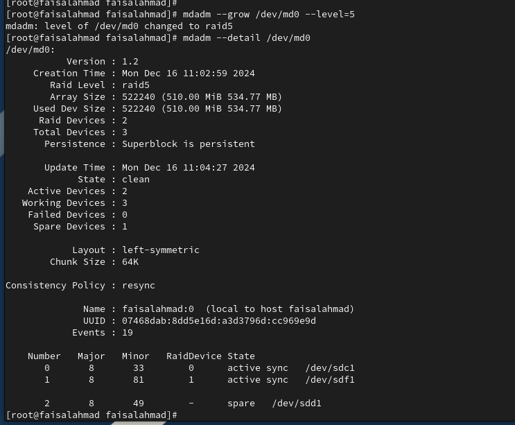7. Проверьте состояние
массива: mdadm --detail /dev/md0 Опишите состояние массива в отчёте.

8\. Измените количество дисков в массиве RAID 5: mdadm --grow /dev/md0
--raid-devices 3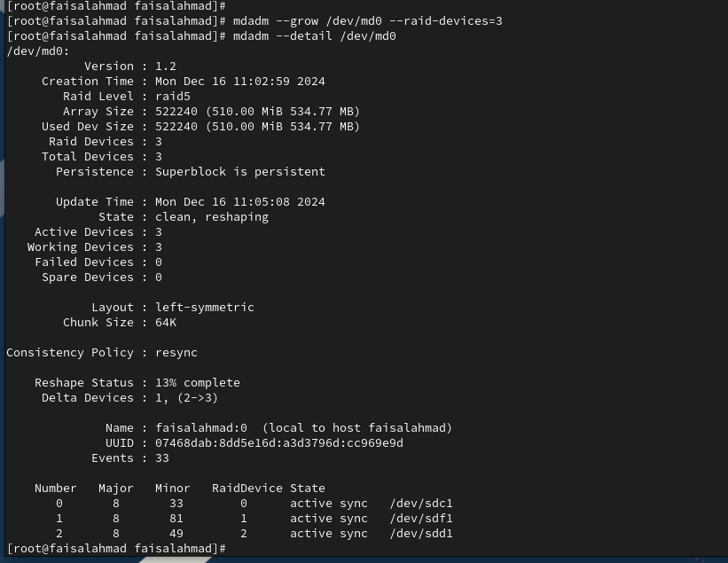

9\. Проверьте состояние массива: mdadm --detail /dev/md0 Опишите
состояние массива в отчёте.

10\. Удалите массив и очистите метаданные: umount /dev/md0 mdadm --stop
/dev/md0 mdadm --zero-superblock /dev/sdd1 mdadm --zero-superblock
/dev/sde1 mdadm --zero-superblock /dev/sdf1

11\. Закомментируйте запись в /etc/fstab: /dev/md0 /data ext4 defaults 1
2

**Контрольные** **вопросы**

1\. Приведите определение RAID.

RAID (Redundant Array of Independent Disks) — это технология объединения
нескольких

физических жестких дисков в один логический массив для повышения

производительности, надежности или емкости. Использование RAID позволяет
обеспечить защиту данных от сбоев, улучшить скорость доступа к ним или
увеличить объем доступного пространства.

2\. Какие типы RAID-массивов существуют на сегодняшний день?

На сегодняшний день существуют следующие основные типы RAID:

> • **RAID** **0** • **RAID** **1** • **RAID** **5** • **RAID** **6**
>
> • **RAID** **10** (комбинированный массив 1+0)
>
> • **RAID** **50**, **RAID** **60** (комбинированные массивы 5+0, 6+0).
>
> Также существуют проприетарные и программные реализации, такие как
> JBOD (Just a Bunch of Disks).

3\. Охарактеризуйте RAID 0, RAID 1, RAID 5, RAID 6, опишите алгоритм
работы,

назначение, приведите примеры применения.

> **RAID** **0**
>
> • **Алгоритм** **работы:** Данные равномерно распределяются между
> всеми дисками без избыточности. Это называется стрипинг (разделение
> данных на блоки и запись их на разные диски).
>
> • **Назначение:** Повышение скорости записи/чтения данных.
>
> • **Достоинства:** Высокая производительность и максимальное
> использование доступного пространства.
>
> •  **Недостатки:** Отсутствие отказоустойчивости. Поломка одного диска
> ведет к потере всех данных.
>
> • **Применение:** Сценарии, где критична скорость (например, работа с
> временными файлами, обработка видео).
>
> **RAID** **1**
>
> • **Алгоритм** **работы:** Дублирование данных (мирроринг). Одни и те
> же данные записываются на каждый из двух дисков.
>
> • **Назначение:** Повышение надежности хранения данных.
>
> • **Достоинства:** Высокая отказоустойчивость. Если один диск выйдет
> из строя, данные сохранятся на другом.
>
> •      **Недостатки:** Половина емкости используется для дублирования.
> Производительность записи ограничена скоростью одного диска.
>
> • **Применение:** Системы с критически важными данными, требующие
> высокой надежности (например, бухгалтерские данные, серверы баз
> данных).
>
> **RAID** **5**
>
> • **Алгоритм** **работы:** Данные и информация четности распределяются
> между всеми дисками. Четность используется для восстановления данных в
> случае отказа одного диска.
>
> •  **Назначение:** Сбалансированное решение между производительностью,
> надежностью и эффективностью использования пространства.
>
> • **Достоинства:** Устойчивость к отказу одного диска, экономия
> пространства (по сравнению с RAID 1).
>
> •  **Недостатки:** Сложность восстановления данных при отказе (большая
> нагрузка на оставшиеся диски), уменьшенная скорость записи.
>
> • **Применение:** Файловые серверы, системы резервного копирования,
> корпоративные хранилища данных.
>
> **RAID** **6**
>
> • **Алгоритм** **работы:** Данные и информация четности распределяются
> между всеми дисками, с добавлением дополнительного уровня четности.
> Это позволяет массиву выдерживать выход из строя двух дисков.
>
> • **Назначение:** Повышение отказоустойчивости по сравнению с RAID 5.
> • **Достоинства:** Устойчивость к одновременному отказу двух дисков.
>
> •  **Недостатки:** Более низкая скорость записи, меньшее эффективное
> использование дискового пространства (чем в RAID 5).
>
> • **Применение:** Критически важные системы, где требуется высокая
> надежность (например, крупные базы данных, облачные хранилища).

**Заключение**

Освоили работу с RAID-массивами

> .
