> **РОССИЙСКИЙ** **УНИВЕРСИТЕТ** **ДРУЖБЫ** **НАРОДОВ** **Факультет**
> **физико-математических** **и** **естественных** **наук**
>
> **Кафедра** **прикладной** **информатики** **и** **теории**
> **вероятностей**
>
> **ОТЧЕТ**
>
> **ПО** **ЛАБОРАТОРНОЙ** **РАБОТЕ** **№16**
>
> *<u>дисциплина:</u>* *<u>Основы администрирования операционных
> систем</u>*

Студент: Хамди Мохаммад, 1032235868

> **МОСКВА**
>
> 2<u>024</u> г.

**Постановка** **задачи**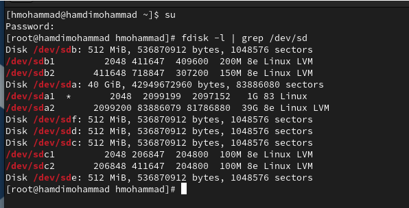

Освоить работу с RAID-массивами при помощи утилиты mdadm.

**Выполнение** **работы**

**Создание** **RAID-диска**

1\. Запустите виртуальную машину. Получите полномочия администратора: su
–

2\. Проверьте наличие созданных вами на предыдущем этапе дисков: fdisk
-l \| grep /dev/sd

Если предыдущая работа по LVM у вас выполнена успешно, то в системе
добавленные диски отобразятся как /dev/sdd, /dev/sde, /dev/sdf.

Создайте на каждом из дисков раздел: sfdisk /dev/sdd \<\<EOF

; EOF

sfdisk /dev/sde \<\<EOF ;

EOF

sfdisk /dev/sdf \<\<EOF ;

EOF

4\. Проверьте текущий тип созданных разделов: sfdisk --print-id /dev/sdd
1

sfdisk --print-id /dev/sde 1 sfdisk --print-id /dev/sdf 1

В отчёте укажите, какой тип имеют созданные вами разделы на дисках.

5\. Просмотрите, какие типы партиций, относящиеся к RAID, можно задать:

sfdisk -T \| grep -i raid

6\. Установите тип разделов в Linux raid autodetect: sfdisk --change-id
/dev/sdd 1 fd

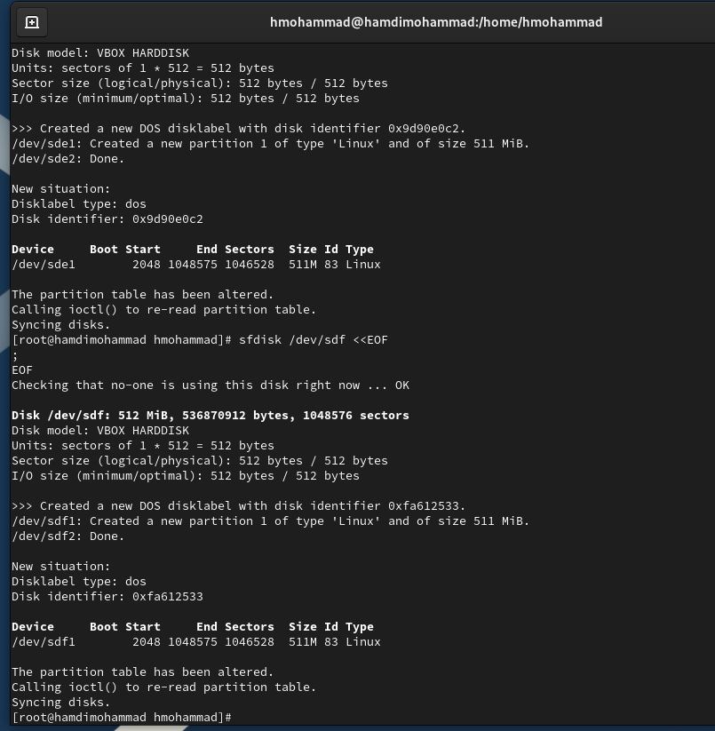sfdisk --change-id /dev/sde 1
fd sfdisk --change-id /dev/sdf 1 fd

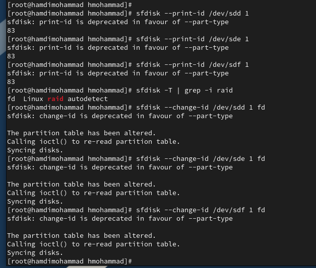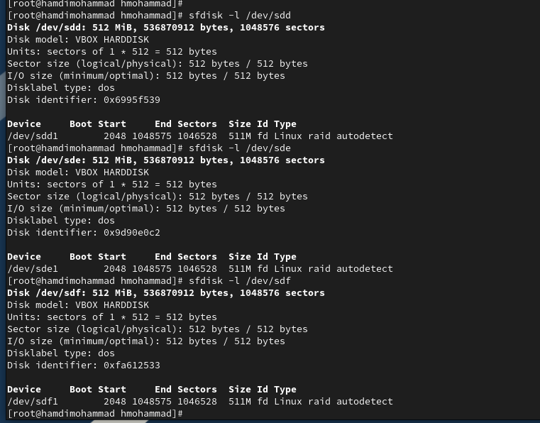

7\. Просмотрите состояние дисков: sfdisk -l /dev/sdd

sfdisk -l /dev/sde sfdisk -l /dev/sdf

8\. Если утилита mdadm не установлена в вашей системе, то установите её.

9\. При помощи утилиты mdadm создайте массив RAID 1 из двух дисков:
mdadm --create --verbose /dev/md0 --level=1 --raid-devices=2 /dev/sdd1
/dev/sde1

10\. Проверьте состояние массива RAID, используя команды cat
/proc/mdstat

mdadm --query /dev/md0 mdadm --detail /dev/md0

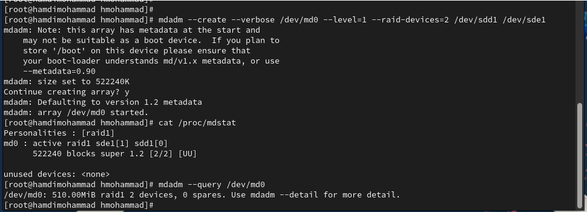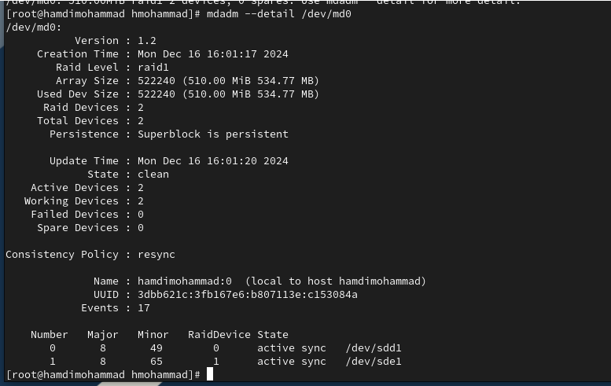Опишите состояние массива в
отчёте.

11\. Создайте файловую систему на RAID: mkfs.ext4
/dev/md0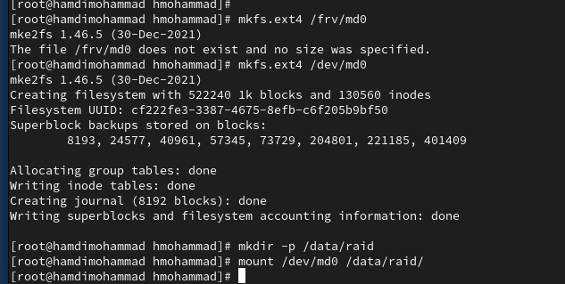

12\. Подмонтируйте RAID: mkdir /data mount /dev/md0 /data

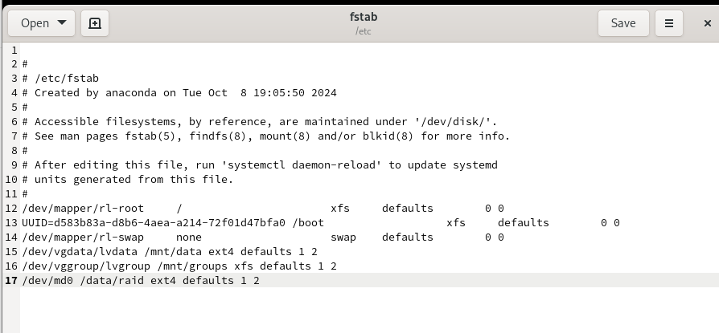13. Для автомонтирования
добавьте запись в /etc/fstab: /dev/md0 /data ext4 defaults 1 2

14\. Сымитируйте сбой одного из дисков: mdadm /dev/md0 --fail /dev/sde1

15\. Удалите сбойный диск: mdadm /dev/md0 --remove /dev/sde1

16\. Замените диск в массиве: mdadm /dev/md0 --add /dev/sdf1

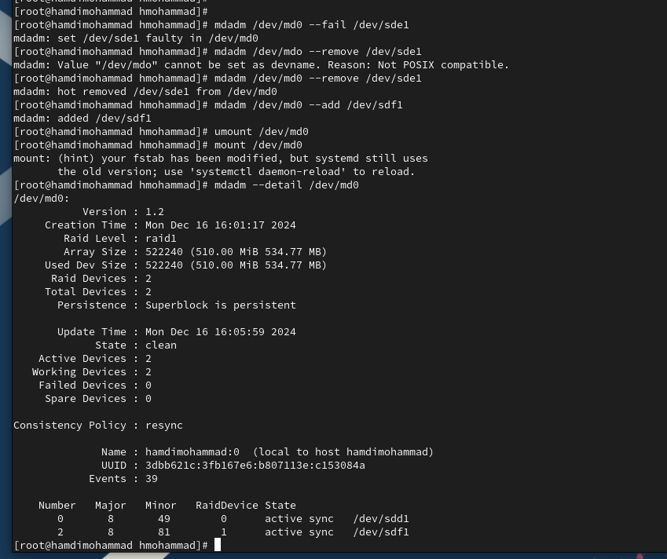17.
Посмотрите состояние массива и опишите его в отчёте.

18\. Удалите массив и очистите метаданные: umount /dev/md0 mdadm --stop
/dev/md0 mdadm --zero-superblock /dev/sdd1 mdadm --zero-superblock
/dev/sde1 mdadm --zero-superblock
/dev/sdf1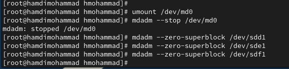

**RAID-массив** **с** **горячим** **резервом** **(hotspare)**

1\. Получите полномочия администратора: su –

2\. Создайте массив RAID 1 из двух дисков: mdadm --create --verbose
/dev/md0 --level=1 --raid-devices=2 /dev/sdd1 /dev/sde1

3\. Добавьте третий диск: mdadm --add /dev/md0 /dev/sdf1

4\. Подмонтируйте /dev/md0 mount /dev/md0

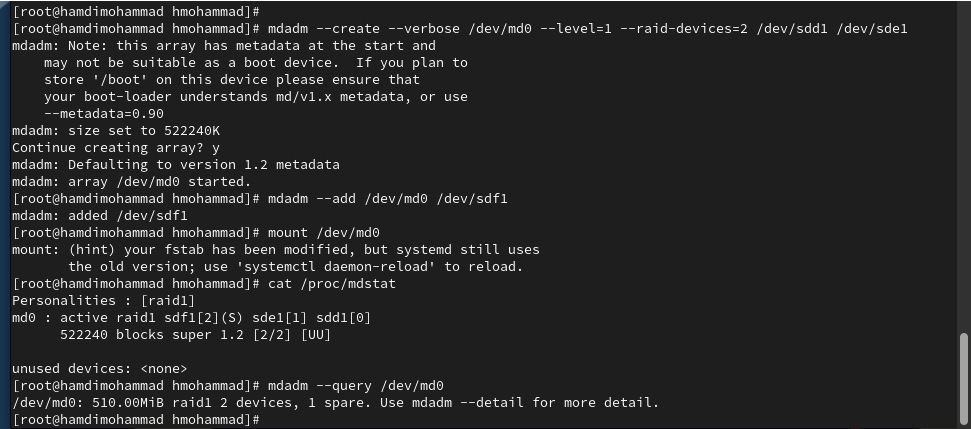5. Проверьте состояние
массива: cat /proc/mdstat mdadm --query /dev/md0 mdadm --detail /dev/md0
Опишите состояние массива в отчёте.

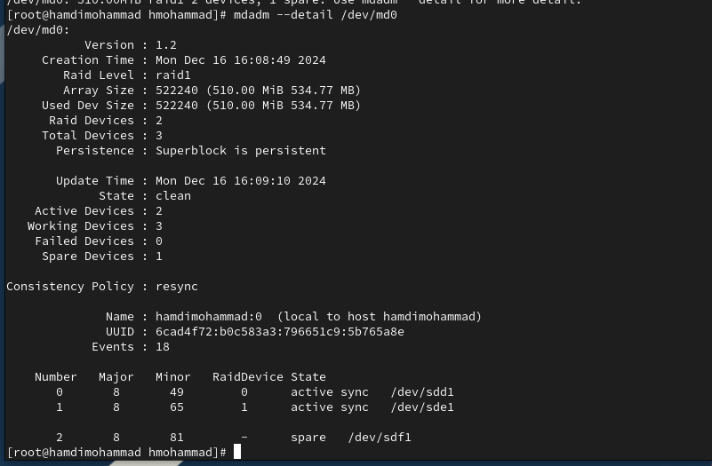

6\. Сымитируйте сбой одного из дисков: mdadm /dev/md0 --fail
/dev/sde1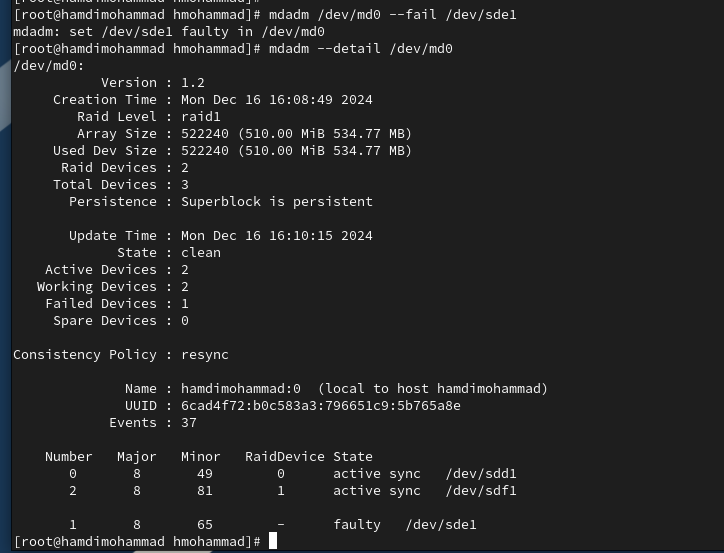

7\. Проверьте состояние массива: mdadm --detail /dev/md0

Убедитесь, что массив автоматически пересобирается. Отобразите и
поясните состояние массива в отчёте.

8\. Удалите массив и очистите метаданные: umount /dev/md0

mdadm --stop /dev/md0

mdadm --zero-superblock /dev/sdd1 mdadm --zero-superblock /dev/sde1
mdadm --zero-superblock /dev/sdf1

**Преобразование** **массива** **RAID** **1** **в** **RAID** **5** 1.
Получите полномочия администратора: su –

2\. Создайте массив RAID 1 из двух дисков: mdadm --create --verbose
/dev/md0 --level=1 --raid-devices=2 /dev/sdd1 /dev/sde1

3\. Добавьте третий диск: mdadm --add /dev/md0 /dev/sdf1

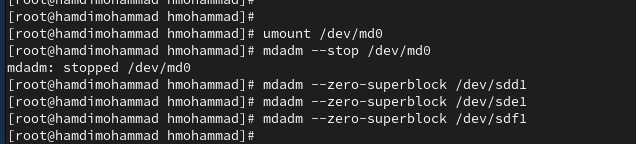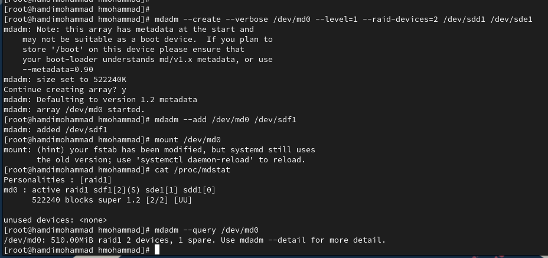4. Подмонтируйте /dev/md0
mount /dev/md0

5\. Проверьте состояние массива: cat /proc/mdstat mdadm --query /dev/md0
mdadm --detail /dev/md0 Опишите состояние массива в отчёте.

6\. Измените тип массива RAID: mdadm --grow /dev/md0 --level=5

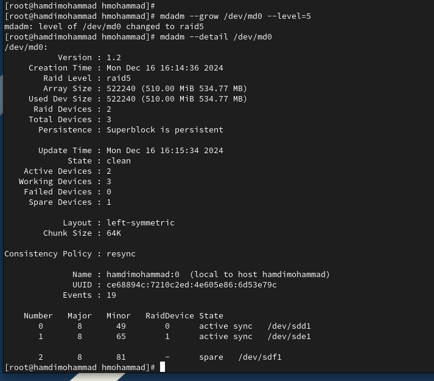7. Проверьте состояние
массива: mdadm --detail /dev/md0 Опишите состояние массива в отчёте.

8\. Измените количество дисков в массиве RAID 5: mdadm --grow /dev/md0
--raid-devices
3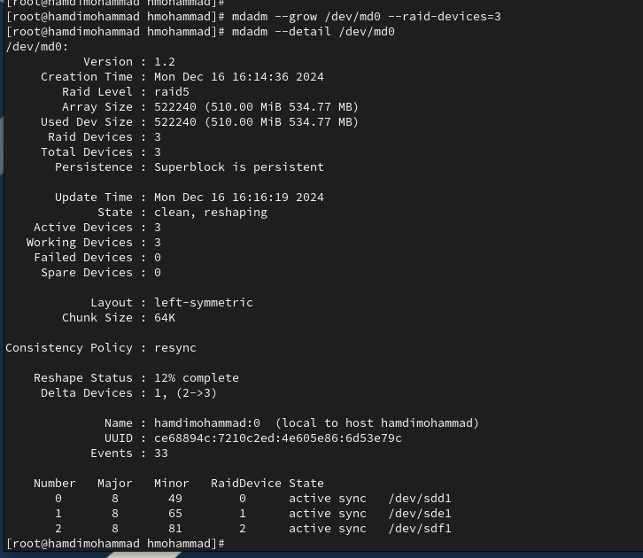

9\. Проверьте состояние массива: mdadm --detail /dev/md0 Опишите
состояние массива в отчёте.

10\. Удалите массив и очистите метаданные: umount /dev/md0 mdadm --stop
/dev/md0 mdadm --zero-superblock /dev/sdd1 mdadm --zero-superblock
/dev/sde1 mdadm --zero-superblock /dev/sdf1

11\. Закомментируйте запись в /etc/fstab: /dev/md0 /data ext4 defaults 1
2

**Контрольные** **вопросы**

1\. Приведите определение RAID.

RAID (Redundant Array of Independent Disks) — это технология объединения
нескольких

физических жестких дисков в единый логический массив для повышения

производительности, отказоустойчивости или сочетания обоих этих
факторов. RAID позволяет использовать разные схемы распределения данных
и избыточности для защиты от потери данных в случае сбоя одного или
нескольких дисков.

2\. Какие типы RAID-массивов существуют на сегодняшний день?

На сегодняшний день существует несколько популярных уровней RAID, каждый
из которых имеет свои особенности:

> • **RAID** **0** (striping) — минимальная избыточность, увеличивает
> производительность. • **RAID** **1** (mirroring) — зеркалирование,
> повышает отказоустойчивость.
>
> • **RAID** **5** (striping с распределенной четностью) — сочетание
> повышения производительности и избыточности.
>
> • **RAID** **6** (striping с двойной четностью) — схож с RAID 5, но с
> дополнительной четностью для повышения отказоустойчивости.
>
> • **RAID** **10** (RAID 1+0) — сочетание зеркалирования и стрипинга. •
> **RAID** **50** (RAID 5+0) — сочетание RAID 5 и стрипинга.
>
> • **RAID** **60** (RAID 6+0) — сочетание RAID 6 и стрипинга.

3\. Охарактеризуйте RAID 0, RAID 1, RAID 5, RAID 6, опишите алгоритм
работы,

назначение, приведите примеры применения.

**RAID** **0** **(Striping)**

> • **Алгоритм** **работы**: Данные разделяются на блоки, которые
> записываются попеременно на каждый диск массива. Нет избыточности или
> восстановления данных в случае сбоя.
>
> • **Назначение**: Максимизация производительности за счет параллельной
> записи и чтения данных с нескольких дисков.
>
> • **Применение**: Подходит для задач, где важна высокая скорость
> работы, например, для видеоредакторов или игровых систем. Однако
> данные не защищены от потери, и при выходе одного диска из строя все
> данные теряются.

**Преимущества**:

> • Очень высокая скорость записи и чтения. • Простота реализации.

**Недостатки**:

> • Отсутствие отказоустойчивости.
>
> • Потеря данных при выходе одного диска из строя.

**RAID** **1** **(Mirroring)**

> • **Алгоритм** **работы**: Данные полностью дублируются на два и более
> диска (зеркалирование). Каждый диск содержит копию всех данных.
>
> • **Назначение**: Обеспечение отказоустойчивости за счет создания
> точных копий данных на разных дисках.
>
> • **Применение**: Идеально для использования в серверах, где важна
> высокая доступность данных, например, для хранения критически важных
> данных в компаниях.

**Преимущества**:

> • Высокая надежность — при выходе одного диска данные сохраняются на
> другом. • Быстрое чтение (так как данные могут считываться с любого
> диска).

**Недостатки**:

> • В два раза большее количество необходимого места для хранения данных
> (диски зеркалируются).
>
> • Меньшая скорость записи по сравнению с RAID 0.

**RAID** **5** **(Striping** **с** **распределенной** **четностью)**

> • **Алгоритм** **работы**: Данные распределяются по всем дискам, и на
> каждом диске записывается блок с четностью, которая позволяет
> восстанавливать утраченные данные в случае выхода одного диска из
> строя.
>
> • **Назначение**: Сочетание высокой производительности и
> отказоустойчивости. • **Применение**: Широко используется для серверов
> хранения данных, где важен
>
> баланс между производительностью и надежностью, например, в файловых
> серверах, базах данных и т. д.

**Преимущества**:

> • Высокая скорость записи и чтения.
>
> • Повышенная отказоустойчивость по сравнению с RAID 0. • Экономия
> места по сравнению с RAID 1.

**Недостатки**:

> • При выходе одного диска из строя массив продолжает работать, но
> производительность снижается до тех пор, пока не заменят поврежденный
> диск и не восстановят данные.
>
> • Сложность в реализации и восстановлении данных.

**RAID** **6** **(Striping** **с** **двойной** **четностью)**

> • **Алгоритм** **работы**: Подобно RAID 5, но с дополнительной
> четностью, которая позволяет восстанавливать данные при выходе двух
> дисков из строя одновременно.
>
> • **Назначение**: Обеспечение отказоустойчивости даже при выходе двух
> дисков из строя.
>
> • **Применение**: Идеально подходит для крупных корпоративных систем
> хранения данных, где высокая доступность критична.

**Преимущества**:

> • Меньше риска потери данных при сбое двух дисков.
>
> • Подходит для серверов, где нужна высокая надежность и защита данных.

**Недостатки**:

> • Меньше полезной емкости по сравнению с RAID 5 (два блока для
> четности на каждый набор данных).
>
> • Снижение производительности записи из-за дополнительной четности.

**Заключение**

Освоили работу с RAID-массивами
