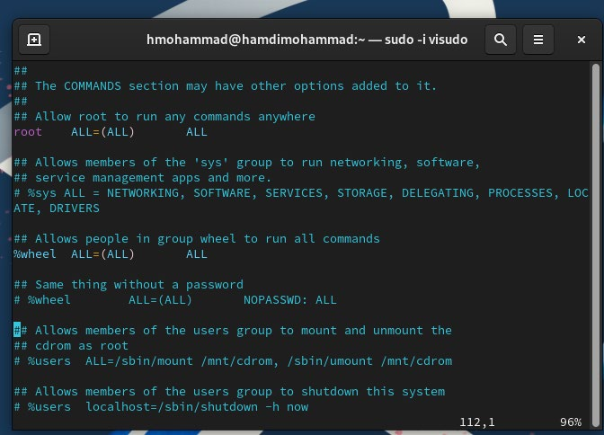
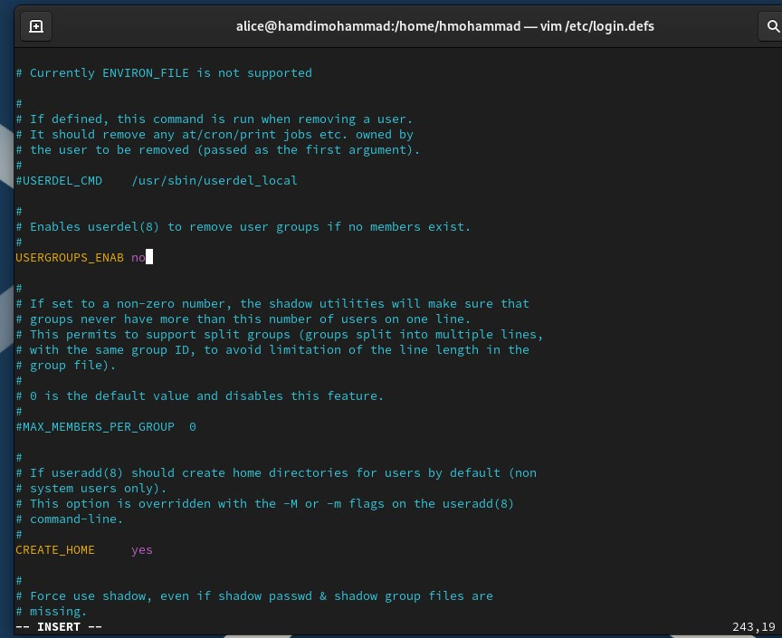

**РОССИЙСКИЙ** **УНИВЕРСИТЕТ** **ДРУЖБЫ** **НАРОДОВ** **Факультет**
**физико-математических** **и** **естественных** **наук** **Кафедра**
**теории** **вероятности** **и** **кибербезопасности**

> **ОТЧЕТ**
>
> **ПО** **ЛАБОРАТОРНОЙ** **РАБОТЕ** **№2**
>
> *<u>дисциплина:</u>* *<u>Основы администрирования операционных
> систем</u>*
>
> Студент: <u>Хамди Мохаммад, 1032235868</u>
>
> **МОСКВА** 2024г.

**Постановка** **задачи**

> Получить представление о работе с учётными записями пользователей и
> группами

пользователей в операционной системе типа Linux

**Выполнение** **работы**

**Переключение** **учётных** **записей** **пользователей**

1\. Войдите в систему как обычный пользователь и откройте терминал.

2\. Определите, какую учётную запись пользователя вы используете, введя
команду whoami

Выведите на экран более подробную информацию, используя команду id В
отчёте дайте

пояснение по отображённой информации.

3\. Используйте команду su для переключения к учётной записи root. При
запросе пароля

введите пароль пользователя root. Наберите id В отчёте дайте пояснение
по отображённой

информации.

Команда id в Unix-подобных операционных системах выводит информацию о
текущем

пользователе или о другом пользователе (если указано). Основная цель
этой команды —

показать идентификаторы пользователя, группы и дополнительные сведения.

4\. Вернитесь к учётной записи своего пользователя: su имя_пользователя
или воспользуйтесь комбинацией клавиш Ctrl + d или командой exit.

5\. Просмотрите в безопасном режиме файл /etc/sudoers, используя,
например, sudo -i visudo

Обычно visudo открывает файл /etc/sudoers в текстовом редакторе vi, но
проверяет

синтаксис файла при его сохранении. Открываемый visudo редактор можно
указать любой.

Например, если требуется использовать mcedit, то в терминале для запуска
visudo следует

указать: sudo -i EDITOR=mcedit visudo В отчёте поясните, почему для
работы с файлом

/etc/sudoers требуется использовать visudo, а не произвольный редактор.

visudo автоматически проверяет файл на наличие синтаксических ошибок
после

завершения редактирования. Если файл содержит ошибку, это может привести
к

невозможности использования команды sudo, что фактически заблокирует
пользователя от

выполнения административных действий. Если ошибка найдена, visudo не
сохранит

изменения, и это предотвратит проблемы в работе системы.

6\. Убедитесь, что в открытом с помощью visudo файле присутствует строка
%wheel

ALL=(ALL) ALL В отчёте
поясните, что это означает и для чего нужна группа wheel.

7\. Создайте пользователя alice, входящего в группу wheel: sudo -i
useradd -G wheel alice

8\. Убедитесь, что пользователь alice добавлен в группу wheel, введя id
alice

9\. Задайте пароль для пользователя alice, набрав sudo -i passwd alice
Пароль требуется

ввести дважды.

10\. Переключитесь на учётную запись пользователя alice: su alice

11\. Создайте пользователя bob: sudo useradd bob Введите пароль при
запросе. Проверьте,

что пользователь bob создан.

12\. Установите пароль для пользователя bob: sudo passwd bob

13\. Просмотрите, в какие группы входит пользователь bob: id bob

**Создание** **учётных** **записей** **пользователей**

Применим общие решения для создания учётных записей пользователей.

1\. Переключитесь в терминале на учётную запись пользователя root: su

2\. Откройте файл конфигурации /etc/login.defs для редактирования,
используя, например,

vim (не забудьте, что требуются полномочия пользователя root): vim
/etc/login.defs

Измените несколько параметров. Например, найдите параметр CREATE_HOME и

убедитесь, что он установлен в значение yes. Также установите параметр

USERGROUPS_ENAB no Это позволит не добавлять нового пользователя в
группу с тем

же именем, что и
пользователь, а использовать группу users.

3\. Перейдите в каталог /etc/skel: cd /etc/skel Создайте каталоги
Pictures и Documents: mkdir

Pictures и mkdir Documents Это позволит добавить эти каталоги по
умолчанию во все

домашние каталоги пользователей.

4\. Измените содержимое файла .bashrc, добавив строку export
EDITOR=/usr/bin/vim или

export EDITOR=/usr/bin/mceditor Эта запись означает, что текстовый
редактор vim или

редактор mceditor будет установлен по умолчанию для инструментов,
которые нуждаются

в изменении текстовых файлов.

5\. Переключитесь в терминале на учётную запись пользователя alice: su
alice

6\. Используя утилиту useradd, создайте пользователя carol: sudo -i
useradd carol

7\. Установите пароль для пользователя carol: sudo passwd carol

8\. Посмотрите и прокомментируйте информацию о пользователе carol,
проверьте, в какую

первоначальную группу входит пользователь carol; также убедитесь, что
каталоги Pictures

и Documents были созданы в домашнем каталоге пользователя carol: su
carol id cd ls -Al

9\. Переключитесь в терминале на учётную запись пользователя alice: su
alice

10\. Поясните в отчёте строку записи о пароле пользователя carol в файле
/etc/shadow: sudo

cat /etc/shadow \| grep carol

11\. Измените свойства пароля пользователя carol следующим образом: sudo
passwd -n 30 -

w 3 -x 90 carol В этой записи срок действия пароля истекает через 90
дней (-x 90). За три

дня до истечения срока действия пользователь получит предупреждение (-w
3). Пароль

должен использоваться как минимум за 30 дней (-n 30) до того, как его
можно будет

изменить.

12\. Убедитесь в изменении в строке с данными о пароле пользователя
carol в файле

/etc/shadow: sudo cat /etc/shadow \| grep carol

13\. Убедитесь, что идентификатор alice существует во всех трёх файлах:
grep alice

/etc/passwd /etc/shadow /etc/group

14\. Убедитесь, что идентификатор carol существует не во всех трёх
файлах: sudo grep carol /etc/passwd /etc/shadow /etc/group

**Работа** **с** **группами**

В этом упражнении требуется создать две группы и добавить некоторых
пользователей в

эти группы.

1\. Находясь под учётной записью пользователя root, создайте группы main
и third: groupadd

main groupadd third

2\. Используйте usermod для добавления пользователей alice и bob в
группу main, а carol,

dan, dave и david — в группу third: usermod -aG main alice usermod -aG
main bob usermod -

aG third carol usermod -aG third dan usermod -aG third dave usermod -aG
third david

3\. Убедитесь, что пользователь carol правильно добавлен в группу third:
id carol

Пользователю carol должна быть назначена основная группа с
идентификатором gid = 100

(users). Определите, в какие вторичные группы входит carol.

4\. Определите, участниками каких групп являются другие созданные вами
пользователи.

Укажите эту информацию в
отчёте

**Контрольные** **вопросы**

1\. При помощи каких команд можно получить информацию о номере
(идентификаторе),

назначенном пользователю Linux, о группах, в которые включён
пользователь?

> Чтобы получить информацию о номере (UID) и группах, в которые включён
>
> пользователь в Linux, можно использовать команды id, groups и whoami.
> Команда id
>
> показывает UID, GID и группы пользователя, groups выводит список
> групп, к
>
> которым принадлежит пользователь, а whoami возвращает имя текущего
>
> пользователя.

2\. Какой UID имеет пользователь root? При помощи какой команды можно
узнать UID

пользователя? Приведите примеры.

> Пользователь root имеет UID 0. Чтобы узнать UID пользователя, можно
>
> использовать команду id username. Пример: id root покажет, что UID для
>
> пользователя root — 0. Если команда выполняется без указания имени
> пользователя,
>
> она выведет информацию для текущего пользователя.

3\. В чём состоит различие между командами su и sudo?

> Команда su позволяет переключиться на другого пользователя, полностью
> меняя
>
> окружение на его, запрашивая пароль этого пользователя. Команда sudo
> позволяет временно выполнить одну команду с привилегиями другого
> пользователя (по умолчанию root), при этом запрашивается пароль
> текущего пользователя.

4\. В каком конфигурационном файле определяются параметры sudo?

> Параметры для sudo определяются в конфигурационном файле /etc/sudoers.

5\. Какую команду следует использовать для безопасного изменения
конфигурации sudo?

> Для безопасного изменения конфигурации sudo следует использовать
> команду
>
> visudo, которая проверяет синтаксис файла и предотвращает ошибки при
>
> редактировании.

6\. Если вы хотите предоставить пользователю доступ ко всем командам

администрирования системы через sudo, членом какой группы он должен
быть?

> Чтобы предоставить пользователю доступ ко всем командам
> администрирования
>
> через sudo, он должен быть членом группы sudo (в некоторых системах
> это может
>
> быть группа wheel).

7\. Какие файлы/каталоги можно использовать для определения параметров,
которые будут

использоваться при создании учётных записей пользователей? Приведите
примеры

настроек.

> Файлыи каталоги, которые используются для определения параметровпри
> создании
>
> учётных записей, включают /etc/default/useradd и /etc/login.defs.
> Например, в
>
> /etc/login.defs можно настроить такие параметры, как минимальная длина
> пароля
>
> (PASS_MIN_LEN), максимальный срок действия пароля (PASS_MAX_DAYS), и
>
> начальный диапазон UID для новых пользователей (UID_MIN, UID_MAX).

8\. Где хранится информация о первичной и дополнительных группах
пользователей ОС

типа Linux? В отчёте приведите пояснение таких записей для пользователя
alice.

> Информация о первичной и дополнительных группах пользователей хранится
> в
>
> файлах /etc/passwd и /etc/group. В /etc/passwd указана первичная
> группа
>
> пользователя, а в /etc/group — все группы, включая дополнительные.

9\. Какие команды вы можете использовать для изменения информации о
пароле

пользователя (например о сроке действия пароля)?

> Для изменения информации о пароле пользователя, включая срок действия,
> можно
>
> использовать команду chage. Например, chage -l username показывает
> информацию
>
> о пароле, а chage -M 90 username устанавливает максимальный срок
> действия пароля в 90 дней.

10\. Какую команду следует использовать для прямого изменения информации
в файле

/etc/group и почему?

> Для прямого изменения информации в файле /etc/group следует
> использовать команду
>
> vigr, так как она блокирует файл от одновременного редактирования и
> проверяет
>
> синтаксис, предотвращая ошибки, которые могут возникнуть при ручном
>
> редактировании.

**Заключение**

> Получены навыки работы с созданием пользователей
