**РОССИЙСКИЙ** **УНИВЕРСИТЕТ** **ДРУЖБЫ** **НАРОДОВ** **Факультет**
**физико-математических** **и** **естественных** **наук** **Кафедра**
**теории** **вероятности** **и** **кибербезопасности**

> **ОТЧЕТ**
>
> **ПО** **ЛАБОРАТОРНОЙ** **РАБОТЕ** **№3**
>
> *<u>дисциплина:</u>* *<u>Основы администрирования операционных
> систем</u>*
>
> Студент: <u>Хамди Мохаммад, 1032235868</u>
>
> **МОСКВА** 2024г.

**Постановка** **задачи**

> Получение навыков настройки базовых и специальных прав доступа для
> групп

пользователей в операционной системе типа Linux.

**Выполнение** **работы**

**Управление** **базовыми** **разрешениями**

1\. Откройте терминал с учётной записью root: su –

2\. В корневом каталоге создайте каталоги /data/main и /data/third:
mkdir -p /data/main /data/third

Посмотрите, кто является владельцем этих каталогов. Для этого
используйте: ls -Al /data

3\. Прежде чем устанавливать разрешения, измените владельцев этих
каталогов с root на main и third соответственно:

chgrp main /data/main chgrp third /data/third

Посмотрите, кто теперь является владельцем этих каталогов: ls -Al /data

4\. Установите разрешения, позволяющие владельцам каталогов записывать
файлы в эти каталоги и запрещающие доступ к содержимому каталогов всем
другим пользователям и группам:

chmod 770 /data/main chmod 770 /data/third

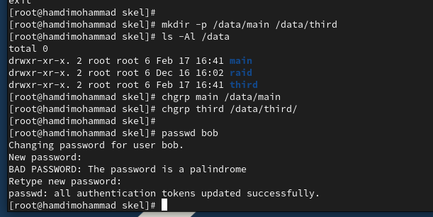Проверьте установленные права
доступа.

5\. В другом терминале перейдите под учётную запись пользователя bob: su
– bob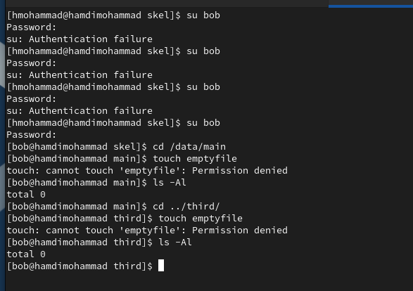

6\. Под пользователем bob попробуйте перейти в каталог /data/main и
создать файл emptyfile в этом каталоге:

cd /data/main touch emptyfile ls -Al

Опишите и поясните результат этого действия.

7\. Под пользователем bob попробуйте перейти в каталог /data/third и
создать файл emptyfile в этом каталоге. Опишите и поясните результат
этого действия.

Bob является членом группы main. Директория /data/main после манипуляций
тоже принадлежит группе main, директория /data/third принадлежит группе
third. На обоих директориях установлены права 770, это значит, что для
владельца и его группы разрешены все действия, для остальных
пользователей наоборот все запрещено.

Получается, что в директории /data/main для боба срабатывает ограничение
для группы, т е 7(rwx), а в директории /data/third – ограничение для
остальных 0 (---).

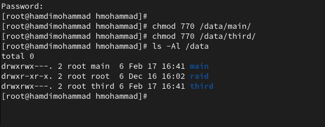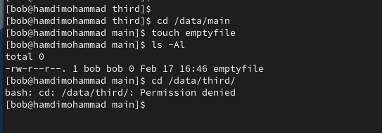

**Управление** **специальными**
**разрешениями**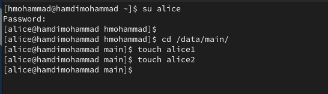

1\. Откройте новый терминал под пользователем alice.

2\. Перейдите в каталог /data/main: cd /data/main

Создайте два файла, владельцем которых является alice: touch alice1

touch alice2

3\. В другом терминале перейдите под учётную запись пользователя bob
(пользователь bob является членом группы main, как и alice):

su – bob

4\. Перейдите в каталог /data/main: cd /data/main

и в этом каталоге введите: ls -l

Вы увидите два файла, созданные пользователем alice. Попробуйте удалить
файлы, принадлежащие пользователю alice:

rm -f alice\*

Убедитесь, что файлы будут удалены пользователем bob.

5\. Создайте два файла, которые принадлежат пользователю bob: touch bob1

touch bob2

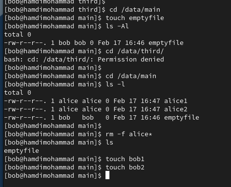

6\. В терминале под пользователем root установите для каталога
/data/main бит идентификатора группы, а также stiky-бит для разделяемого
(общего) каталога группы: chmod g+s,o+t /data/main

7\. В терминале под пользователем alice создайте в каталоге /data/main
файлы alice3 и alice4:

touch alice3 touch alice4 ls -l

Теперь вы должны увидеть, что два созданных вами файла принадлежат
группе main, которая является группой-владельцем каталога /data/main.

8\. В терминале под пользователем alice попробуйте удалить файлы,
принадлежащие пользователю bob:

rm -rf bob\*

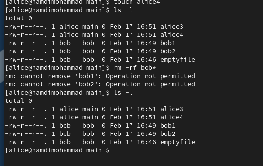

**Управление** **расширенными** **разрешениями** **с**
**использованием** **списков** **ACL**

1\. Откройте терминал с учётной записью root su –

2\. Установите права на чтение и выполнение в каталоге /data/main для
группы third и права на чтение и выполнение для группы main в каталоге
/data/third:

setfacl -m g:third:rx /data/main setfacl -m g:main:rx /data/third

3\. Используйте команду getfacl, чтобы убедиться в правильности
установки разрешений: getfacl /data/main

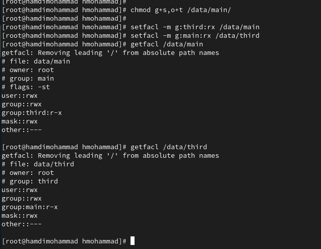getfacl /data/third

4\. Создайте новый файл с именем newfile1 в каталоге /data/main: touch
/data/main/newfile1

Используйте

getfacl /data/main/newfile1

для проверки текущих назначений полномочий. Какие права доступа у этого
файла? Объясните, почему.

Выполните аналогичные действия для каталога /data/third. Дайте
пояснения.

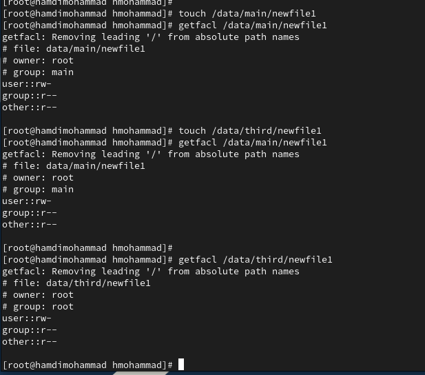На каталоге main установлен
дополнительный бит g+s, поэтому файлы, созданные внутри него, получают
то же имя группы, что и сам каталог. У каталога third такого бита нет.

5\. Установите ACL по умолчанию для каталога /data/main: setfacl -m
d:g:third:rwx /data/main

6\. Добавьте ACL по умолчанию для каталога /data/third: setfacl -m
d:g:main:rwx /data/third

7\. Убедитесь, что настройки ACL работают, добавив новый файл в каталог
/data/main: touch /data/main/newfile2

Используйте getfacl /data/main/newfile2 для проверки текущих назначений
полномочий. Выполните аналогичные действия для каталога /data/third.

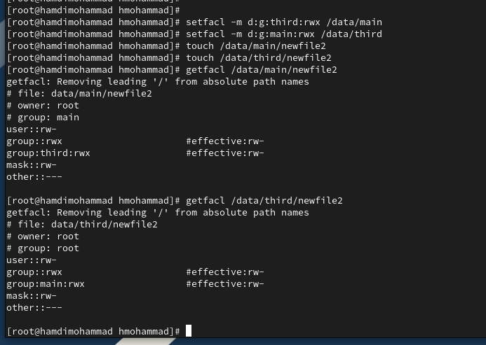Использовав в команде setfacl
литеру d мы указали применять ACL к директории и к содержимому.

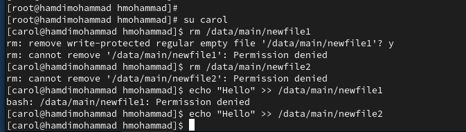

8\. Для проверки полномочий группы third в каталоге /data/third войдите
в другом терминале под учётной записью члена группы third:

su - carol

Проверьте операции с файлами: rm /data/main/newfile1

rm /data/main/newfile2

Проверьте, возможно ли осуществить запись в файл: echo "Hello, world"
\>\> /data/main/newfile1

echo "Hello, world" \>\> /data/main/newfile2 Объясните результат
произведённых действий.

carol не смог удалить файлы, принадлежащие другим пользователям, но смог
дозаписать файл, принадлежащий той же группе, что и carol.

**Контрольные** **вопросы**

1\. Как следует использовать команду chown, чтобы установить владельца
группы для

файла? Приведите пример.

> Для установки владельца и группы для файла используется команда chown
> с
>
> указанием владельца и группы через двоеточие. Пример: chown user:group
> файл.txt

2\. С помощью какой команды можно найти все файлы, принадлежащие
конкретному

пользователю? Приведите пример.

> Чтобы найти все файлы, принадлежащие конкретному пользователю,
> используйте
>
> команду find. Пример: find / -user имя_пользователя

3\. Как применить разрешения на чтение, запись и выполнение для всех
файлов в каталоге

/data для пользователей и владельцев групп, не устанавливая никаких прав
для других?

Приведите пример.

> Для применения разрешений на чтение, запись и выполнение для
> пользователей и
>
> владельцев групп, но без прав для остальных, используйте команду
> chmod.
>
> Пример: chmod 770 /data/\*

4\. Какая команда позволяет добавить разрешение на выполнение для файла,
который

необходимо сделать исполняемым?

> Для добавления разрешения на выполнение файла используется команда
> chmod.
>
> Пример: chmod +x файл.sh

5\. Какая команда позволяет убедиться, что групповые разрешения для всех
новых файлов,

создаваемых в каталоге, будут присвоены владельцу группы этого каталога?
Приведите

пример.

> Чтобы обеспечить, что новые файлы в каталоге наследуют групповые
> разрешения
>
> каталога, используйте команду chmod с установкой SGID. Пример: chmod
> g+s
>
> /каталог

6\. Необходимо, чтобы пользователи могли удалять только те файлы,
владельцами которых

они являются, или которые находятся в каталоге, владельцами которого они
являются. С

помощью какой команды можно это сделать? Приведите пример.

> Для того чтобы пользователи могли удалять только свои файлы или файлы
> в
>
> каталогах, владельцами которых они являются, нужно установить для
> каталога
>
> sticky-бит.
>
> Пример: chmod +t /каталог

7\. Какая команда добавляет ACL, который предоставляет членам группы
права доступа на чтение для всех существующих файлов в текущем каталоге?

> Для добавления ACL, который предоставляет членам группы права на
> чтение для
>
> всех существующих файлов, используется команда setfacl. Пример:
> setfacl -R -m
>
> g:группа:rx .

8\. Что нужно сделать для гарантии того, что члены группы получат
разрешения на чтение

для всех файлов в текущем каталоге и во всех его подкаталогах, а также
для всех файлов,

которые будут созданы в этом каталоге в будущем? Приведите пример.

> Чтобы члены группы получали права на чтение для всех файлов в текущем
> каталоге,
>
> его подкаталогах, и для всех новых файлов, необходимо установить ACL с
>
> наследованием. Пример:
>
> setfacl -R -m g:группа:rx .
>
> setfacl -d -m g:группа:rx .

9\. Какое значение umask нужно установить, чтобы «другие» пользователи
не получали

какие-либо разрешения на новые файлы? Приведите пример.

> Чтобы «другие» пользователи не получали никаких разрешений на новые
> файлы,
>
> umask должен быть установлен на 0077. Пример: umask 0077

10\. Какая команда гарантирует, что никто не сможет удалить файл myfile
случайно?

> Чтобы никто не смог случайно удалить файл, можно установить атрибут
> immutable с
>
> помощью команды chattr. Пример: chattr +i myfile

**Заключение**

> Получены навыки работы c настройкой прав доступа.
