> **РОССИЙСКИЙ** **УНИВЕРСИТЕТ** **ДРУЖБЫ** **НАРОДОВ** **Факультет**
> **физико-математических** **и** **естественных** **наук**
>
> **Кафедра** **теории** **вероятностей** **и** **кибербезопасности**
>
> **ОТЧЕТ**
>
> **ПО** **ЛАБОРАТОРНОЙ** **РАБОТЕ** **№4**
>
> *<u>дисциплина:</u>* *<u>Основы администрирования операционных
> систем</u>*

Студент: Хамди Мохаммад, 1032235868

> **МОСКВА**
>
> 2<u>024</u> г.

**Постановка** **задачи**

> Получить навыки работы с репозиториями и менеджерами пакетов.

**Выполнение** **работы**

**Работа** **с** **репозиториями**

1\. В консоли перейдите в режим работы суперпользователя (используйте
команду su -).

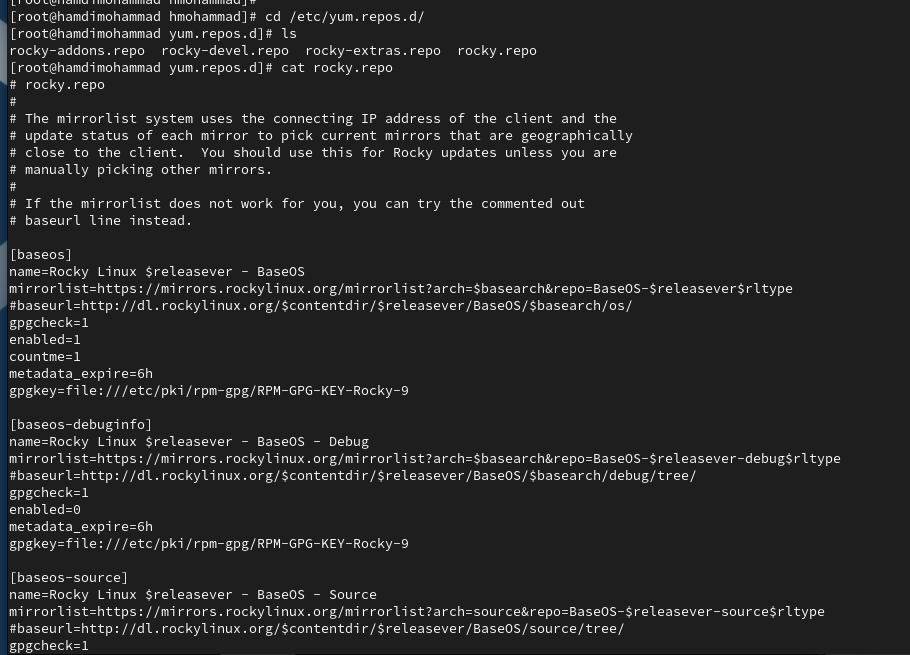2. Перейдите в каталог
/etc/yum.repos.d и изучите содержание каталога и файлов репозиториев: cd
/etc/yum.repos.d ls cat название_репозитория.repo

3\. Выведите на экран список репозиториев: dnf repolist и поясните
полученную информацию.

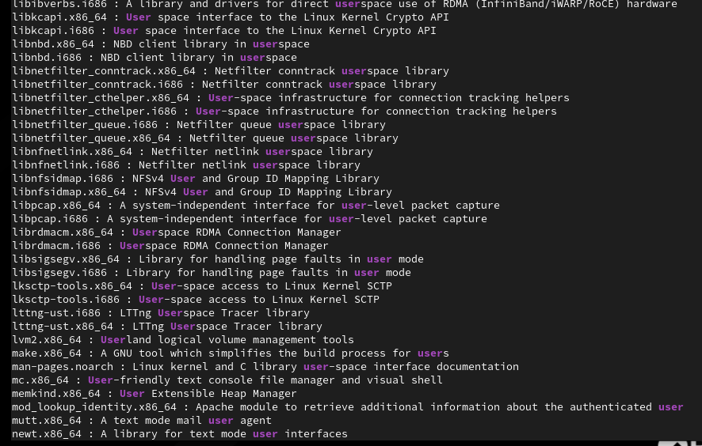4. Выведите на экран список
пакетов, в названии или описании которых есть слово user: dnf search
user и поясните полученную информацию.

5\. Установите nmap, предварительно изучив информацию по имеющимся
пакетам: dnf search nmap

dnf info nmap dnf install nmap

dnf install nmap\\

Поясните разницу между dnf install nmap и dnf install nmap\\.

dnf install nmap - это команда, которая устанавливает пакет nmap.

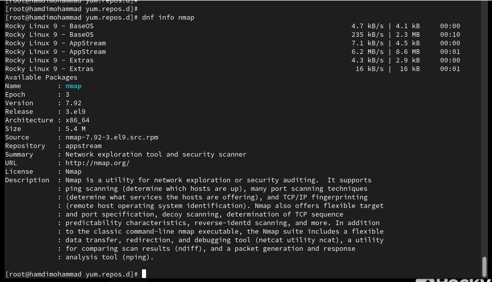dnf install nmap\\\` -
команда устанавливает все пакеты, начинающиеся с nmap

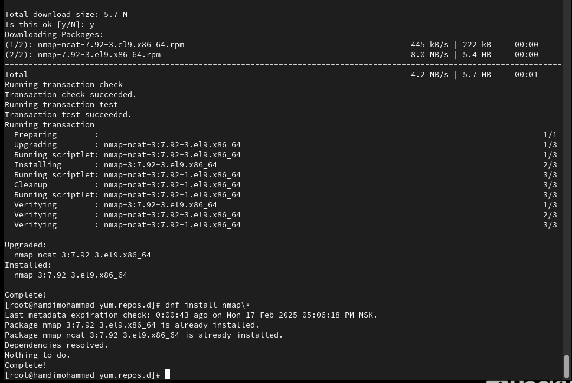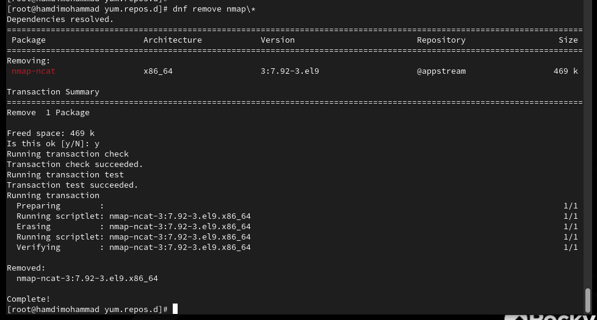

6\. Удалите nmap: dnf remove nmap dnf remove nmap\\

7\. Получите список имеющихся групп пакетов, затем установите группу
пакетов RPM Development Tools:

dnf groups list LANG=C dnf groups list dnf groups info "RPM Development
Tools"

dnf groupinstall "RPM Development Tools"

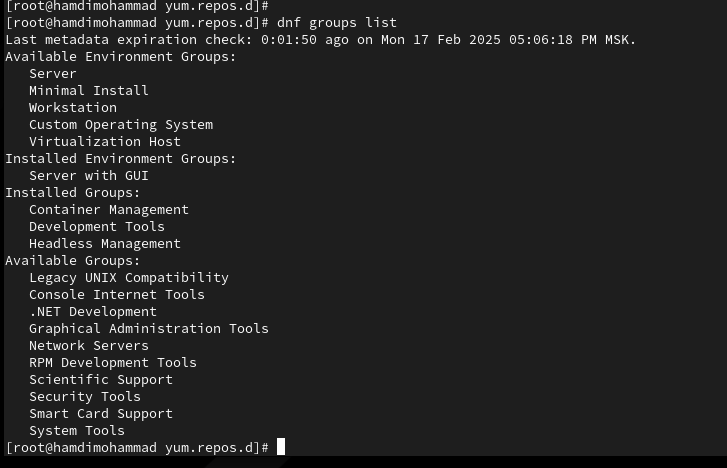Для удаления группы пакетов
RPM Development Tools можно воспользоваться командой dnf groupremove
"RPM Development Tools"

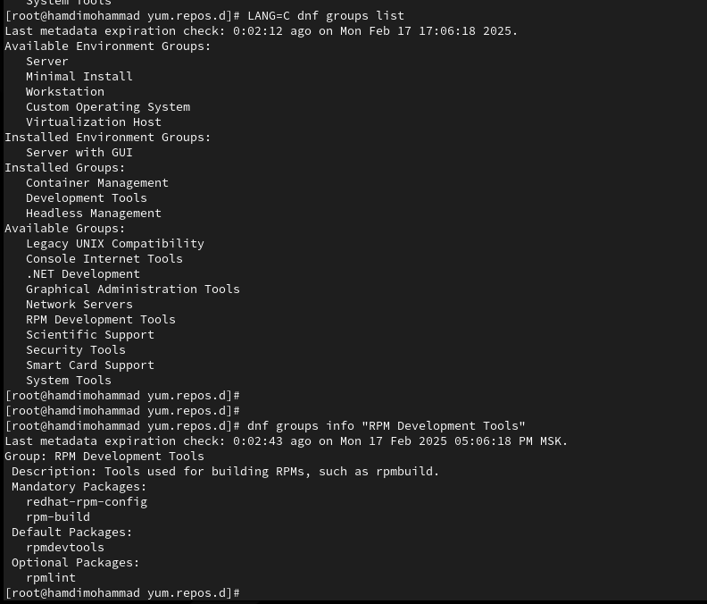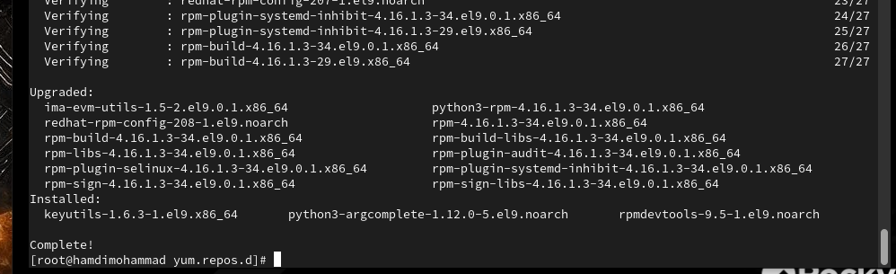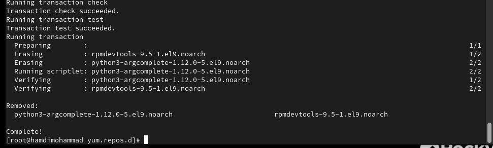

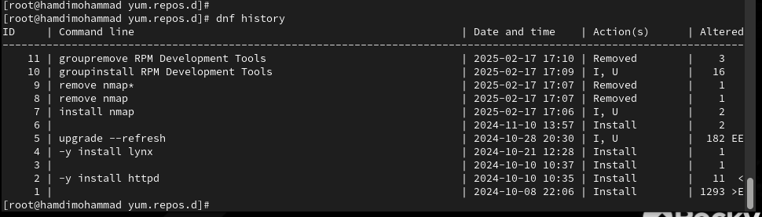

8\. Посмотрите историю использования команды dnf: dnf history и отмените
последнее, например шестое по счёту, действие: dnf history undo 6

**Использование** **rpm**

Предположим, что требуется установить текстовый браузер lynx из
rpm-пакета.

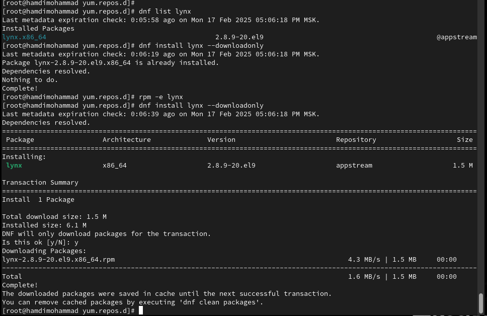1. Скачайте rpm-пакет lynx:
dnf list lynx dnf install lynx --downloadonly

2\. Найдите каталог, в который был помещён пакет после загрузки: find
/var/cache/dnf/ -name lynx\*

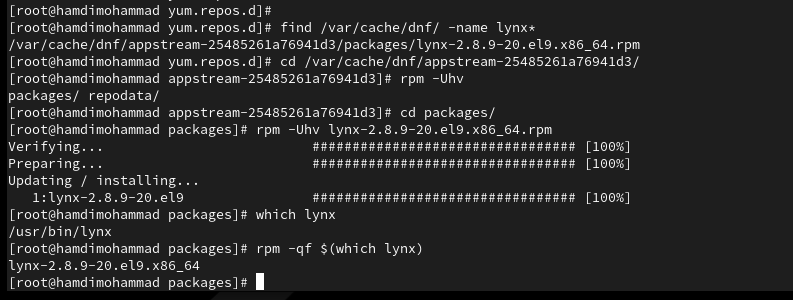3. Перейдите в этот каталог и
затем установите rpm-пакет: rpm -Uhv lynx-.rpm

4\. Определите расположение исполняемого файла: which lynx

5\. Используя rpm, определите по имени файла, к какому пакету
принадлежит lynx: rpm -qf \$(which lynx)

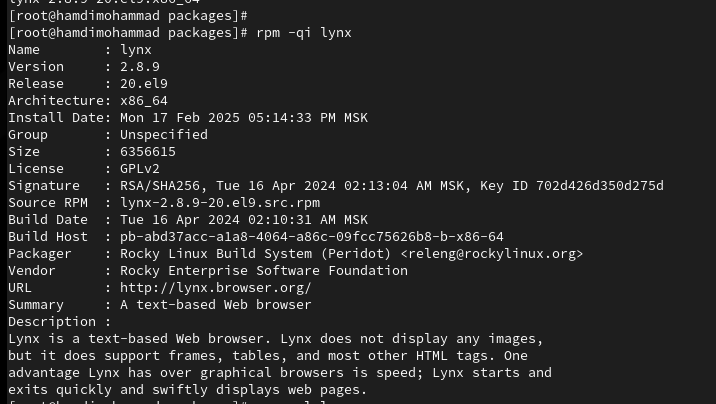и получите дополнительную
информацию о содержимом пакета, введя: rpm -qi lynx

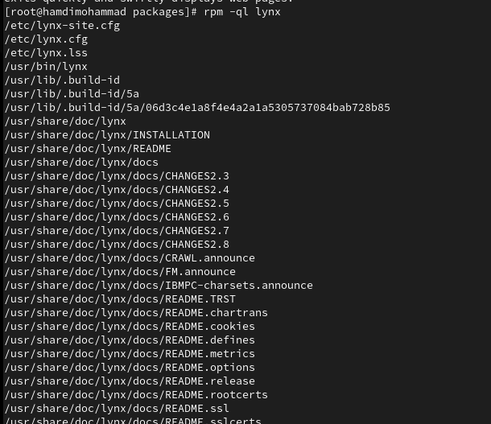6. Получите список всех
файлов в пакете, используя: rpm -ql lynx

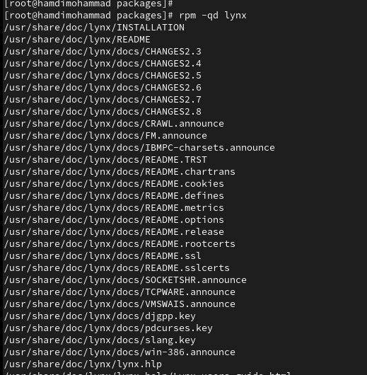также выведите перечень
файлов с документацией пакета, введя: rpm -qd lynx

Посмотрите файлы документации, применив команду man
lynx.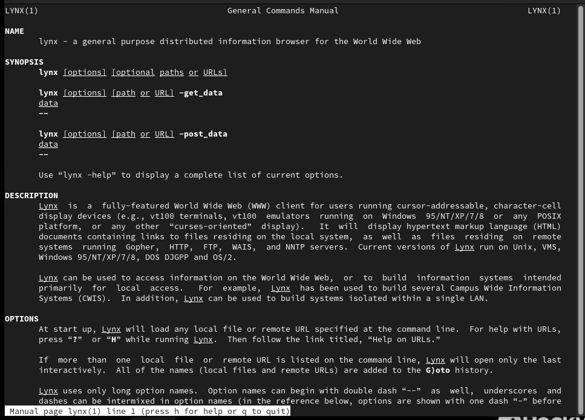

7\. Выведите на экран перечень и месторасположение конфигурационных
файлов пакета: rpm -qc lynx

8\. Выведите на экран расположение и содержание скриптов, выполняемых
при установке пакета:

rpm -q --scripts lynx

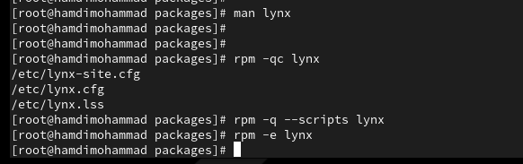и поясните, для чего
предназначены скрипты, если они есть.

9\. В отдельном терминале под своей учётной записью запустите текстовый
браузер lynx, чтобы проверить корректность установки
пакета.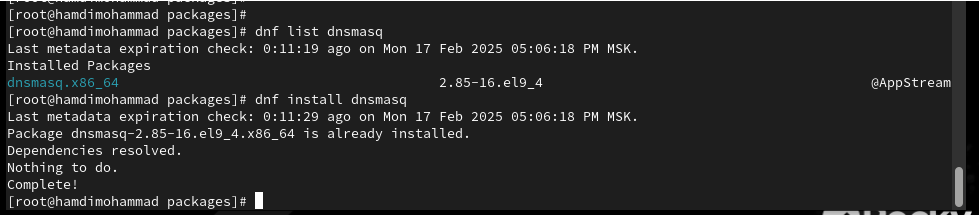

10\. Вернитесь в терминал с учётной записью root и удалите пакет: rpm -e
lynx ls

Предположим, что требуется из rpm-пакетов установить dnsmasq (DNS-,
DHCP- и TFTPсервер).

1\. Установите пакет dnsmasq: dnf list dnsmasq

dnf install dnsmasq

и определите расположение исполняемого файла: which dnsmasq

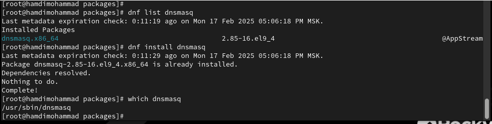2. Определите по имени файла,
к какому пакету принадлежит dnsmasq: rpm -qf \$(which dnsmasq)

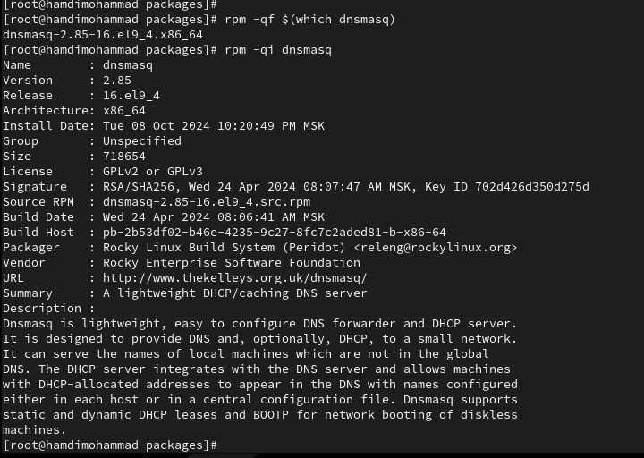и
получите дополнительную информацию о содержимом пакета: rpm -qi dnsmasq

3\. Получите список всех файлов в пакете:

rpm -ql dnsmasq а также выведите перечень файлов с документацией пакета:
rpm -qd dnsmasq

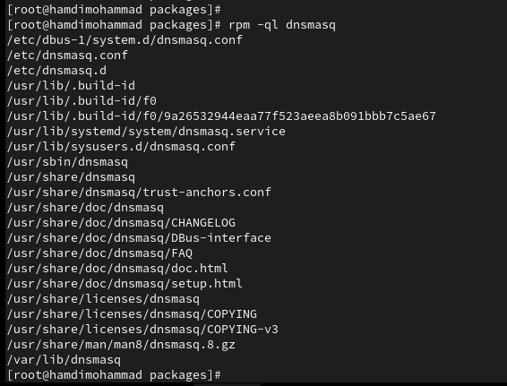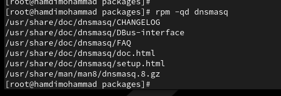Посмотрите файлы
документации, применив команду man dnsmasq.

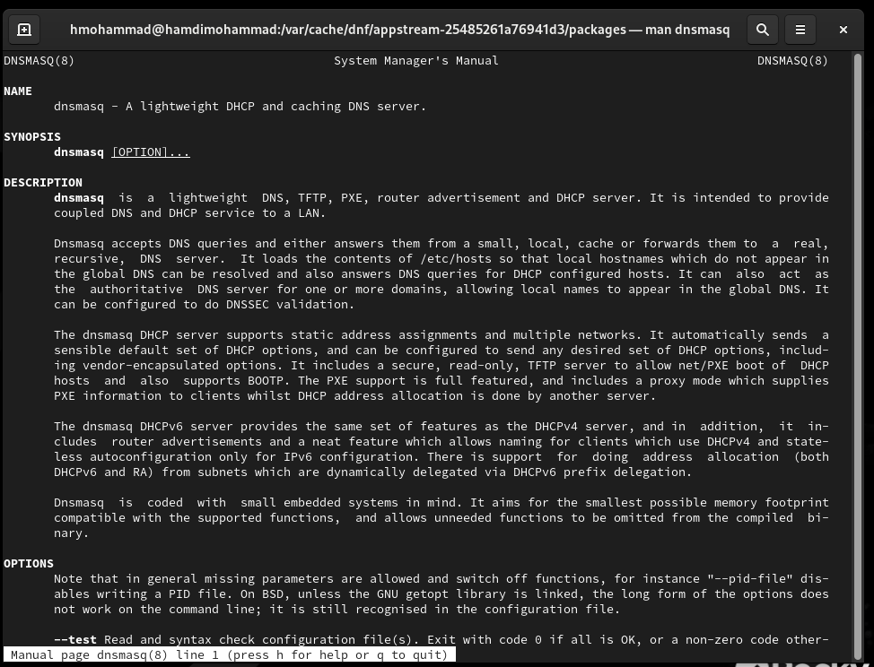

4\. Выведите на экран перечень и месторасположение конфигурационных
файлов пакета: rpm -qc dnsmasq

5\. Выведите на экран расположение и содержание скриптов, выполняемых
при установке пакета:

rpm -q --scripts dnsmasq

и поясните, для чего предназначены скрипты.

Скрипты предназначены для установки dnsmasq как системного сервиса

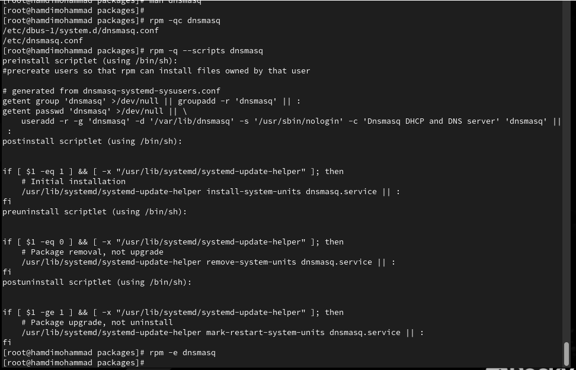6. Вернитесь в терминал с
учётной записью root и удалите пакет: rpm -e dnsmask

**Контрольные** **вопросы**

1\. Какая команда позволяет вам искать пакет rpm, содержащий файл
useradd?

> Для поиска пакета, содержащего файл useradd, используйте команду:
>
> dnf provides \*/useradd

2\. Какие команды вам нужно использовать, чтобы показать имя группы dnf,
которая

содержит инструменты безопасности и показывает, что находится в этой
группе?

> Найти имя группы с инструментами безопасности: dnf group list \| grep
> -i security
>
> Показать содержимое группы: dnf group info "Security Tools"

3\. Какая команда позволяет вам установить rpm, который вы загрузили из
Интернета и

который не находится в репозиториях?

> Чтобы установить RPM-пакет, загруженный из Интернета, используйте:
> sudo dnf
>
> install /path/to/package.rpm

4\. Вы хотите убедиться, что пакет rpm, который вы загрузили, не
содержит никакого

опасного кода сценария. Какая команда позволяет это сделать?

> Для проверки содержимого скриптов RPM-пакета: rpm -qp --scripts
>
> /path/to/package.rpm

5\. Какая команда показывает всю документацию в rpm?

> Для отображения документации, включенной в пакет RPM: rpm -qd
> package_name

6\. Какая команда показывает, какому пакету rpm принадлежит файл?

> Чтобы узнать, какому пакету принадлежит файл: rpm -qf /path/to/file

**Заключение**

> Получены навыки работы c репозиториями и менеджерами пакетов.
