> **РОССИЙСКИЙ** **УНИВЕРСИТЕТ** **ДРУЖБЫ** **НАРОДОВ** **Факультет**
> **физико-математических** **и** **естественных** **наук**
>
> **Кафедра** **теории** **вероятностей** **и** **кибербезопасности**
>
> **ОТЧЕТ**
>
> **ПО** **ЛАБОРАТОРНОЙ** **РАБОТЕ** **№5**
>
> *<u>дисциплина:</u>* *<u>Основы администрирования операционных
> систем</u>*

Студент: <u>Хамди Мохаммад, 1032235868</u>

> **МОСКВА**
>
> 2<u>024</u> г.

**Постановка** **задачи**

> Получить навыки управления системными службами операционной системы

посредством systemd.

**Выполнение** **работы**

**Управление** **сервисами**

1\. Получите полномочия администратора su –

2\. Проверьте статус службы Very Secure FTP: systemctl status vsftpd

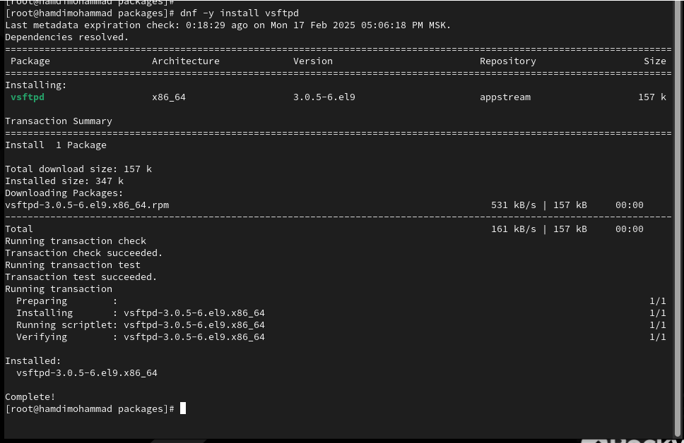Вывод команды должен
показать, что сервис в настоящее время отключён, так как служба Very
Secure FTP не установлена.

3\. Установите службу Very Secure FTP: dnf -y install
vsftpd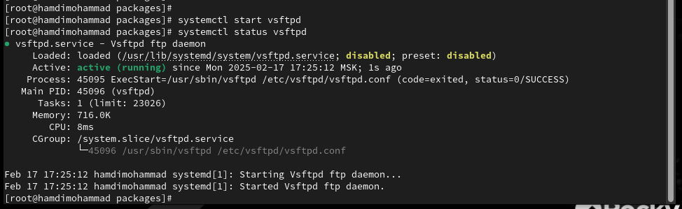

4\. Запустите службу Very Secure FTP: systemctl start vsftpd

5\. Проверьте статус службы Very Secure FTP: systemctl status vsftpd

Вывод команды должен показать, что служба в настоящее время работает, но
не будет активирована при перезапуске операционной системы.

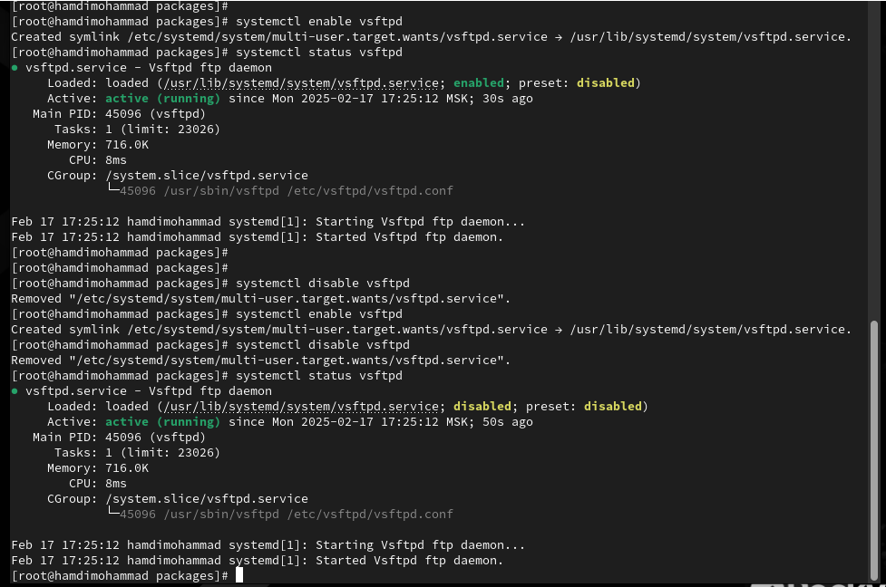6. Добавьте службу Very
Secure FTP в автозапуск при загрузке операционной системы, используя
команду systemctl enable. Затем проверьте статус службы. Удалите службу
из автозапуска, используя команду systemctl disable, и снова проверьте
её статус.

7\. Выведите на экран символические ссылки, ответственные за запуск
различных сервисов:

ls /etc/systemd/system/multi-user.target.wants

Должно отобразиться, что ссылка на vsftpd.service не существует.

8\. Снова добавьте службу Very Secure FTP в автозапуск: systemctl enable
vsftpd

и выведите на экран символические ссылки, ответственные за запуск
различных сервисов. Вывод команды покажет, что создана символическая
ссылка для файла /usr/lib/systemd/system/vsftpd.service в каталоге
/etc/systemd/system/multi-user.target.wants.

9\. Снова проверьте статус службы Very Secure FTP: systemctl status
vsftpd

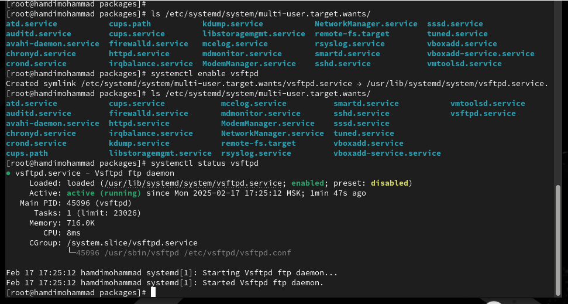Теперь вы увидите, что для
файла юнита состояние изменено с disabled на enabled.

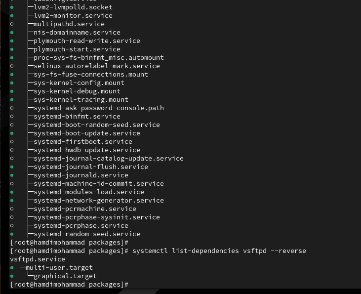

10\. Выведите на экран список зависимостей юнита: systemctl
list-dependencies vsftpd

11\. Выведите на экран список юнитов, которые зависят от данного юнита:
systemctl list-dependencies vsftpd --reverse

**Конфликты** **юнитов**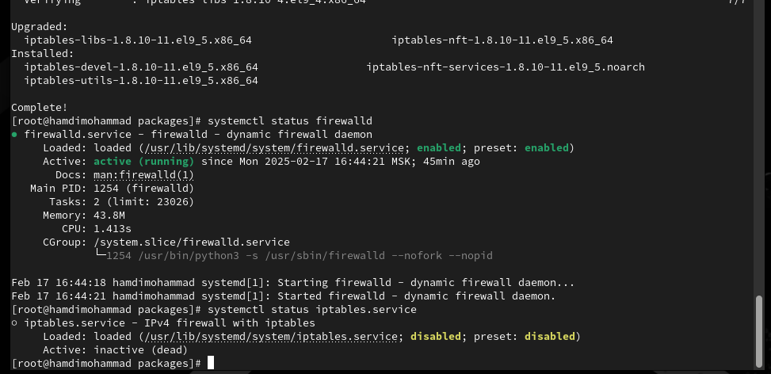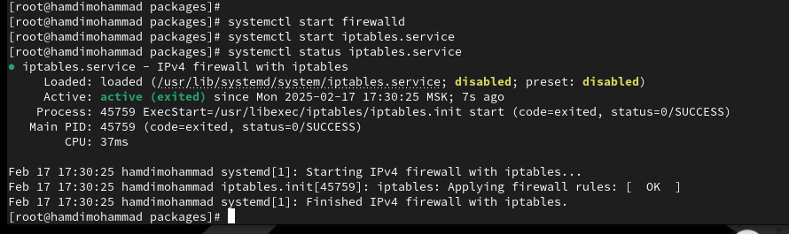

1\. Получите полномочия администратора. Установите iptables: dnf -y
install iptables\\

2\. Проверьте статус firewalld и iptables: systemctl status firewalld

systemctl status iptables

3\. Попробуйте запустить firewalld и iptables: systemctl start firewalld

systemctl start iptables

Вы увидите, что при запуске одной службы вторая дезактивируется или не
запускается.

4\. Введите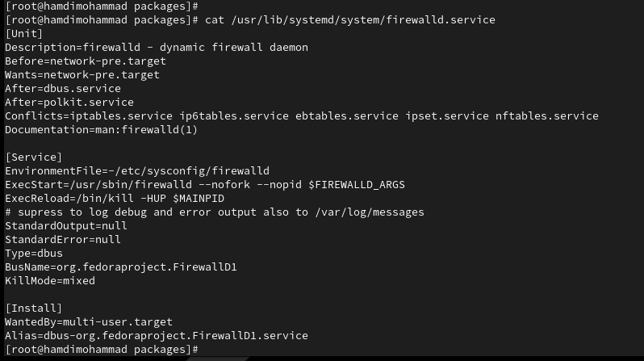

cat /usr/lib/systemd/system/firewalld.service

и опишите настройки конфликтов для этого юнита при наличии.

5\. Введите

cat /usr/lib/systemd/system/iptables.service

и опишите настройки конфликтов для этого юнита.

6\. Выгрузите службу iptables (на всякий случай, чтобы убедиться, что
данная служба не загружена в систему):

systemctl stop iptables

и загрузите службу firewalld systemctl start firewalld

7\. Заблокируйте запуск iptables, введя: systemctl mask iptables

Будет создана символическая ссылка на /dev/null для

/etc/systemd/system/iptables.service (проверьте это). Поскольку
юнитфайлы в /etc/systemd имеют приоритет над файлами в /usr/lib/systemd,
то это сделает невозможным случайный запуск сервиса iptables.

8\. Попробуйте запустить iptables: systemctl start iptables

Должно появиться сообщение об ошибке, указывающее, что служба
замаскирована и по этой причине не может быть запущена.

9\. Попробуйте добавить iptables в автозапуск: systemctl enable iptables
Сервис будет неактивен, а статус загрузки отобразится как
замаскированный.

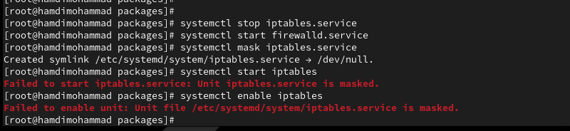

**Изолируемые** **цели**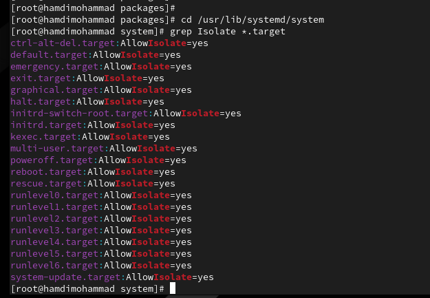

1\. Получите полномочия администратора. Перейдите в каталог systemd и
найдите список всех целей, которые можно изолировать:

cd /usr/lib/systemd/system grep Isolate \*.target

2\. Переключите операционную систему в режим восстановления: systemctl
isolate rescue.target

При этом необходимо ввести пароль root на консоли сервера для входа в
систему.

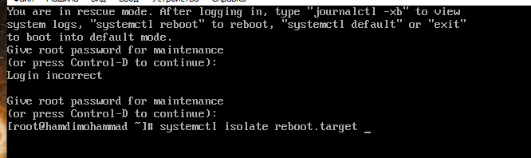3. Перезапустите операционную
систему следующим образом: systemctl isolate reboot.target

**Цель** **по** **умолчанию**

1\. Получите полномочия администратора. Выведите на экран цель,
установленную по умолчанию:

systemctl get-default

2\. Для установки цели по умолчанию используется команда systemctl
set-default

Например, для запуска по умолчанию текстового режима введите systemctl
set-default multi-user.target

Перегрузите систему командой reboot. Убедитесь, что система загрузилась
в текстовом режиме. Получите полномочия администратора. Для запуска по
умолчанию графического режима введите

systemctl set-default graphical.target

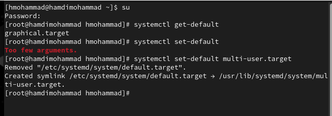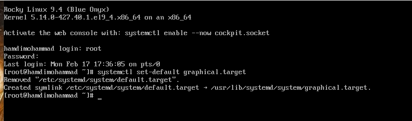Вновь перегрузите систему
командой reboot. Убедитесь, что система загрузилась в графическом
режиме.

**Контрольные** **вопросы**

> 1\. Что такое юнит (unit)? Приведите примеры.
>
> Юнит (unit) — это объект в systemd, который описывает службу, сокет,
> устройство
>
> и т.д. Примеры: service, target, mount.
>
> 2\. Какая команда позволяет вам убедиться, что цель больше не входит в
> список
>
> автоматического запуска при загрузке системы?
>
> systemctl is-enabled \<unit\>
>
> 3\. Какую команду вы должны использовать для отображения всех
> сервисных юнитов,
>
> которые в настоящее время загружены?
>
> systemctl list-units --type=service
>
> 4\. Как создать потребность (wants) в сервисе?
>
> Создать потребность в сервисе можно с помощью команды systemctl enable
>
> \<service\>, или создав символическую ссылку в каталоге
>
> /etc/systemd/system/\<target\>.wants/.
>
> 5\. Как переключить текущее состояние на цель восстановления (rescue
> target)?
>
> systemctl isolate rescue.target
>
> 6\. Поясните причину получения сообщения о том, что цель не может быть
>
> изолирована.
>
> Цель не может быть изолирована, если другие юниты или зависимости
> блокируют
>
> выполнение этой цели.
>
> 7\. Вы хотите отключить службу systemd, но, прежде чем сделать это, вы
> хотите узнать,
>
> какие другие юниты зависят от этой службы. Какую команду вы бы
> использовали?
>
> systemctl list-dependencies \<service\>

**Заключение**

> Получены навыки управления системными службами операционной системы.
