> **РОССИЙСКИЙ** **УНИВЕРСИТЕТ** **ДРУЖБЫ** **НАРОДОВ** **Факультет**
> **физико-математических** **и** **естественных** **наук**
>
> **Кафедра** **теории** **вероятностей** **и** **кибербезопасности**
>
> **ОТЧЕТ**
>
> **ПО** **ЛАБОРАТОРНОЙ** **РАБОТЕ** **№6**
>
> *<u>дисциплина:</u>* *<u>Основы администрирования операционных
> систем</u>*

Студент: <u>Хамди Мохаммад, 1032235868</u>

> **МОСКВА** 2<u>024</u> г.

**Постановка** **задачи**

Получить навыки управления процессами операционной системы.

> **Выполнение** **работы**

**Управление** **заданиями**

1\. Получите полномочия администратора su –

2\. Введите следующие команды: sleep 3600 & dd if=/dev/zero of=/dev/null
& sleep 7200

3\. Поскольку вы запустили последнюю команду без & после неё, у вас есть
2 часа, прежде чем вы снова получите контроль над оболочкой. Введите
Ctrl + z , чтобы остановить процесс.

4\. Введите jobs Вы увидите три задания, которые вы только что
запустили. Первые два имеют состояние Running, а последнее задание в
настоящее время находится в состоянии Stopped.

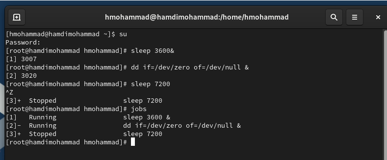5. Для продолжения выполнения
задания 3 в фоновом режиме введите bg 3 С помощью команды jobs
посмотрите изменения в статусе заданий.

6\. Для перемещения задания 1 на передний план введите fg
1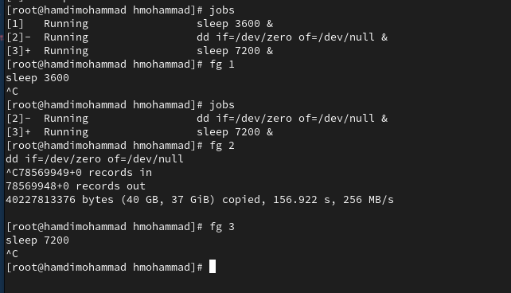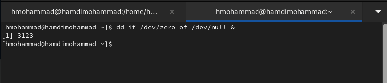

7\. Введите Ctrl + c , чтобы отменить задание 1. С помощью команды jobs
посмотрите изменения в статусе заданий.

8\. Проделайте то же самое для отмены заданий 2 и 3.

9\. Откройте второй терминал и под учётной записью своего пользователя
введите в нём: dd if=/dev/zero of=/dev/null &

10\. Введите exit, чтобы закрыть второй терминал.

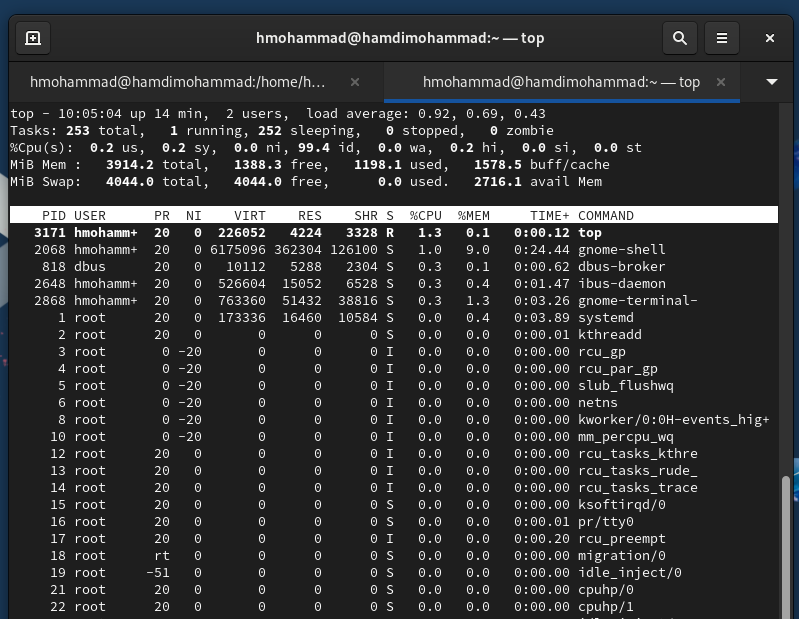11. На другом терминале под
учётной записью своего пользователя запустите top Вы увидите, что
задание dd всё ещё запущено. Для выхода из top используйте q .

12. Вновь запустите top и в
нём используйте k , чтобы убить задание dd. После этого выйдите из top.

**Управление** **процессами**

1\. Получите полномочия администратора su –

2\. Введите следующие команды: dd if=/dev/zero of=/dev/null & dd
if=/dev/zero of=/dev/null & dd if=/dev/zero of=/dev/null &

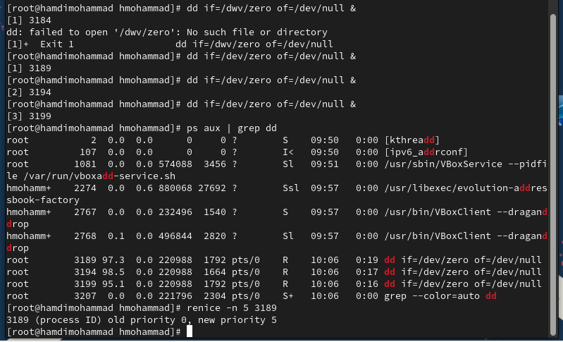3. Введите ps aux \| grep dd
Это показывает все строки, в которых есть буквы dd. Запущенные процессы
dd идут последними.

4\. Используйте PID одного из процессов dd, чтобы изменить приоритет.
Используйте renice -n 5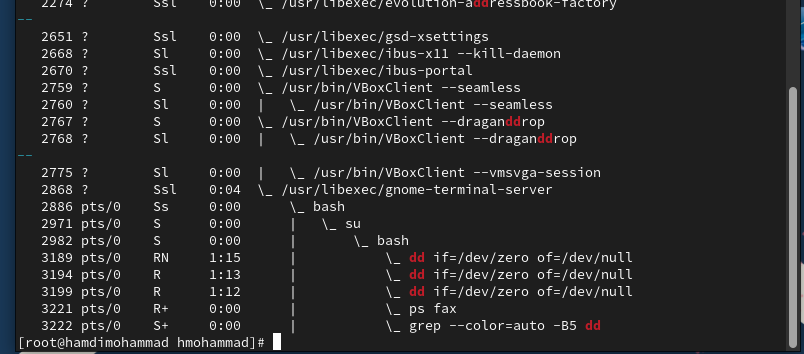

5\. Введите ps fax \| grep -B5 dd Параметр -B5 показывает
соответствующие запросу строки, включая пять строк до этого. Поскольку
ps fax показывает иерархию отношений между процессами, вы также увидите
оболочку, из которой были запущены все процессы dd, и её PID.

6\. Найдите PID корневой оболочки, из которой были запущены процессы dd,
и введите kill -9 (заменивназначениеPIDоболочки). Выувидите, что
вашакорневая оболочказакрылась, а вместе с ней и все процессы dd.
Остановка родительского процесса — простой и удобный способ остановить
все его дочерние процессы.

**Самостоятельная** **работа.** **Задание** **1**

1\. Запустите команду dd if=/dev/zero of=/dev/null трижды как фоновое
задание.

2\. Увеличьте приоритет одной из этих команд, используя значение
приоритета −5.

3\. Измените приоритет того же процесса ещё раз, но используйте на этот
раз значение −15. В чём разница?

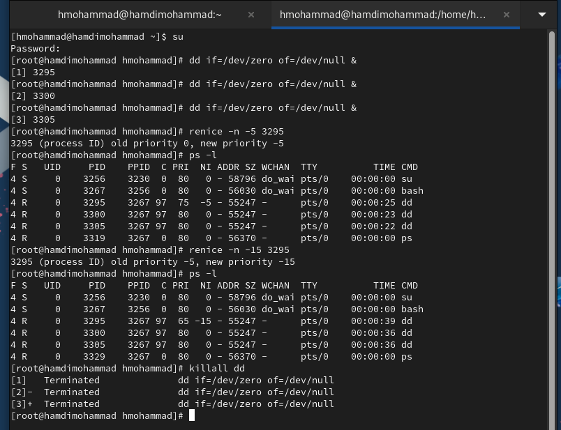4. Завершите все процессы dd,
которые вы запустили.

**Самостоятельная** **работа.** **Задание**
**2**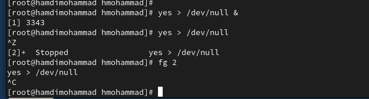

1\. Запустите программу yes в фоновом режиме с подавлением потока
вывода.

2\. Запустите программу yes на переднем плане с подавлением потока
вывода. Приостановите выполнение программы. Заново запустите программу
yes с теми же параметрами, затем завершите её выполнение.

3\. Запустите программу yes на переднем плане без подавления потока
вывода. Приостановите выполнение программы. Заново запустите программу
yes с теми же параметрами, затем завершите её выполнение.

4\. Проверьте состояния заданий, воспользовавшись командой jobs.

5\. Переведите процесс, который у вас выполняется в фоновом режиме, на
передний план, затем остановите его.

6\. Переведите любой ваш процесс с подавлением потока вывода в фоновый
режим.

7\. Проверьте состояния заданий, воспользовавшись командой jobs.
Обратите внимание, что процесс стал выполняющимся (Running) в фоновом
режиме.

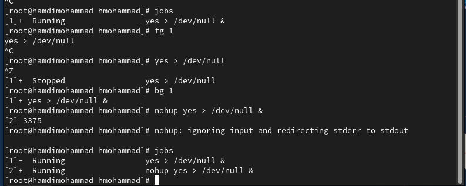8. Запустите процесс в
фоновом режиме таким образом, чтобы он продолжил свою работу даже после
отключения от терминала.

9\. Закройте окно и заново запустите консоль. Убедитесь, что процесс
продолжил свою работу.

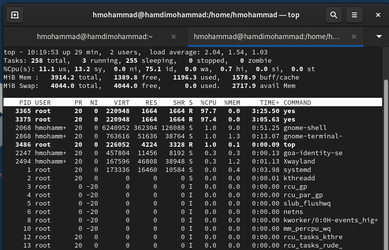10. Получите информацию о
запущенных в операционной системе процессах с помощью утилиты top.

11\. Запустите ещё три программы yes в фоновом режиме с подавлением
потока вывода.

12\. Убейте два процесса: для одного используйте его PID, а для другого
— его идентификатор конкретного задания.

13\. Попробуйте послать сигнал 1 (SIGHUP) процессу, запущенному с
помощью nohup, и обычному процессу.

4\. Запустите ещё несколько программ yes в фоновом режиме с подавлением
потока вывода.

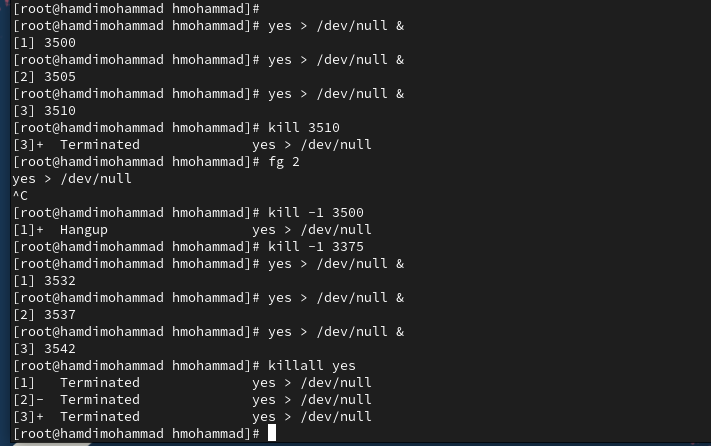15.
Завершите их работу одновременно, используя команду killall.

16\. Запустите программу yes в фоновом режиме с подавлением потока
вывода. Используя утилиту nice, запустите программу yes с теми же
параметрами и с приоритетом, большим на 5. Сравните абсолютные и
относительные приоритеты у этих двух процессов.

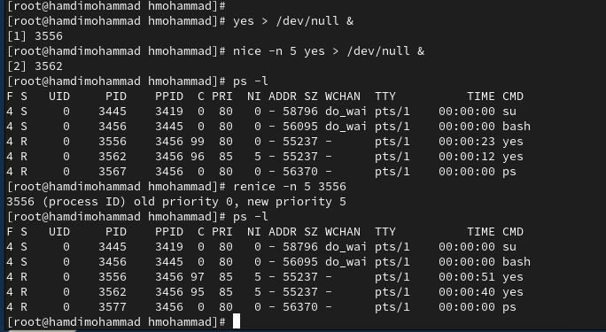17. Используя утилиту renice,
измените приоритет у одного из потоков yes таким образом, чтобы у обоих
потоков приоритеты были равны.

**Контрольные** **вопросы**

> 1\. Какая команда даёт обзор всех текущих заданий оболочки?
>
> Команда jobs отображает все текущие задания оболочки:
>
> 2\. Как остановить текущее задание оболочки, чтобы продолжить его
> выполнение в фоновом режиме?
>
> Для этого можно использовать комбинацию клавиш Ctrl+Z, чтобы
> остановить
>
> задание, а затем команду bg, чтобы продолжить его выполнение в фоновом
>
> режиме
>
> 3\. Какую комбинацию клавиш можно использовать для отмены текущего
> задания
>
> оболочки?
>
> Комбинация клавиш Ctrl+C используется для отмены (прерывания) текущего
>
> задания оболочки.
>
> 4\. Необходимо отменить одно из начатых заданий. Доступ к оболочке, в
> которой в
>
> данный момент работает пользователь, невозможен. Что можно сделать,
> чтобы
>
> отменить задание?
>
> Если доступ к оболочке невозможен, можно найти задание с помощью
> команды
>
> ps и завершить его с помощью команды kill.
>
> 5\. Какая команда используется для отображения отношений между
> родительскими
>
> и дочерними процессами?
>
> Команда pstree отображает отношения между родительскими и дочерними
>
> процессами:
>
> 6\. Какая команда позволит изменить приоритет процесса с
> идентификатором 1234
>
> на более высокий?
>
> Для повышения приоритета процесса используется команда renice.
> Например,
>
> чтобы повысить приоритет процесса с PID 1234: renice -n -10 -p 1234
>
> Чем меньше значение nice, тем выше приоритет.
>
> 7\. В системе в настоящее время запущено 20 процессов dd. Как проще
> всего
>
> остановить их все сразу?
>
> Можно использовать команду pkill, которая завершает процессы по имени
>
> 8\. Какая команда позволяет остановить команду с именем mycommand?
>
> Для этого можно использовать команду pkill
>
> 9\. Какая команда используется в top, чтобы убить процесс?
>
> В top для завершения процесса используется клавиша k. После нажатия k,
>
> необходимо ввести PID процесса для его завершения.
>
> 10\. Как запустить команду с достаточно высоким приоритетом, не
> рискуя, что не хватит ресурсов для других процессов?
>
> Команду можно запустить с помощью nice, задав низкий приоритет, чтобы
> не
>
> отнимать ресурсы у других процессов.

**Заключение**

> Получены навыки управления процессами операционной системы.
