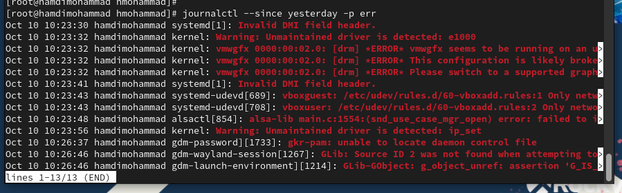

> **РОССИЙСКИЙ** **УНИВЕРСИТЕТ** **ДРУЖБЫ** **НАРОДОВ** **Факультет**
> **физико-математических** **и** **естественных** **наук**
>
> **Кафедра** **теории** **вероятностей** **и** **кибербезопасности**
>
> **ОТЧЕТ**
>
> **ПО** **ЛАБОРАТОРНОЙ** **РАБОТЕ** **№7**
>
> *<u>дисциплина:</u>* *<u>Основы администрирования операционных
> систем</u>*

Студент: Хамди Мохаммад, 1032235868

> **МОСКВА**
>
> 2<u>024</u> г.

**Постановка** **задачи**

Получить навыки работы с журналами мониторинга различных событий в
системе.

**Выполнение** **работы**

**Мониторинг** **журнала** **системных** **событий** **в** **реальном**
**времени**

1\. Запустите три вкладки терминала и в каждом из них получите
полномочия администратора: su -

2\. На второй вкладке терминала запустите мониторинг системных событий в
реальном времени: tail -f /var/log/messages

3. В третьей вкладке
терминала вернитесь к учётной записи своего пользователя достаточно
нажать Ctrl + d ) и попробуйте получить полномочия администратора, но
введите неправильный пароль. Обратите внимание, что во второй вкладке
терминала с мониторингом событий или ничего не отобразится, или появится
сообщение «FAILED SU (to root) username ...». Отображаемые на экране
сообщения также фиксируются в файле /var/log/messages.

4\. В третьей вкладке терминала из оболочки пользователя введите logger
hello

Во второй вкладке терминала с
мониторингом событий вы увидите сообщение, которое также будет
зафиксировано в файле /var/log/messages.

5\. Во второй вкладке терминала с мониторингом остановите трассировку
файла сообщений мониторинга реального времени, используя Ctrl + c .
Затем запустите мониторинг сообщений безопасности (последние 20 строк
соответствующего файла

логов):

tail -n 20 /var/log/secure

Вы увидите сообщения, которые
ранее были зафиксированы во время ошибки авторизации при вводе команды
su.

**Изменение** **правил**
**rsyslog.conf**

По умолчанию веб-служба не регистрирует свои сообщения через rsyslog, а
пишет свой собственный журнал (в каталоге /var/log/httpd). Настройте
регистрацию сообщений веб-службы через syslog, создав правило,
регистрирующее отладочные сообщения в отдельном лог-файле. Для этого
выполните следующие действия.

1\. В первой вкладке терминала установите Apache, если он не был ранее
инсталлирован: dnf -y install httpd

2\. После окончания процесса установки запустите веб-службу: systemctl
start httpd

systemctl enable httpd

3\. Во второй вкладке терминала посмотрите журнал сообщений об ошибках
веб-службы: tail -f /var/log/httpd/error_log

Чтобы закрыть трассировку
файла журнала, используйте Ctrl + c .

4\. В третьей вкладке терминала получите полномочия администратора и в
файле конфигурации /etc/httpd/conf/httpd.conf в конце добавьте следующую
строку:

ErrorLog syslog:local1

Здесь local0 — local7 — это
«настраиваемые» средства (объекты), которые syslog предоставляет
пользователю для регистрации событий приложения в системном журнале.

5\. В каталоге /etc/rsyslog.d создайте файл мониторинга событий
веб-службы: cd /etc/rsyslog.d

touch httpd.conf

Открыв его на редактирование, пропишите в нём local1.\*
-/var/log/httpd-error.log

Эта строка позволит отправлять все сообщения, получаемые для объекта
local1 (который теперь используется службой httpd), в файл
/var/log/httpd-error.log.

6\. Перейдите в первую вкладку терминала и перезагрузите конфигурацию
rsyslogd и веб-службу:

systemctl restart rsyslog.service systemctl restart httpd

Все сообщения об ошибках
веб-службы теперь будут записаны в файл /var/log/httpd-error.log, что
можно наблюдать или в режиме реального времени, используя команду tail с
соответствующими параметрами, или непосредственно просматривая указанный
файл.

7\. В третьей вкладке терминала создайте отдельный файл конфигурации для
мониторинга отладочной информации:

cd /etc/rsyslog.d touch debug.conf

В этом же терминале введите

> echo "\*.debug /var/log/messages-debug" \> /etc/rsyslog.d/debug.conf

8\. В первой вкладке терминала снова перезапустите rsyslogd: systemctl
restart rsyslog.service

9\. Во второй вкладке терминала запустите мониторинг отладочной
информации: tail -f /var/log/messages-debug

10\. В третьей вкладке терминала введите:

logger -p daemon.debug "Daemon Debug Message"

11. В терминале с
мониторингом посмотрите сообщение отладки. Чтобы закрыть трассировку
файла журнала, используйте Ctrl + c .

**Использование** **journalctl**

1\. Во второй вкладке терминала посмотрите содержимое журнала с
событиями с момента последнего запуска системы:

journalctl

Для пролистывания журнала
используйте или Enter (построчный просмотр), или пробел (постраничный
просмотр). Для выхода из просмотра используйте q .

2\. Просмотр содержимого журнала без использования пейджера: journalctl
--no-pager

3\. Режим просмотра журнала в реальном времени: journalctl -f

Используйте Ctrl + c для
прерывания просмотра.

4. Для использования
фильтрации просмотра конкретных параметров журнала введите journalctl и
дважды нажмите клавишу Tab .

5\. Просмотрите события для UID0: journalctl
\_UID=0

6. Для отображения последних
20 строк журнала введите journalctl -n 20

7\. Для просмотра только сообщений об ошибках введите journalctl -p
err

8\. Если вы хотите просмотреть сообщения журнала, записанные за
определённый период времени, вы можете использовать параметры --since и
--until. Обе опции принимают параметр времени в формате YYYY-MM-DD
hh:mm:ss Кроме того, вы можете использовать yesterday, today и tomorrow
в качестве параметров. Например, для просмотра всех сообщений со
вчерашнего дня введите

journalctl --since yesterday

9\. Если вы хотите показать все сообщения с ошибкой приоритета, которые
были зафиксированы со вчерашнего дня, то
используйте

journalctl --since yesterday -p err

10.
Если вам нужна детальная информация, то используйте journalctl -o
verbose

11\. Для просмотра дополнительной информации о модуле sshd введите
journalctl \_SYSTEMD_UNIT=sshd.service

**Постоянный** **журнал** **journald**

По умолчанию журнал journald хранит сообщения в оперативной памяти
системы и записи доступны в каталоге /run/log/journal только до
перезагрузки системы. Для того чтобы сделать журнал journald постоянным,
выполните следующие действия.

1\. Запустите терминал и получите полномочия администратора.

2\. Создайте каталог для хранения записей журнала: mkdir -p
/var/log/journal

3\. Скорректируйте права доступа для каталога /var/log/journal, чтобы
journald смог записывать в него информацию: chown root:systemd-journal
/var/log/journal chmod 2755 /var/log/journal

4\. Для принятия изменений необходимо или перезагрузить систему
(перезапустить службу systemd-journald недостаточно), или использовать
команду: killall -USR1 systemd-journald

5. Журнал systemd теперь
постоянный. Если вы хотите видеть сообщения журнала с момента последней
перезагрузки, используйте: journalctl -b

**Контрольные** **вопросы**

1\. Какой файл используется для настройки rsyslogd?

> Файл конфигурации для rsyslogd — это /etc/rsyslog.conf. Дополнительные
>
> конфигурации могут находиться в директории /etc/rsyslog.d/.

2\. В каком файле журнала rsyslogd содержатся сообщения, связанные с
аутентификацией?

> Сообщения, связанные с аутентификацией, обычно записываются в файл
> /var/log/auth.log на большинстве систем Linux.

3\. Если вы ничего не настроите, то сколько времени потребуется для
ротации файлов

журналов?

> По умолчанию ротация журналов происходит еженедельно. Это определяется
>
> настройками в файле /etc/logrotate.conf или в файлах конфигурации в
> /etc/logrotate.d/.

4\. Какую строку следует добавить в конфигурацию для записи всех
сообщений с

приоритетом info в файл /var/log/messages.info?

> В файл /etc/rsyslog.conf добавьте следующую строку: \*.info
> /var/log/messages.info

5\. Какая команда позволяет вам видеть сообщения журнала в режиме
реального времени?

> Команда tail -f /var/log/syslog или journalctl -f позволяет вам
> наблюдать за
>
> сообщениями журнала в режиме реального времени.

6\. Какая команда позволяет вам видеть все сообщения журнала, которые
были написаны

> Команда journalctl выводит все сообщения журнала journald, а для
> сообщений rsyslog
>
> можно использовать команду cat /var/log/syslog (или другой файл
> журнала в
>
> зависимости от системы).

7\. Какая команда позволяет вам видеть сообщения journald после
последней перезагрузки

системы?

> Команда journalctl -b выводит сообщения journald, записанные после
> последней
>
> перезагрузки.

8\. Какая процедура позволяет сделать журнал journald постоянным?

> Создайте каталог для хранения записей журнала: mkdir -p
> /var/log/journal
>
> Скорректируйте права доступа для каталога /var/log/journal, чтобы
> journald смог
>
> записывать в него информацию: chown root:systemd-journal
> /var/log/journal chmod
>
> 2755 /var/log/journal
>
> Для принятия изменений необходимо или перезагрузить систему
> (перезапустить
>
> службу systemd-journald недостаточно), или использовать команду:
> killall -USR1
>
> systemd-journald

**Заключение**

> Получены навыки работы с журналом событий.
