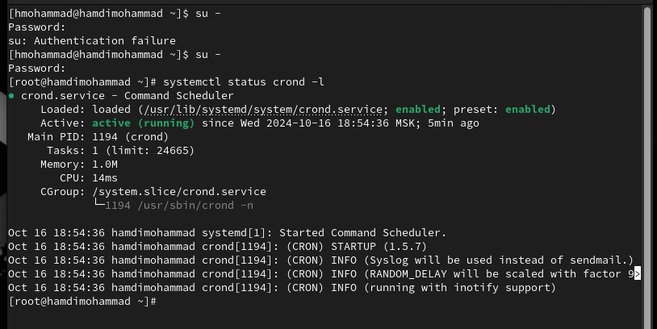
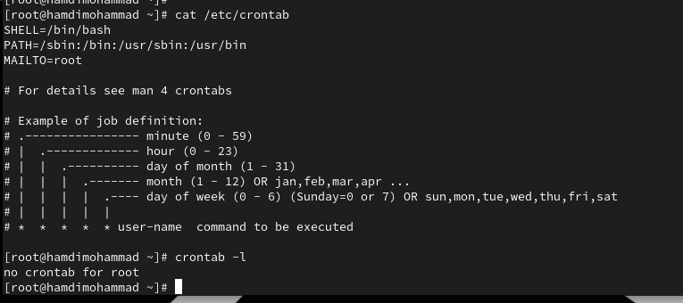
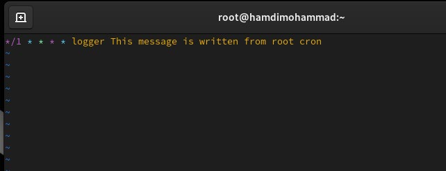
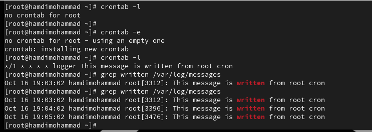
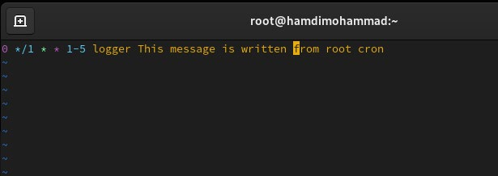
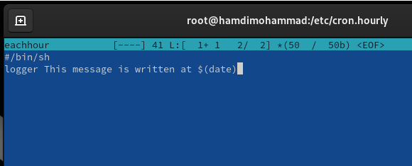
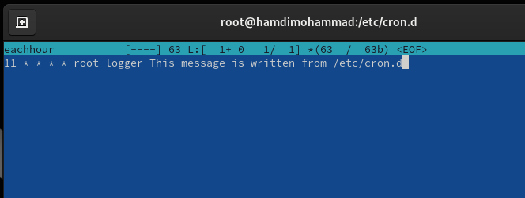
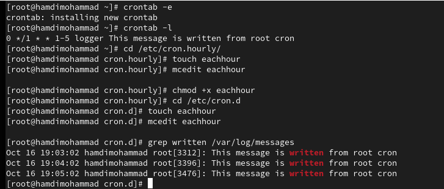
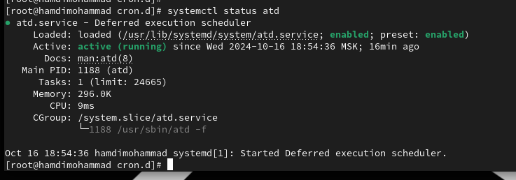
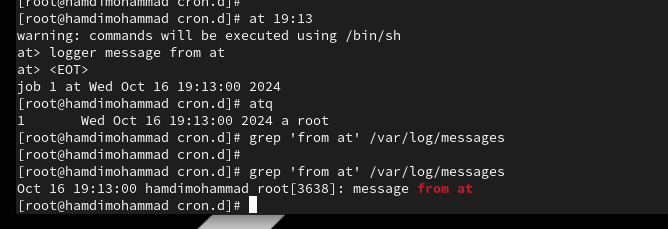

> **РОССИЙСКИЙ** **УНИВЕРСИТЕТ** **ДРУЖБЫ** **НАРОДОВ** **Факультет**
> **физико-математических** **и** **естественных** **наук**
>
> **Кафедра** **теории** **вероятностей** **и** **кибербезопасности**
>
> **ОТЧЕТ**
>
> **ПО** **ЛАБОРАТОРНОЙ** **РАБОТЕ** **№8**
>
> *<u>дисциплина:</u>* *<u>Основы администрирования операционных
> систем</u>*

Студент: Хамди Мохаммад, 1032235868

> **МОСКВА**
>
> 2<u>024</u> г.

**Постановка**
**задачи**

Получение навыков работы с планировщиками событий cron и at.

**Выполнение** **работы**

**Планирование** **задач** **с** **помощью** **cron**

1\. Запустите терминал и получите полномочия администратора: su –

2\. Посмотрите статус демона crond: systemctl status crond -l

3\. Посмотрите содержимое файла конфигурации /etc/crontab: cat
/etc/crontab

4\. Посмотрите список заданий в расписании: crontab -l Ничего не
отобразится, так как расписание ещё не задано.

5\. Откройте файл расписания на редактирование: crontab -e Команда
запустит интерфейс редактора (по умолчаниюиспользуется vi). Добавьте
следующуюстроку вфайл расписания (запись сообщения в системный журнал),
используя Ins для перехода в vi в режим ввода: \*/1 \* \* \* \* logger
This message is written from root cron

Закройте сеанс редактирования vi и сохраните изменения, используя
команду vi: Esc : w q . В отчёте поясните синтаксис записи в crontab.

задание будет выполняться каждую минуту, в любой час, в любой день
месяца, в любой месяц и в любой день недели.

6\. Посмотрите список заданий в расписании: crontab -l В расписании
должна появиться запись о запланированном событии.

7. Не выключая систему, через
некоторое время (2–3 минуты) просмотрите журнал системных событий: grep
written /var/log/messages В отчёте отразите результат.

8\. Измените запись в расписании crontab на следующую: 0 \*/1 \* \* 1-5
logger This message is written from root cron В отчёте поясните
синтаксис записи в
crontab.

задание будет выполняться в начале каждого часа, каждый день недели с
понедельника по пятницу.

9\. Посмотрите список заданий в расписании: crontab -l

10\. Перейдите в каталог /etc/cron.hourly и создайте в нём файл сценария
с именем eachhour: cd /etc/cron.hourly touch eachhour

11\. Откройте файл eachhour для редактирования и пропишите в нём
следующий скрипт (запись сообщения в системный журнал):

\#!/bin/sh logger

This message is written at
\$(date)

12\. Сделайте файл сценария eachhour исполняемым: chmod +x
eachhour

13\. Теперь перейдите в каталог /etc/crond.d и создайте в нём файл с
расписанием eachhour: cd /etc/cron.d

touch eachhour

Откройте этот файл для редактирования и поместите в него следующее
содержимое: 11 \* \* \* \* root logger This message is written from
/etc/cron.d Сохраните изменения.

В отчёте поясните синтаксис этой записи.

задание будет выполняться в 11 минут каждого часа, в любой день месяца,
в любой месяц и в любой день недели от имени пользователя root

14. Не выключая систему, через
некоторое время (2–3часа) просмотрите журналсистемных событий: grep
written /var/log/messages По журналу определите, был ли осуществлён
запуск сценария eachhour в соответствии с заданным расписанием.

**Планирование** **заданий** **с** **помощью**
**at**

1\. Запустите терминал и получите полномочия администратора: su –

2\. Проверьте, что служба atd загружена и включена: systemctl status atd

3\. Задайте выполнение команды logger message from at в 9:30 (или
замените на любое другое время, когда вы работаете над этим
упражнением). Для этого введите at 9:30 Затем введите logger message
from at Используйте Ctrl + d , чтобы закрыть оболочку.

4\. Убедитесь, что задание действительно запланировано: atq С помощью
команды

grep 'from at'
/var/log/messages посмотрите, появилось ли соответствующее сообщение в
лог-файле в указанное вами время.

**Контрольные** **вопросы**

1\. Как настроить задание cron, чтобы оно выполнялось раз в 2 недели?

> Для выполнения задания раз в 2 недели:
>
> 0 0 \*/14 \* \* your_command
>
> Эта запись выполняет задание в полночь каждые 14 дней. Однако cron не
> имеет понятия "недели", поэтому это будет строго каждые 14 дней,
> независимо от недели.

2\. Как настроить задание cron, чтобы оно выполнялось 1-го и 15-го числа
каждого месяца в

2 часа ночи?

> Для выполнения задания 1-го и 15-го числа в 2:00:
>
> 0 2 1,15 \* \* your_command
>
> Эта запись выполнит задание в 2 часа ночи 1-го и 15-го числа каждого
> месяца.

3\. Как настроить задание cron, чтобы оно выполнялось каждые 2 минуты
каждый день?

> Чтобы задание выполнялось каждые 2 минуты:
>
> \*/2 \* \* \* \* your_command
>
> Это выполнит команду каждую вторую минуту ежедневно.

4\. Как настроить задание cron, чтобы оно выполнялось 19 сентября
ежегодно?

> Для выполнения задания ежегодно 19 сентября:
>
> 0 0 19 9 \* your_command
>
> Эта запись выполнит задание 19 сентября в полночь.

5\. Как настроить задание cron, чтобы оно выполнялось каждый четверг
сентября ежегодно?

> Чтобы задание выполнялось каждый четверг сентября:
>
> 0 0 \* 9 4 your_command
>
> Здесь 4 означает четверг (в cron дни недели обозначены числами: 0 или
> 7 —
>
> воскресенье, 1 — понедельник и так далее).

6\. Какая команда позволяет вам назначить задание cron для пользователя
alice? Приведите

подтверждающий пример.

> Чтобы назначить задание для пользователя alice, используйте:
>
> sudo crontab -u alice -e
>
> Это откроет редактор cron для пользователя alice, где можно добавить
> задания cron.

7\. Как указать, что пользователю bob никогда не разрешено назначать
задания через cron?

Приведите подтверждающий пример.

> Чтобы запретить пользователю bob использовать cron, добавьте его в
> файл
>
> /etc/cron.deny:
>
> echo "bob" \| sudo tee -a /etc/cron.deny
>
> Теперь bob не сможет использовать cron.

8\. Вам нужно убедиться, что задание выполняется каждый день, даже если
сервер во время

выполнения временно недоступен. Как это сделать?

> Используйте anacron, который выполняет пропущенные задачи, когда
> сервер снова
>
> доступен. Anacron предназначен для машин, которые не работают 24/7.
>
> Добавьте задачу в файл /etc/anacrontab. Пример:
>
> 1 5 cron.daily /path/to/your_command
>
> Это означает, что задание будет выполнено ежедневно (если пропущено,
> выполнится при включении сервера).

9\. Какая команда позволяет узнать, запланированы ли какие-либо задания
на выполнение

планировщиком atd?

> Чтобы увидеть запланированные задания через at, используйте команду:
> atq

**Заключение**

> Получены навыки работы с назначением заданий.
