> **РОССИЙСКИЙ** **УНИВЕРСИТЕТ** **ДРУЖБЫ** **НАРОДОВ** **Факультет**
> **физико-математических** **и** **естественных** **наук**
>
> **Кафедра** **прикладной** **информатики** **и** **теории**
> **вероятностей**
>
> **ОТЧЕТ**
>
> **ПО** **ЛАБОРАТОРНОЙ** **РАБОТЕ** **№9**
>
> *<u>дисциплина:</u>* *<u>Основы администрирования операционных
> систем</u>*

Студент: Хамди Мохаммад, 1032235868

> **МОСКВА** 2<u>024</u> г.

**Постановка** **задачи**

Получить навыки работы с контекстом безопасности и политиками SELinux.

**Выполнение** **работы**

**Управление** **режимами** **SELinux**

1\. Запустите терминал и получите полномочия администратора: su –

2\. Просмотрите текущую информацию о состоянии SELinux: sestatus -v В
отчёте построчно поясните выведенную на экран информацию.

3\. Посмотрите, в каком режиме работает SELinux: getenforce По умолчанию
SELinux находится в режиме принудительного исполнения (Enforcing).

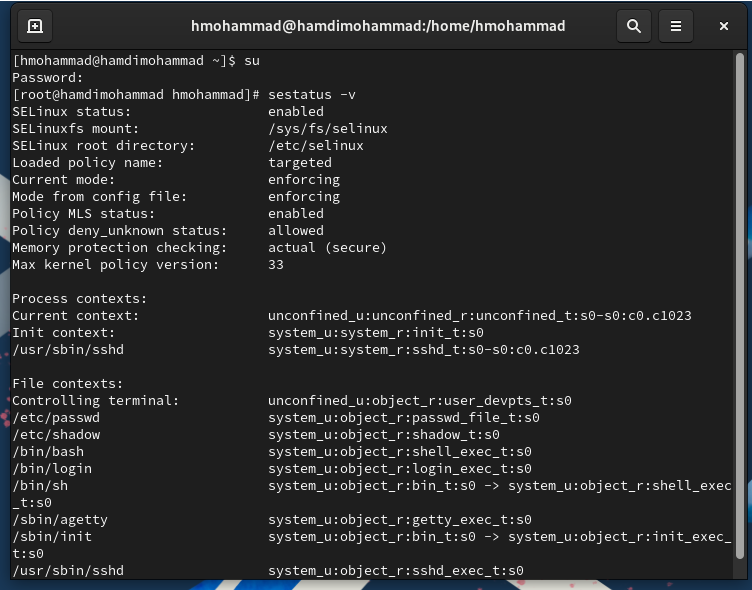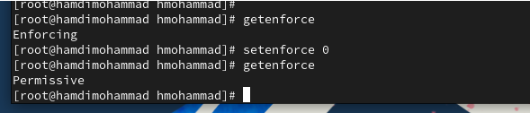4. Измените режим работы
SELinux на разрешающий (Permissive): setenforce 0 и снова введите
getenforce

5\. В файле /etc/sysconfig/selinux с помощью редактора установите
SELINUX=disabled Перезагрузите систему.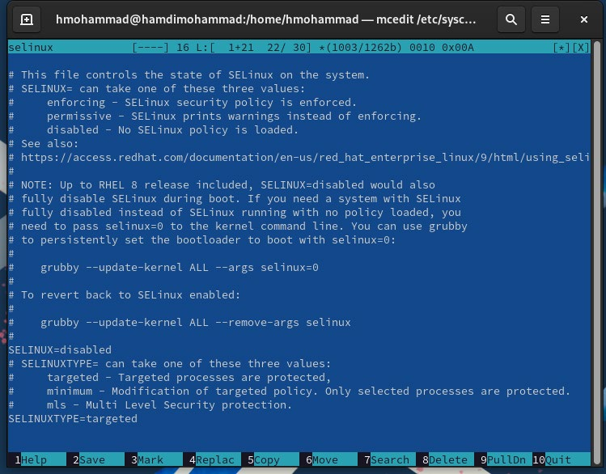

6\. После перезагрузки запустите терминал и получите полномочия
администратора.

7\. Посмотрите статус SELinux: getenforce Вы увидите, что SELinux теперь
отключён.

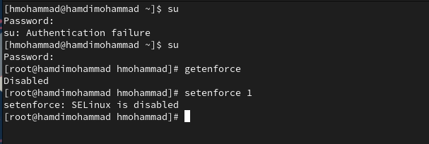8. Попробуйте переключить
режим работы SELinux: setenforce 1 Какая реакция системы? Вы не можете
переключаться между отключённым и принудительным режимом без
перезагрузки системы.

9\. Откройте файл /etc/sysconfig/selinux с помощью редактора и
установите: SELINUX=enforcing Перезагрузите
систему.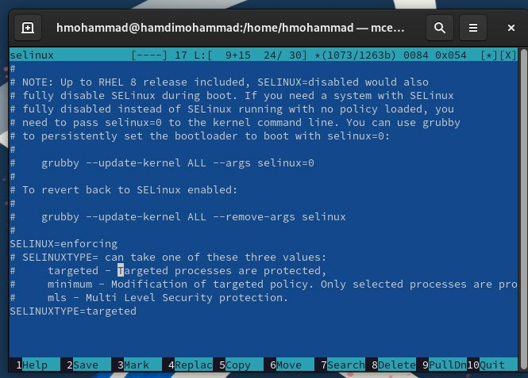

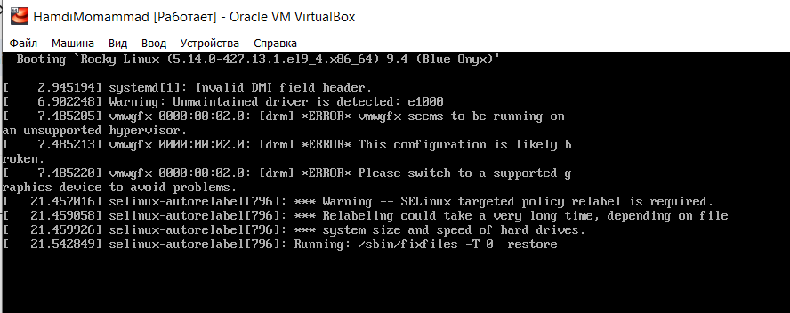10. Во время загрузки системы
вы, скорее, всего получите предупреждающее сообщение о необходимости
восстановления меток SELinux, что может занять некоторое время, а также
потребует дополнительной перезагрузки системы.

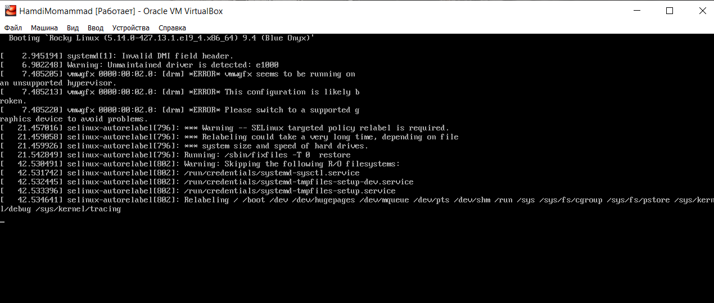

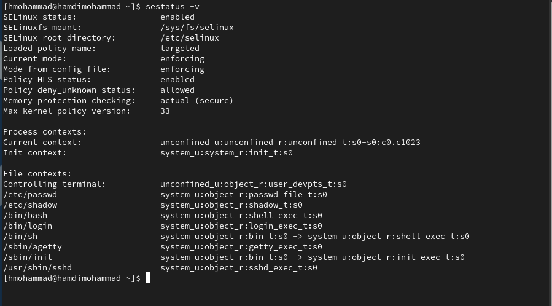11.
После перезагрузки в терминале с полномочиями администратора просмотрите
текущую информацию о состоянии SELinux: sestatus -v Убедитесь, что
система работает в принудительном режиме (enforcing) SELinux.

**Использование** **restorecon** **для** **восстановления**
**контекста** **безопасности**

1\. Запустите терминал и получите полномочия администратора.

2\. Посмотрите контекст безопасности файла /etc/hosts: ls -Z /etc/hosts
Вы увидите, что у файла есть метка контекста net_conf_t.

3\. Скопируйте файл /etc/hosts вдомашнийкаталог: cp/etc/hosts ~/
Проверьте контекстфайла ~/hosts:ls -Z~/hostsПоскольку
копированиесчитается созданиемнового файла,то параметр контекста в файле
~/hosts, расположенном в домашнем каталоге, станет admin_home_t.

4\. Попытайтесь перезаписать существующий файл hosts из домашнего
каталога в каталог /etc: mv ~/hosts /etc и подтвердите, что вы хотите
сделать это.

5\. Убедитесь, что тип контекста по-прежнему установлен на admin_home_t:
ls -Z /etc/hosts

6\. Исправьте контекст безопасности: restorecon -v /etc/hosts Опция -v
покажет процесс изменения.

7\. Убедитесь, что тип контекста изменился: ls -Z /etc/hosts

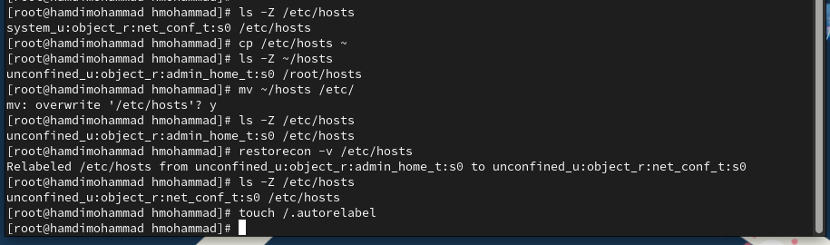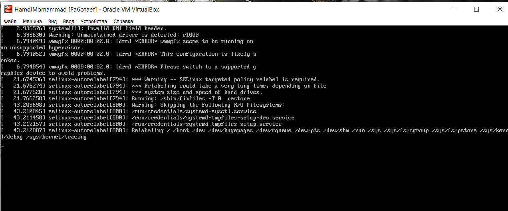8. Для массового исправления
контекста безопасности на файловой системе введите touch /.autorelabel и
перезагрузите систему. Во время перезапуска не забудьте нажать клавишу
Esc на клавиатуре, чтобы вы видели загрузочные сообщения. Вы увидите,
что файловая система автоматически перемаркирована.

**Настройка** **контекста** **безопасности** **для** **нестандартного**
**расположения** **файлов**
**веб-сервера**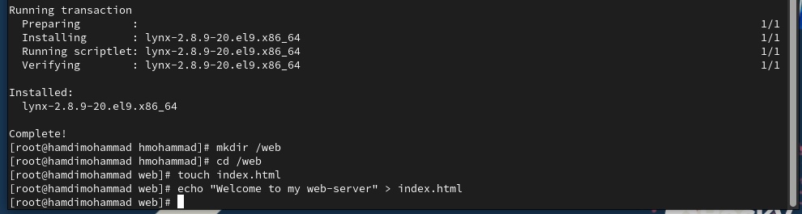

1\. Запустите терминал и получите полномочия администратора.

2\. Установите необходимое программное обеспечение: dnf -y install httpd
dnf -y install lynx

3\. Создайте новое хранилище для файлов web-сервера: mkdir /web

4\. Создайте файл index.html в каталоге с контентом веб-сервера: cd /web
touch index.html и поместите в файл следующий текст: Welcome to my
web-server

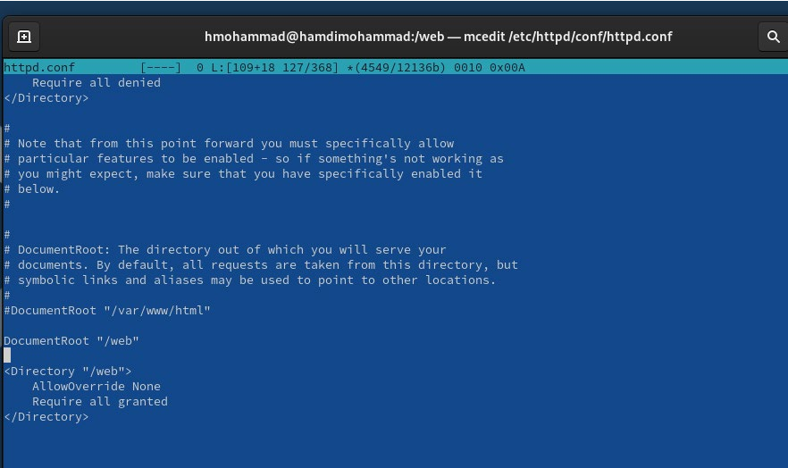5. В файле
/etc/httpd/conf/httpd.conf закомментируйте строку DocumentRoot
"/var/www/html" и ниже добавьте строку DocumentRoot "/web" Затем в
этомже файле ниже закомментируйте раздел AllowOverride None Require all
grantedидобавьте следующийраздел,определяющий правила доступа:
AllowOverride None Require all granted

6\. Запустите веб-сервер и службу httpd: systemctl start httpd systemctl
enable httpd

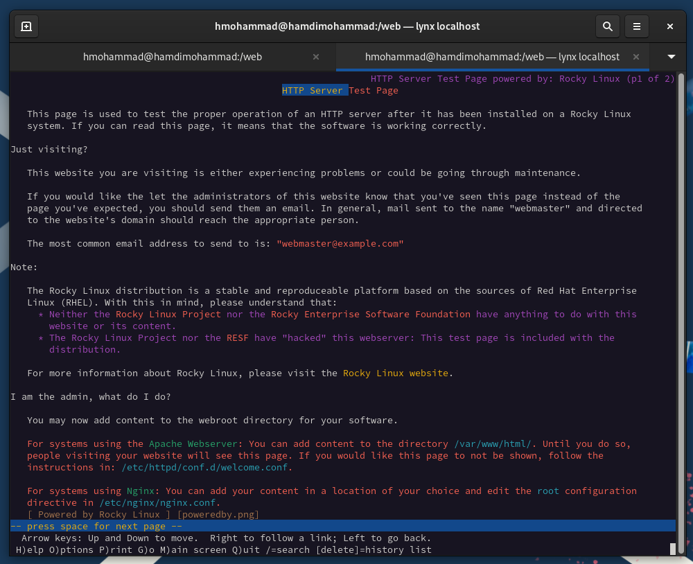7. В терминале под учётной
записью своего пользователя при обращении к веб-серверу в текстовом
браузере lynx: lynx [<u>http://localhost</u>](http://localhost/) вы
увидите веб-страницу Red Hat по умолчанию, а не содержимое только что
созданного файла index.html. В нижней части терминала с lynx указаны
подсказки по навигации. Для выхода из lynx нажмите q .

8\. В терминале с полномочиями администратора примените новую метку
контекста к /web: semanage fcontext -a -t httpd_sys_content_t
"/web(/.\*)?"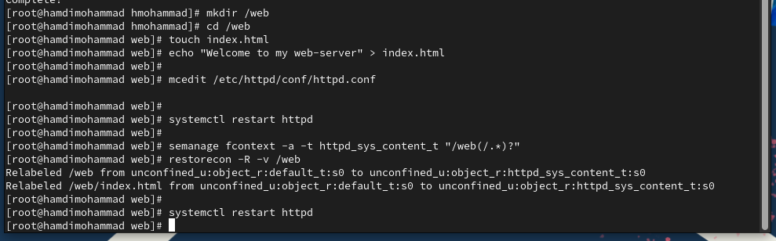

9\. Восстановите контекст безопасности: restorecon -R -v /web

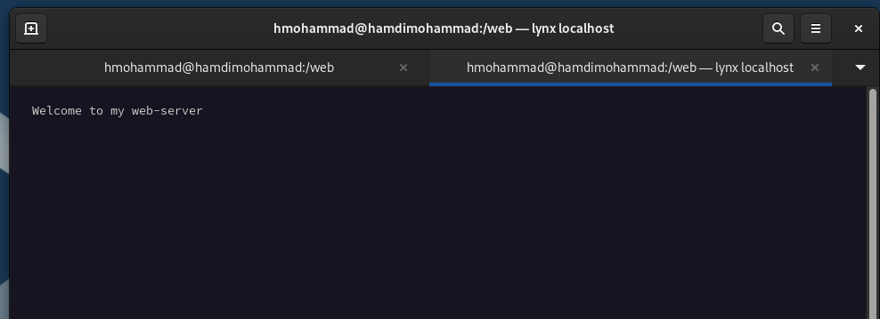10. В терминале под учётной
записью своего пользователя снова обратитесь к веб-серверу: lynx
http://localhost Теперь вы получите доступ к своей пользовательской
веб-странице. Если этого не произошло, то перегрузите систему и снова
попытайтесь получить доступ к своей пользовательской веб-странице. В
случае успеха на экране должна быть отображена запись «Welcome to my
web-server».

**Работа** **с** **переключателями** **SELinux**

1\. Запустите терминал и получите полномочия администратора.

2\. Посмотрите список переключателей SELinux для службы ftp: getsebool
-a \| grep ftp Вы увидите переключатель ftpd_anon_write с текущим
значением off.

3\. Для службы ftpd_anon посмотрите список переключателей с пояснением,
за что отвечает каждый переключатель, включён он или выключен: semanage
boolean -l \| grep ftpd_anon

4\. Измените текущее значение переключателя для службы ftpd_anon_write с
off на on: setsebool ftpd_anon_write on

5\. Повторно посмотрите список переключателей SELinux для службы
ftpd_anon_write: getsebool ftpd_anon_write

6\. Посмотрите список переключателей с пояснением: semanage boolean -l
\| grep ftpd_anon Обратите внимание, что настройка времени выполнения
включена, но постоянная настройка по-прежнему отключена.

7\. Измените постоянное значение переключателя для службы
ftpd_anon_write с off на on: setsebool -P ftpd_anon_write on

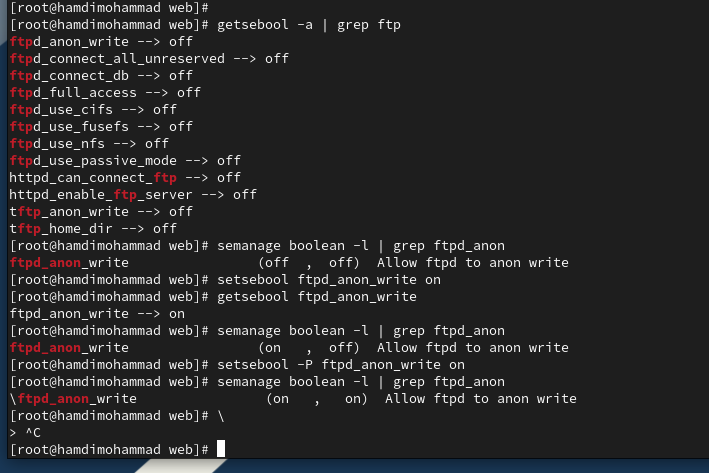8. Посмотрите список
переключателей: semanage boolean -l \| grep ftpd_anon В отчёте отразите,
какое состояние имеет переключатель?

**Контрольные** **вопросы**

1\. Вы хотите временно поставить SELinux в разрешающем режиме. Какую
команду вы

используете?

> setenforce 0

2\. Вам нужен список всех доступных переключателей SELinux. Какую
команду вы используете?

> getsebool -a

3\. Каково имя пакета, который требуется установить для получения легко
читаемых

сообщений журнала SELinux в журнале аудита?

> setroubleshoot

4\. Какие команды вам нужно выполнить, чтобы применить тип контекста

> Чтобы изменить контекст: chcon -t \<type\> \<file\>
>
> Чтобы восстановить контекст по умолчанию: restorecon \<file\>

5\. Какой файл вам нужно изменить, если вы хотите полностью отключить
SELinux?

> /etc/selinux/config
>
> В файле нужно изменить строку: SELINUX=disabled

6\. Где SELinux регистрирует все свои сообщения?

> /var/log/audit/audit.log
>
> Если пакет auditd не установлен, сообщения могут быть записаны в:
>
> /var/log/messages

7\. Вы не знаете, какие типы контекстов доступны для службы ftp. Какая
команда позволяет

получить более конкретную информацию?

> semanage fcontext -l \| grep ftp

8\. Ваш сервис работает не так, как ожидалось, и вы хотите узнать,
связано ли это с SELinux

или чем-то ещё. Какой самый простой способ узнать?

> Временно перевести SELinux в разрешающий режим: setenforce 0
>
> Если проблема исчезнет, то, вероятно, она связана с SELinux.

**Заключение**

> Получены навыки работы с SELinux.
